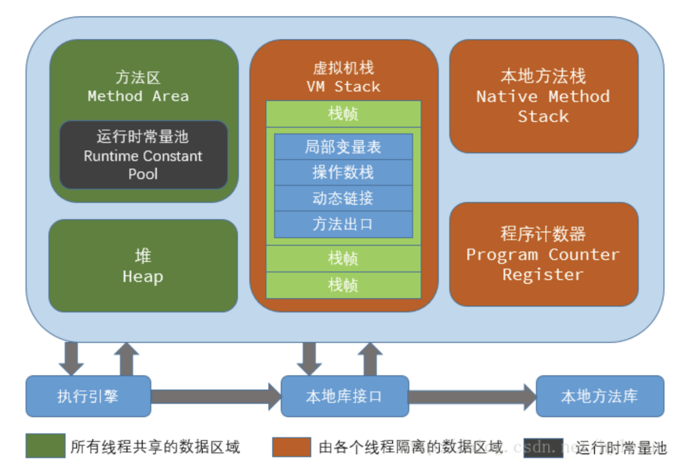
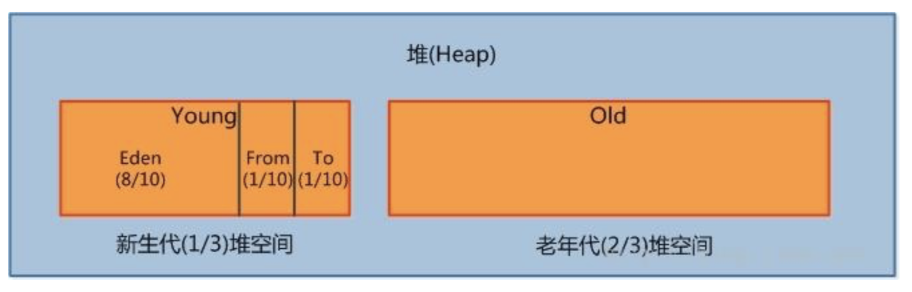
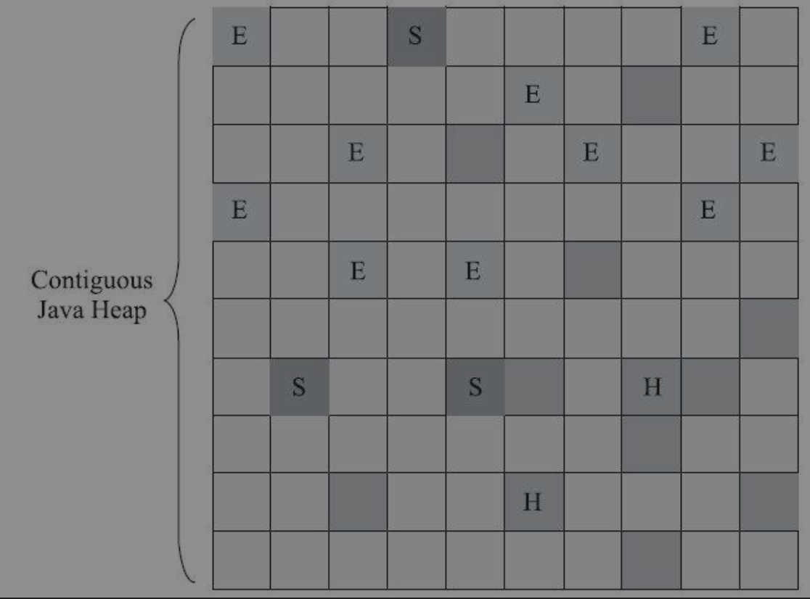

# 前沿

官网地址：https://docs.oracle.com/javase/8/

VM参数官方文档：https://docs.oracle.com/javase/8/docs/technotes/tools/unix/java.html

参考文档：[](https://blog.csdn.net/tterminator/article/details/54342666)

# 一.类加载机制


## **1.什么是类加载机制？它的作用是什么？**			

​		类加载机制粗略的描述就是：**将class文件的内容加载到JVM的一个过程**。**具体的描述**：**Class文件加载到内存，并对数据进行校验、转换解析和初始化，最终形成可以被虚拟机直接使用的Java类型的过**程。

​		我们编写的Java源码文件，经过编译器（词法分析/语法分析/语义分析）编辑，生成字节码文件。然后将这个字节码文件交给JVM区解析，这个过程就是类加载。

## 2.类加载的时机


## 3.类加载都有哪些过程？


### 3.1 装载

在装载阶段，JVM虚拟机需要完成下面三件事情：

1. 通过类的全限定名获取其定义的二进制字节流。需要借助`类装载器`  [classLoader](##类装载器classLoader)完成(就是用来装载Class文件的)。
2. 将这个字节流所代表的静态存储结构转化为方法区的运行时数据结构。 
3. 在Java堆中生成一个代表这个类的java.lang.Class对象，作为对方法区中这些数据的访问入口。

------

==**注意：**==

​		**加载阶段与连接阶段的部分动作（如一部分字节码文件格式验证动作）是交叉进行的，加载阶段尚未完成，连接阶段可能已经开始。**

------


### 3.2 链接

#### 3.2.1 验证

**目的：保证被加载类的正确性**

- 文件格式的验证
- 元数据的验证
- 字节码的验证
- 符号引用的验证


#### 3.2.2 准备

**目的：**为类的`静态变量`分配内存，并将其初始化为默认值。

------

**==备注：==**

​		**1.类中变量所使用的内存是方法区进行分配的（方法区是一个逻辑上的区域，逻辑上属于堆）。**

​		**2.此阶段进行内存分配的只包括类变量，而不包括实例变量。实例变量将会在对象实例化时随着对象一起分配在Java堆中**

​		3.这里所说的初始值“通常情况”下是数据类型的零值。但是对于`静态常量属性`，那在准备阶段变量值就会被初始化为所指定的值，比如下面这个变量：

```java
public static final int value = 123;
```

------


#### 3.2.3  链接-解析

**目的**：把类中的符号引用转换为直接引用

------

==**什么是符号引用，符号引用和直接应用有什么关系？**==

​		**符号引用**：就是一组符号来描述引用的对象。个个虚拟机实现的内存布局可以不同，但是符号引用引用所代表的意思必须相同，因为他是一套规范。

​		**直接引用**：直接的内存地址引用，通过该引用能够确定唯一的一块内存空间。

------

### 3.5 初始化

**目的：对类的静态变量，静态代码块执行初始化操作。**


## 4.类装载器classLoader

​		类加载器虽然只用于实现类的加载动作，

# 二.运行时数据区



## 程序计数器


## 2.1堆

HotSpot JVM堆的内存分布图：



- **Young区(新声代)**：是用来存放新生的对象，一般占据堆的 1/3 空间。年轻代有细分下面几个区域
- **Eden区**：新对象的出生地(新创建的对象很大，会直接进入老年代)。**当Eden区内存不足时会触发`Minor GC`**
- **ServivorFrom**： 上一次GC的幸运者，作为这一次GC被扫描的对象
- **ServivorTo**：保留一次`Minor GC`过程中的幸存者。


## 2.2 方法区

方法区是`线程共享`的内存区域。在 Java8 中，永久代已经被移除，被一个称为`MateSpace`的区域所取代


## 

## 2.4  虚拟机栈

## 2.5 运行时常量池

首先**运行时常量池时属于方法区的一部分**（内存分配）。**一个类或者接口被JVM创建加载的同时也会构造该类或接口的运行时常量池**（何时创建 ）。

## 2.6 本地方法区


# 内存分配策略

- **对象优先在Eden分配**

大多数情况下，对象在新生代Eden区中分配。**当Eden区没有足够空间进行分配时，虚拟机将发起一次Minor GC**。


- **大对象直接进入老年代**

大对象就是指需要大量连续内存空间的Java对象，最典型的大对象便是那种很长的字符串，或者元素数量很庞大的数组。

​		**-XX:PretenureSizeThreshold**：大于该设置值的对象直接在老年代分配。

- **长期存活的对象将进入老年代**

虚拟机给每个对象定义了一个对象年龄（Age）计数器，存储在对象头中。


# 三. GC-垃圾回收

## 3.1 名次解释

- **`MinorGc/YungGc`：**只是**新生代**的垃圾收集操作。
- **`MajorGC/Old GC`：**只是**老年代**的垃圾收集。目前只有CMS收集器会有单独收集老年代的行为。
- **`Full GC`：**收集整个Java堆和方法区的垃圾收集。
- **`Mixed GC(混合收集)`**：指**收集整个新生代以及部分老年代**的垃圾收集。目前**只有G1收集器**会有这种行为。

这些回收类型的划分，主要是因为这一设计原则：将**堆划分为不同的区域，垃圾收集器可以每次只回收其中某一个或者某些部分的区域（分代收集的理论）。**


## 3.2 两个重要指标

**`吞吐量`：**处理器用于运行用户代码的时间与处理器总消耗时间的比值。


## 3.3 对象已死？

### 3.3.1 可达性分析


 

------

==**灵魂拷问：**==

**1.谁都可能成为GCRoot？**

​		固定可作为GC Roots的节点主要在全局性的引用（例如常量或类静态属性）与执行上下文（例如栈帧中的本地变量表）中。

------


## 3.4 清除算法

#### 3.4.1 标记清除算法

算法分为两个阶段**`标记`，`清除`**。

- **首先标记出所有需要回收的对象。**
- **在标记完成后，统一回收掉所有被标记的对象。**


==**该算法的缺点：**==

- **`执行效率不高`**。Java堆中包含大量对象，大部分是需要被回收的，这时必须进行大量标记和清除的动作，导致标记和清除两个过程的执行效率都随对象数量增长而降低/

- **`空间碎片化`**。标记/清除后会产生大量不连续的内存碎片，较大内存对象因为空间不够而不得不再次出发一次GC。


#### 3.4.2 标记-复制算法

为了解决上面算法的执行效率问题，提出了“**`半区复制`”**的垃圾收集算法。也就是：**将可用内存按容量划分为大小相等的两块，每次只使用其中的一块。当这一块的内存用完了，就将还存活着的对象复制到另外一块上面，然后再把已使用过的内存空间一次清理掉**。


==**新生代中的对象有98%熬不过第一轮收集。因此并不需要按照1∶1的比例来划分新生代的内存空间。**==


==**该算法好处：**==

- **效率高。对于多数对象都是可回收的情况，算法需要复制的就是占少数的存活对象（这就注定该算法比较实用与年轻代，因为多数的对象都是可回收的）**
- **没有空间碎片问题**。**因为每次回收都回收整个半区**。


==**该算法的缺点：**==

- **空间浪费**。**可以空间一分为二，相当于每次分配内存只在一个半区里进行。**
- **大量对象存活是，复制过程还是挺降低效率的**。
- **内存担保**。


------

==**备注：**==

​		HotSpot虚拟机`Serial`、`ParNew`等新生代收集器都采用了该算法来回收新生代区域。他将**新生代分为一块较大的Eden空间**和**两块较小的Survivor空间**。**`每次分配内存只使用Eden和其中一块Survivor`**。

​		HotSpot虚拟机**默认Eden和Survivor的大小比例是8∶1**，也即每次**新生代中可用内存空间**为整个新生代容量的**90%**（**Eden的80%加上一个Survivor的10%**）。


-==内存担保机制（看视频再去理解一下这个过程）？？==


------


#### 3.4.3 标记-整理算法

​		老年代对象一般存活比较就，所以不太适用于复制算法，因为复制过程会降低效率。而且也不使用清除算法，因为会引入空间碎片。所以引入一套新的算法思想"**`标记-整理`**"算法。具体过程如下：

​		**标记过程还是和之前的一样，后续步骤不是清除可回收的对象，而是让所有存活的对象都向内存空间一端移动，然后直接清理掉边界以外的内存**。

​		


------

==**备注：**==

​		**老年代**如何使用该算法，**每次移动存活对象后，势必要更新所有引用了这些对象的地方（因为内存地址发生了改变）**。**`而且这种对象移动操作必须全程暂停用户应用程序(stop the world)才能进行`**。

==**所以如何衡量性能的优缺点呢？**== 


------

==**灵魂拷问环节**==

**`1.什么时候会出发FullGC？`**


## 3.4 垃圾收集器

**首先迄今为止，所有收集器在枚举GCROOT这一步骤时都是必须暂停用户线程的**。现在可达性分析算法耗时最长的**查找引用链的过程已经可以做到与用户线程一起并发**，**但根节点枚举始终还是必须在一个能保障一致性的快照中才得以进行**。**`主要是为了保证在分析过程中，根节点集合的对象引用关系还在是不变化的`**。

这是导致垃圾收集过程必须停顿所有用户线程的其中一个重要原因。即使是号称停顿时间可控，或者（几乎）不会发生停顿的CMS、G1、ZGC等收集器，枚举根节点时也是必须要停顿的。

	

- **并行**

并行描述的是多条垃圾收集器线程之间的关系，说明同一时间有多条这样的线程在协同工作，通常默认此时用户线程是处于等待状态

- **并发**

并发描述的是垃圾收集器线程与用户线程之间的关系，说明同一时间垃圾收集器线程与用户线程都在运行


### Serial收集器

该收集器是一个“**单线程工作**”的收集器。注意，这里的“单线程”指的是**`它只会使用一个处理器或一条收集线程去完成垃圾收集工作，在进行垃圾收集时，必须暂停其他所有工作线程，直到它收集结束`**。


他的优点在于：简单高效。Serial收集器由于没有线程交互的开销，专心做垃圾收集自然可以获得最高的单线程收集效率。


### ParNew收集器

**ParNew收集器实质上是Serial收集器的多线程并行版本。ParNew收集器除了支持多线程并行收集之外，其他与Serial收集器相比并没有太多创新之处**。

在JDK 5 中使用CMS来收集老年代的时候，新生代只能选择ParNew或者Serial收集器中的一个。JDK 9开始，ParNew加CMS收集器的组合就不再是官方推荐的服务端模式下的收集器解决方案了


### Parallel Scavenge收集器

Parallel Scavenge收集器也是一款**新生代收集器**，它同样是基于**标记-复制算法**实现的收集器，也是能够并行收集的多线程收集器。ParallelScavenge是**吞吐量优先的收集器**。

**`吞吐量 = 用户代码运行时间 / （用户代码运行时间 + 垃圾收集时间）`**


**垃圾收集停顿时间缩短是以牺牲吞吐量和新生代空间为代价换取的**：系统把新生代调得小一些，收集300MB新生代肯定比收集500MB快，但这也直接导致垃圾收集发生得更频繁，原来10秒收集一次、每次停顿100毫秒，现在变成5秒收集一次、每次停顿70毫秒。停顿时间的确在下降，但吞吐量也降下来了。


核心参数：

- **`-XX：MaxGCPauseMillis`**：控制最大垃圾收集停顿时间
- **`-XX：GCTimeRatio`**：垃圾收集时间占总时间的比率，相当于吞吐量的倒数。譬如把此参数设置为19，那允许的最大垃圾收集时间就占总时间的5%（即1/(1+19)），默认值为99，即允许最大1%（即1/(1+99)）的垃圾收集时间
- **`-XX：+UseAdaptiveSizePolicy`**：虚拟机会根据当前系统的运行情况收集性能监控信息，动态调整这些参数以提供最合适的停顿时间或者最大的吞吐量。


### Serial Old 收集器

Serial Old是Serial收集器的老年代版本，它同样是一个**单线程收集器**，使用**标记-整理算法**。


### Parallel Old收集器

Parallel Old是Parallel Scavenge收集器的老年代版本，**支持多线程并发收集**，**基于标记-整理算法**实现。在注重吞吐量或者处理器资源较为稀缺的场合，都可以优先考虑Parallel Scavenge加Parallel Old收集器这个组合。


### CMS收集器

CMS收集器是一种以获**取`最短回收停顿时间为目标`**的收集器。基于**`标记-清除算法`**实现的。它的运作过程相对复杂一些，整个过程分为四个步骤：

- **初始标记**

需要**"stop the world"**，初始标记**仅仅只是标记一下GC Roots能直接关联到的对象**，速度很快。

- **并发标记**

就是从GC Roots的直接关联对象开始遍历整个对象图的过程，这个过程耗时较长但是不需要停顿用户线程，可以与垃圾收集线程一起并发运行。

- **重新标记**

需要**"stop the world"**。改阶段是为了修正并发标记期间，因用户程序继续运作而导致标记产生变动的那一部分对象的标记记录。

- **并发清除**

清理删除掉标记阶段判断的已经死亡的对象，由于不需要移动存活对象，所以这个阶段也是可以与用户线程同时并发的。


CMS优点：

- 并发收集、低停顿。


CMS的缺点

- **CMS收集器会占用一部分CPU资源**，在并发标记和并发清除阶段，它虽然不会导致用户线程停顿，但却会占用了一部分线程，降低总吞吐量。CMS默认启动的回收线程数是（处理器核心数量+3）/4。

- **2）无法处理"浮动的垃圾"**。就是在并发清除阶段，用户线程是还在继续运行的，程序在运行自然就还会伴随有新的垃圾对象不断产生，但这一部分垃圾对象出现在标记之后，只能等下一次垃圾收集时再清理掉。

- **CMS是基于"`标记-清除`算法"**。所以存在空间碎片的问题。

`-XX：+UseCMS-CompactAtFullCollection`： 默认开启（JDK 9 后废弃），用于在CMS收集器不得不进行Full GC时开启内存碎片的合并整理过程。这样空间碎片问题是解决了，但停顿时间又会变长。


### G1收集器

包括CMS在内，垃圾收集的目标范围要么是整个新生代（Minor GC），要么就是整个老年代（Major GC），再要么就是整个Java堆（Full GC）。JDK 9 以后，CMS则沦落至被声明为不推荐使用（Deprecate）的收集器。


G1垃圾收集器的目标是：**消耗在垃圾收集上的时间大概率不超过指定的N毫秒**。G1开创的**基于Region的堆内存布局**。具体的就是说：

​		**G1不再坚持固定大小以及固定数量的分代区域划分，而是把连续的Java堆划分为多个大小相等的独立区域（Region），每一个Region都可以根据需要，扮演新生代的Eden空间、Survivor空间，或者老年代空间。收集器能够对扮演不同角色的Region采用不同的策略去处理**。

​		Region中还有一类特殊的**Humongous区域**，**专门用来存储大对象**。**G1认为只要大小超过了一个Region容量一半的对象即可判定为大对象**，而对于那些超过了整个Region容量的超级大对象，将会被存放在N个连续的Humongous Region之中，G1的大多数行为都把Humongous Region作为老年代的一部分来进行看待。

- `-XX：G1HeapRegionSize`：用来设置每个Region的大小。取值范围为1MB～32MB


具体的回收思路是：

​		让G1收集器去跟踪各个Region里面的垃圾堆积的“价值”大小，价值即回收所获得的空间大小以及回收所需时间的经验值，然后在后台维护一个优先级列表。每次根据用户设定允许的收集停顿时间，优先处理回收价值收益最大的那些Region。



​		

相比CMS，G1的优点有很多，暂且不论**可以指定最大停顿时间、分Region的内存布局、按收益动态确定回收集**这些创新性设计带来的红利。G1也更有发展潜力。与**CMS的“标记-清除”算法**不同，**G1从整体来看是基于“`标记-整理`”算法**实现的收集器，但从**局部（两个Region之间）上看又是基于“`标记-复制`”算法**实现，无论如何，这两种算法都意味着**G1运作期间不会产生内存空间碎片，垃圾收集完成之后能提供规整的可用内存**。这种特性有利于程序长时间运行，在程序为大对象分配内存时不容易因无法找到连续内存空间而提前触发下一次收集。


# 四.实战篇 - JVM参数【重要】

参考官方文档：[JDK8 VM参数文档](https://docs.oracle.com/javase/8/docs/technotes/tools/unix/java.html)

## 1.标准参数

标准参数：不随着JVM的版本升级而改变的参数。

```java
-version
-help
-server
-cp
```

## 2.非标准参数

```java
-Xms<size>: 设置初始 Java 堆大小
-Xmx<size>: 设置最大 Java 堆大小
-Xss<size>: 设置 Java 线程堆栈大小
-Xmn<size>: 设置年轻代最大空间。Oracle建议将其大小设置为整个堆空间的1/2到1/4之间。
  
// -XX参数：非标准参数，主要用于JVM调优和debug
//boolean类型的 格式：-XX:[+/-]<name>1/
-XX:+UseConcMarkSweepGC: 表示启用CMS类型的垃圾回收器
-XX:+UseG1GC: 表示启用G1类型的垃圾回收器
-XX:+HeapDumpOnOutOfMemoryError: 当出现OOM的时候dump下堆内存快照
//打印每次gc日志，默认这个开关关闭
-XX:+PrintGC
//开发打印每次GC的时间戳
-XX:+PrintGCDateStamps
//开启打印每次gc的详情
-XX:+PrintGCDetails
//gc日志文件的（文件名带上时间戳，当JVM重启时，gcLog将是独一无二的，而且不会存在新的gcLog覆盖调老的gcLog的情况）
-Xloggc:/med/log/gc-%t.log    
  
//2.非boolean类型的
//格式：-XX<name>=<value>: 表示name属性的值是value
-XX:MetaspaceSize=<size>: 
-XX:MaxGCPauseMillis=500: 设置最大暂停时间为500ms
-XX:HeapDumpPath=/tmp: 设置堆内存快照的保存地址

//设置metaspace空间，这个空间的阀值会随着metadat的使用增加和降低，默认大小依赖于具体的平台。
-XX:MetaspaceSize=size
-XX:MaxMetaspaceSize=size

//设置新生(eden+2*s)代和老年代的比率，默认是2（也就是1:2）
-XX:NewRatio=ratio
//设置eden区和survivor区域的比率，默认是8（8:1:1）
-XX:SurvivorRatio=ratio
```

1.打印所有参数

```java
//输出打印所有参数到指定的文件下
java -XX:+PrintFlagsFinal -version > {$PATH}/flags.txt
```

# 五.实战篇-工具的使用

## 1. Java自带的工具


## 2. idea集成VisualVM插件

idea插件仓库地址：[IntelliJ IDEA Ultimate Plugins](https://plugins.jetbrains.com/idea)，搜索`VisualVM Launcher`下载就行了。

**注意：下载插件的时候需要选择对应的idea版本，否则插件可能安装失败。**


插件的配置：


## 3. 安装MAT

存在bug，解决办法：[MAT启动报错](https://blog.csdn.net/qq_33589510/article/details/104536803)


# 六.实战篇：OOM的排查问题定位

开源工具：

1.阿里[arthas](https://github.com/alibaba/arthas)


问题：


从问题中可以明显的看出：是发生了内存溢出，而且提示也很明显是java堆内存溢出了


**疑问：真的是堆内存溢出了吗？会不会是方法区内存溢出了（因为方法区逻辑上也属于堆）？**

1.首先看一下本地堆内存设计的大小？


2.dump下堆内存快照

设置运行时参数：

```shell
-XX:+HeapDumpOnOutOfMemoryError -XX:HeapDumpPath=/tmp
```

参数说明：

- **-XX:+HeapDumpOnOutOfMemoryError**: 当发生OOM是dump错误信息

- **-XX:HeapDumpPath=/tmp**： 设置堆内存文件的路径

  


MAT介绍指南：[MAT使用指南](https://blog.csdn.net/itomge/article/details/48719527)

MAT插件会给出一份可疑的分析报告，我们只需要结合源代码分析到哪里才是引发问题的真正原因所在：


问题复盘：问题如何发生？如何解决？从中能吸取什么教训？


分析目前现状，抛出问题，集中思考。。。


```java
public class UploadBean {
    private String bucket;  //bucket
    private String key;
    private String acl;
    private String fileName;   //key
    private byte[] content;   //content
    private String source;
}
  
public class SignField {
    private String accessKey;        //  jn5tB9Et1byEGg1vc-d
    private String secretKey;          //  zg7ugYrm3_bEcA2toBbb74TdNCeMK753LW6MgiX3
    private HttpMethodTypeEnum httpMethod; //post   
    private Headers headers;
    private String contentType;         //multipart/form-data
    private String path;                //api/upload
    private String date = DateUtil.getGMTTime(new Date());
    private TreeMap<String, String> body; //acl, bucket
    private String expiredTime;
}
```

