# 2. Java中的锁

## 2.1 AQS

​		AQS是用来构建锁或者其他同步组件的基础框架，它使用了一个**valatile** int成员变量(**state**)表示同步状态，通过内置的**FIFO队列**来完成**资源获取线程的排队工作**。**同步器既可以支持独占式地获取同步状态，也可以支持共享式地获取同步状态**（**独占式：防止多个线程对共享资源的访问；共享式：允许多个线程访问共享资源，比如读写锁**）。

​		AQS同步器是实现锁（也可以是任意同步组件）的关键，在锁的实现中聚合同步器，利用同步器实现锁的语义。锁的同步器的关系可以这样理解：**锁是面向使用者的，它定义了使用者与锁交互的接口（比如可以允许两个线程并行访问），隐藏了实现细节；同步器面向的是锁的实现者，它简化了锁的实现方式，屏蔽了同步状态管理、线程的排队、等待与唤醒等底层操作。锁和同步器很好地隔离了使用者和实现者所需关注的领域**。

------

**备注：共享式和独占式最主要的区别在于：同一时刻能否有多个线程同时获取到同步状态。**

以文件读写为例，读操作的时候，多个线程可以并发的读，但是不能写；写操作的时候，读和写都不行。

------

**AQS底层原理探究**

​		AQS同步器的设计是基于**模板方法模式**的。同步器提供的模板方法基本上分为3类：独占式获取与释放同步状态、共享式获取与释放同步状态和查询同步队列中的等待线程情况。

​		==独占锁==：**就是在同一时刻只能有一个线程获取到锁，而其他获取锁的线程只能处于同步队列**中等待，只有获取锁的线程释放了锁，后继的线程才能够获取锁。

### 2.1.1 Node节点

​		Node用来保存获取同步状态失败的线程引用、等待状态以及前驱和后继节点，节点的属性类型与名称以及描述。下面是静态内部类Node的属性列表：

```java
static final class Node {
    //标记同步队列中等待的线程为共享模型静态常量
    static final Node SHARED = new Node();
    //标记同步队列中等待的线程为独占模型静态常量
    static final Node EXCLUSIVE = null;
    //等待状态
    volatile int waitStatus;
    
     //(cancelled)：同步队列中的线程等待超时或中断，需要从同步队列中取消等待
    static final int CANCELLED =  1;
    //(signal)：标记当前节点的后继节点处于等待状态，当前节点如果释放同步状态或被取消，将会通知后继节点
    //                 后继节点的线程的以运行
    static final int SIGNAL    = -1;
    //(condition)：节点在等待队列中，节点等待在Condition上，当其他线程对Condition调用了signal()
    // .                 该节点将会从等待队列中移到同步队列中，加入到对同步状态获取中
    static final int CONDITION = -2;
    //(propagate)：表示下一次共享式同步状态获取将会无条件传播下去
    static final int PROPAGATE = -3;
  
    //前驱节点
    volatile Node prev;
    
    //后驱节点
    volatile Node next;
    
    //获取同步状态的线程
    volatile Thread thread;
    
    //等待队列中的后继节点，如果当前节点是共享的，那么这个字段是SHARD常量，也就是说节点类型(独占和共享)和等待队列中
    //的后继节点共用同一个字段
    Node nextWaiter;
}
```

### 2.2.2 FIFO同步队列

 		同步器依赖内部的同步队列（一个**FIFO双向队列**）来完成同步状态的管理，AQS中有两个Node类型的属性：**head**和**tail**（分别指向同步队列的头和尾）。**当前线程获取同步状态失败时，同步器会将当前线程以及等待状态等信息构造成为一个节点（Node）并将其加入同步队列队尾**，同时会阻塞当前线程，当同步状态释放时，会把**首节点中的线程唤醒**，使其再次尝试获取同步状态。

```java
public abstract class AbstractQueuedSynchronizer extends AbstractOwnableSynchronizer
    implements java.io.Serializable {
    //同步队列
    private transient volatile Node head;
    
    //同步队列尾节点
    private transient volatile Node tail;
    
    /** 同步状态 **/
    private volatile int state;
}
```

Node节点是构成同步队列的基础，同步器拥有首节点（head）和尾节点（tail），没有成功获取同步状态的线程将会成为节点加入该队列的尾部。其基础结构如下图所示。

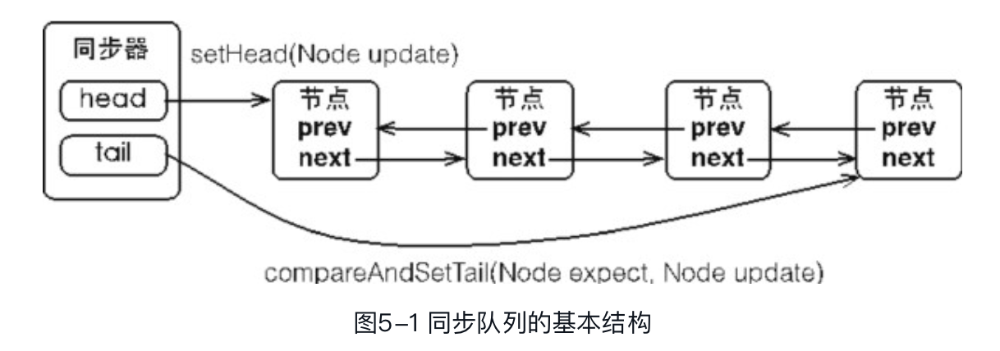

==**如何确保传入队尾操作的安全性？**==当一个线程成功地获取了同步状态（或者锁），其他线程将无法获取到同步状态，转而被构造成为节点并加入到同步队列中，而这个加入队列的过程必须要保证线程安全，因此同步器提供了一个基于CAS的设置尾节点的方法：compareAndSetTail，它需要传递当前线程**“认为”的尾节点**和**当前节点**，只有设置成功后，当前节点才正式与之前的尾节点建立关联。

```java
//会将当前“认为”的尾节点和当前真实的尾节点进行CAS操作
private final boolean compareAndSetTail(Node expect, Node update) {
    return unsafe.compareAndSwapObject(this, tailOffset, expect, update);
}
```

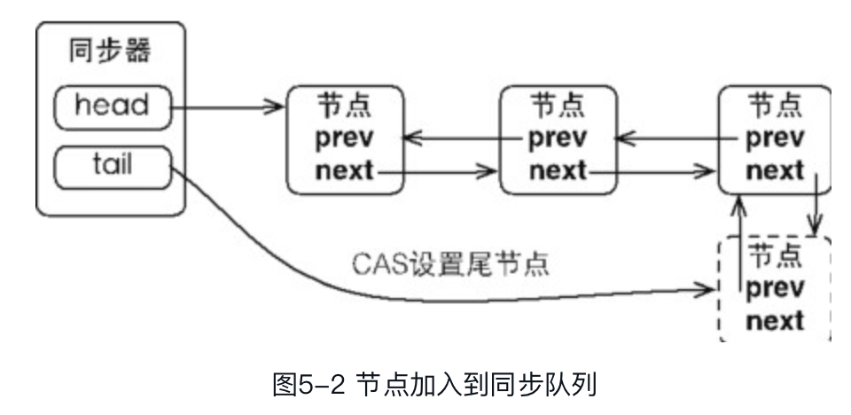

同步队列遵循FIFO，**首节点是获取同步状态成功的节点**，**首节点的线程在释放同步状态时，将会唤醒后继节点，而后继节点将会在获取同步状态成功时将自己设置为首节点**。**设置首节点是通过获取同步状态成功的线程来完成的，由于只有一个线程能够成功获取到同步状态，因此设置头节点的方法并不需要使用CAS来保证**，它只需要将首节点设置成为原首节点的后继节点并断开原首节点的next引用即可。

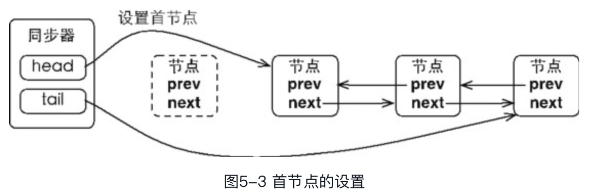

### **2.2.3 独占式同步状态获取与释放**

**acquire(int arg)**方法可以获取同步状态，**该方法对不会响应中断**，也就是由于**线程获取同步状态失败后进入同步队列中，后续对线程进行中断操作时，线程不会从同步队列中移出**。

```java
public final void acquire(int arg) {
    if (!tryAcquire(arg) && acquireQueued(addWaiter(Node.EXCLUSIVE), arg))
        selfInterrupt();
}

//模版方法，需要继承类自己实现。保证线程安全的获取同步状态
protected boolean tryAcquire(int arg) {
    throw new UnsupportedOperationException();
}

final boolean acquireQueued(final Node node, int arg) {
    boolean failed = true;
    try {
        boolean interrupted = false;
        for (;;) {
            final Node p = node.predecessor();
            if (p == head && tryAcquire(arg)) {
                setHead(node);
                p.next = null; // help GC
                failed = false;
                return interrupted;
            }
            if (shouldParkAfterFailedAcquire(p, node) &&
                parkAndCheckInterrupt())
                interrupted = true;
        }
    } finally {
        if (failed)
            cancelAcquire(node);
    }
}

static void selfInterrupt() {
    Thread.currentThread().interrupt();
}
```

### **2.2.4 共享式同步状态的获取和释放**

共享模式同步状态的获取

```java
//以共享模式获取同步状态
public final void acquireShared(int arg) {
    if (tryAcquireShared(arg) < 0)
        doAcquireShared(arg);
}

private void doAcquireShared(int arg) {
    final Node node = addWaiter(Node.SHARED);
    boolean failed = true;
    try {
        boolean interrupted = false;
        for (;;) {
            final Node p = node.predecessor();
            if (p == head) {
                int r = tryAcquireShared(arg);
                if (r >= 0) {
                    setHeadAndPropagate(node, r);
                    p.next = null; // help GC
                    if (interrupted)
                        selfInterrupt();
                    failed = false;
                    return;
                }
            }
            if (shouldParkAfterFailedAcquire(p, node) &&
                parkAndCheckInterrupt())
                interrupted = true;
        }
    } finally {
        if (failed)
            cancelAcquire(node);
    }
}
```

**tryAcquireShared(int arg)**：共享模式尝试获取同步状态

- 返回负数：失败
- 返回0：如果在共享模式下获取成功但没有后续共享模式获取可以成功
- 返回正数：以共享模式获取成功并且随后的共享模式获取可能成功

  

**doAcquireShared(int arg)**：以共享模式获取同步状态

- 以自旋(无限循环)的形式不断的获取同步状态

- 如果当前节点的前驱节点是head头节点，则尝试获取同步状态

- - 如果成功获取到同步状态(头节点释放了同步状态)，设置当前节点为头节点，结束自旋

- 当前节点不是头节点的节点，将会不断的其前驱节点的等待状态是否为Signal，并且检查线程是否中断**【todo 】**


**共享模式同步状态的释放**：

```java
public final void acquireShared(int arg) {
    if (tryAcquireShared(arg) < 0)
        doAcquireShared(arg);
}

private void doAcquireShared(int arg) {
    final Node node = addWaiter(Node.SHARED);
    boolean failed = true;
    try {
        boolean interrupted = false;
        for (;;) {
            final Node p = node.predecessor();
            if (p == head) {
                int r = tryAcquireShared(arg);
                if (r >= 0) {
                    setHeadAndPropagate(node, r);
                    p.next = null; // help GC
                    if (interrupted)
                        selfInterrupt();
                    failed = false;
                    return;
                }
            }
            if (shouldParkAfterFailedAcquire(p, node) &&
                parkAndCheckInterrupt())
                interrupted = true;
        }
    } finally {
        if (failed)
            cancelAcquire(node);
    }
}
```

在释放同步状态之后，将会唤醒后续处于等待状态的节点。对于能够支持多个线程同时访问的并发组件，他和独占示主要区别在于：**释放必须确保同步释放同步状态(CAS)，因为释放同步状态的操作可能同时来自多个线程**。

2.2.3 等待队列


AQS还有个Condition的等待队列（等待condition条件队列，队列可以有多条）

condition状态只存在于等待队列中

## 2.2 Lock接口

​		一般来说，一个锁能够防止多个线程同时访问共享资源（但是有些锁可以允许多个线程并发的访问共享资源，比如读写锁）。Java SE 5之后，并发包中新增了Lock接口（以及相关实现类）用来实现锁功能，它提供了与synchronized关键字类似的同步功能，只是在使用时需要显式地获取和释放锁。虽然它缺少了（通过synchronized块或者方法所提供的）隐式获取释放锁的便捷性，**但是却拥有了锁获取与释放的可操作性、可中断的获取锁以及超时获取锁等多种synchronized关键字所不具备的同步特性**。

​		synchronized关键字将会隐式地获取锁，但是它将锁的获取和释放固化了，也就是先获取再释放。这种方式简化了同步的管理，可是扩展性没有显示的锁获取和释放来的好。Lock的使用也很简单，就如下面所示：


```java
ReentrantLock reentrantLock = new ReentrantLock();
reentrantLock.lock();
try{

}finally {
  reentrantLock.unlock();
}
```

------

==注意==： **不要将获取锁的过程写在try块中，因为如果在获取锁（自定义锁的实现）时发生了异常，异常抛出的同时，如果别的线程获取到锁，执行finally时也会导致锁无故释放**。

**【如果当前线程没有获取到这个锁，执行unlock()时，会抛出IllegalMonitorStateException异常】**

------

### **2.2.1 Lock和synchronized的区别**

- **尝试非阻塞的获取锁tryLock():**   当前线程尝试获取锁，结果立即返回。获取到了返回ture，反之返回false

- **获取锁时能响应中断lockInterruptibly()**：可中断的获取锁，当获取锁的线程被中断时，中断异常将会抛出，同时锁会被释放。

- **支持超时获取锁**。在指定的截止时间之前内获取锁。

  

### **2.2.3 LockAPI介绍**

​       Lock是个接口，它定义了锁获取和释放的基本操作，具体API如下：

```java
/**
* 获取锁，如果锁被其他线程占有，该线程将会处于休眠状态，直到获取锁为止
*/
void lock();

/**
* 获取锁，如果获取到了，立即返回
* 如果当前线程获取不到锁，将处于休眠状态，直到下面两个任意一件事件发生：
*     1.当前线程获取到锁了
*    2.其他线程中断了当前线程
*/
void lockInterruptibly() throws InterruptedException;

/**
* 尝试获取锁，能获取到立即返回true，反之返回false
*/
boolean tryLock();

/**
* 超时的获取锁，当前线程在一下3种情况下会返回：
*     1.当前线程在超时时间内获取到锁
*     2.当前在超时时间内被中断
*     3.超时时间结束，返回false
*/
boolean tryLock(long time, TimeUnit unit) throws InterruptedException;

/**释放锁*/
void unlock();

/** 获取等待通知组件，该组件和当前的锁绑定，当前线程只有获得了锁，才能调用该组件的wait方法，
*   调用后，当前线程会释放锁
*/
Condition newCondition();
```

------

备注：**tryLock()的一个经典的用法，这种用法确保到获取到锁时，一定能被释放。没有获取到锁时，也不用释放锁。**

```java
ReentrantLock lock = new ReentrantLock();
if(lock.tryLock()) {
    try{

    }finally {
        lock.unlock();
    }
}else {
    
}
```

------


## 2.3 重入锁

​		重入锁ReentrantLock，就是支持重进入的锁，它表示**该锁能够支持一个线程对资源的重复加锁**。除此之外，**该锁的还支持获取锁时的公平和非公平性选择**。synchronized关键字一样支持隐式的锁重进入。==在ReentrantLock中，同步状态表示锁被一个线程重复获取的次数==。

​		==公平模式和非公平模式？==   公平的获取锁，也就是等待时间最长的线程最优先获取锁，也可以说锁获取是顺序的，反之就是非公平的。**ReentrantLock默认是支持非公平模式锁的获取**。事实上，公平的锁机制往往没有非公平的效率高，但是，并不是任何场景都是以TPS作为唯一的指标，公平锁能够减少“饥饿”发生的概率，等待越久的请求越是能够得到优先满足。

------

疑问：为什么要支持锁重入，不支持又会怎么样？

​			试想这样一个场景：

------

### 如何实现重入性

​		重进入是指任意线程在获取到锁之后能够再次获取该锁而不会被锁所阻塞，该特性的实现需要解决以下两个问题。

- **线程再次获取锁**：锁需要去识别获取锁的线程是否为当前占据锁的线程，如果是，则再次成功获取。
- **锁的最终释放**：线程重复n次获取了锁，随后在第n次释放该锁后，其他线程能够获取到该锁。**锁的最终释放要求锁对于获取进行计数自增**，计数表示当前锁被重复获取的次数，而锁被释放时，计数自减，当计数等于0时表示锁已经成功释放。

### 非公平模式

下面以**非公平性（默认的）**实现为例，获取同步状态的代码如下：

```java
//非公平模式，尝试获取同锁(同步状态) 
final boolean nonfairTryAcquire(int acquires) {
     final Thread current = Thread.currentThread();
     int c = getState();
     //当前线程第一次获取锁成功(同步状态)，记录当前的线程
     if (c == 0) {
       if (compareAndSetState(0, acquires)) {
         setExclusiveOwnerThread(current);
         return true;
       }
     }
     //如果获取到锁成功的线程再一次来获取锁，同步状态自增+1，并返回true
     else if (current == getExclusiveOwnerThread()) {
       int nextc = c + acquires;
       if (nextc < 0) // overflow
         throw new Error("Maximum lock count exceeded");
       setState(nextc);
       return true;
     }
     return false;
 }
```

非公平模式释放锁，**如果该锁被获取了n次，那么前(n-1)次tryRelease(int releases)方法必须返回false，而只有同步状态完全释放了，才能返回true**。

```java
//非公平模式，尝试释放锁(同步状态)
protected final boolean tryRelease(int releases) {
    //同步状态自减操作(-1)
    int c = getState() - releases;
    if (Thread.currentThread() != getExclusiveOwnerThread())
      	throw new IllegalMonitorStateException();
    boolean free = false;
    //前n-1次都返回false,直到减为0时，才释放同步状态,并将占有线程设置为null
    if (c == 0) {
      free = true;
      setExclusiveOwnerThread(null);
    }
    setState(c);
    return free;
}
```

### 公平模式

公平模式的获取锁，锁的获取顺序就应该符合请求的绝对时间顺序，也就是FIFO。

```java
protected final boolean tryAcquire(int acquires) {
    final Thread current = Thread.currentThread();
    int c = getState();
    if (c == 0) {
        //加入了同步队列中的当前节点是否有前驱节点，如果该方法返回true，则表示有线程比当前线程更早地请求获取锁，
        //需等待前驱线程获取并释放锁之后才能继续获取锁
        if (!hasQueuedPredecessors() && compareAndSetState(0, acquires)) {
            setExclusiveOwnerThread(current);
            return true;
        }
    }
    else if (current == getExclusiveOwnerThread()) {
        int nextc = c + acquires;
        if (nextc < 0)
            throw new Error("Maximum lock count exceeded");
        setState(nextc);
        return true;
    }
    return false;
}
```

### Coding 测试【todo】


## 2.4 读写锁 

接下来分析ReentrantReadWriteLock的实现，主要包括：读写状态的设计、写锁的获取与释放、读锁的获取与释放以及锁降级

### 2.4.1 读写状态的设计

​		ReentrantLock中自定义同步器的实现，同步状态表示锁被一个线程重复获取的次数。而**读写锁**的自定义同步器**需要在同步状态（一个整型变量）上维护多个读线程和一个写线程的状态**。如果在一个整型变量上维护多种状态，就一定需要“**按位切割使用**”这个变量，==**读写锁将变量切分成了两个部分，高16位表示读，低16位表示写**==。

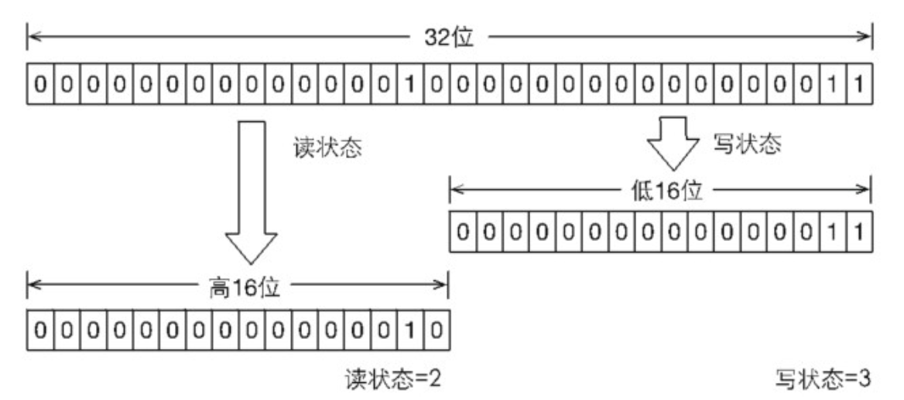

​		如上图，表示一个线程已经获取了写锁，且重进入了两次，同时也连续获取了两次读锁。==**写锁是如何迅速确定读和写各自的状态呢？**==  通过位运算，假设当前同步状态值为S，写状态等于S&0x0000FFFF（将高16位全部抹去），读状态等于S>>>16（无符号补0右移16位）。当写状态增加1时，等于S+1，当读状态增加1时，等于S+(1<<16)，也就是S+0x00010000。所以，当**S不等于0时，当写状态（S & 0x0000FFFF）等于0时，则读状态（S>>>16）大于0，即读锁已被获取。**

### 2.4.2 写锁的获取和释放

​		写锁是一个支持重进入的排它锁。当前线程重入的获取写锁，则增加锁的同步状态；如果读锁已经被获取（读状态不为0）或者该线程不是已经获取写锁的线程，则当前线程进入等待状态。

```java
/**
* 1.读状态不为0(其他线程已获取读锁)，或者写状态不为0但不是当前的线程，return false
* 2.如果同步状态数值溢出(2^16-1=65535)，return false
*/
protected final boolean tryAcquire(int acquires) {
     Thread current = Thread.currentThread();
     int c = getState();
     //计算写状态
     int w = exclusiveCount(c);
     if (c != 0) {
       // (Note: if c != 0 and w == 0 then shared count != 0)
       if (w == 0 || current != getExclusiveOwnerThread())
         return false;
       //判断同步状态是否溢出（是否大于65535）
       if (w + exclusiveCount(acquires) > MAX_COUNT)
         throw new Error("Maximum lock count exceeded");
       // 可重入的获取锁，同步状态自增
       setState(c + acquires);
       return true;
     }
  
  	 // 只有当前线程的写操作允许(不允许别的线程写)，并已CAS的方式设置同步状态(因为支持锁重入，当前线程可能并发的设置同步状态)
     if (writerShouldBlock() || !compareAndSetState(c, c + acquires))
       		return false;
     setExclusiveOwnerThread(current);
     return true;
 }
```

​		写锁的释放与ReentrantLock的释放过程基本类似，每次释放均减少写状态，当写状态为0时表示写锁已被释放，从而等待的读写线程能够继续访问读写锁，同时前次写线程的修改对后续读写线程可见。

```java
protected final boolean tryRelease(int releases) {
            if (!isHeldExclusively())
                throw new IllegalMonitorStateException();
            int nextc = getState() - releases;
            boolean free = exclusiveCount(nextc) == 0;
            if (free)
                setExclusiveOwnerThread(null);
            setState(nextc);
            return free;
        }
```

### 2.4.3 读锁的获取和释放

​		读锁是一个支持重进入的共享锁，它能够被多个线程同时获取，在没有其他写线程访问时，读锁总会被成功地获取，而所做的也只是（线程安全的）增加读状态(CAS)。如果当前线程在获取读锁时，写锁已被其他线程获取，则进入等待状态。**读状态是所有线程获取读锁次数的总和，而每个线程各自获取读锁的次数只能选择保存在ThreadLocal中，由线程自身维护**。

```java
 protected final int tryAcquireShared(int unused) {
     Thread current = Thread.currentThread();
     int c = getState();
     if (exclusiveCount(c) != 0 &&
         getExclusiveOwnerThread() != current)
       return -1;
     int r = sharedCount(c);
     if (!readerShouldBlock() &&
         r < MAX_COUNT &&
         compareAndSetState(c, c + SHARED_UNIT)) {
       if (r == 0) {
         firstReader = current;
         firstReaderHoldCount = 1;
       } else if (firstReader == current) {
         firstReaderHoldCount++;
       } else {
         HoldCounter rh = cachedHoldCounter;
         if (rh == null || rh.tid != getThreadId(current))
           cachedHoldCounter = rh = readHolds.get();
         else if (rh.count == 0)
           readHolds.set(rh);
         rh.count++;
       }
       return 1;
     }
     return fullTryAcquireShared(current);
 }
```

锁的每次释放（线程安全的，可能有多个读线程同时释放读锁）均减少读状态，减少的值是(1<<16)。

```java
protected final boolean tryReleaseShared(int unused) {
            Thread current = Thread.currentThread();
            if (firstReader == current) {
                // assert firstReaderHoldCount > 0;
                if (firstReaderHoldCount == 1)
                    firstReader = null;
                else
                    firstReaderHoldCount--;
            } else {
                HoldCounter rh = cachedHoldCounter;
                if (rh == null || rh.tid != getThreadId(current))
                    rh = readHolds.get();
                int count = rh.count;
                if (count <= 1) {
                    readHolds.remove();
                    if (count <= 0)
                        throw unmatchedUnlockException();
                }
                --rh.count;
            }
            for (;;) {
                int c = getState();
                int nextc = c - SHARED_UNIT;
                if (compareAndSetState(c, nextc))
                    // Releasing the read lock has no effect on readers,
                    // but it may allow waiting writers to proceed if
                    // both read and write locks are now free.
                    return nextc == 0;
            }
        }
```


### 2.4.4 锁降级

​		锁降级指的是**写锁降级成为读锁**，如果当前线程拥有写锁，然后将其释放，最后再获取读锁，这种分段完成的过程不能称之为锁降级。==锁降级==是指**把持住（当前拥有的）写锁，再获取到读锁，随后释放（先前拥有的）写锁的过程（当前线程获取到写锁，操作完之后，有获取到读锁的过程）**。下面有个演示的Demo:


​		上述示例中，当数据发生变更后，update变量（布尔类型且volatile修饰）被设置为false，此时所有访问processData()方法的线程都能够感知到变化，但只有一个线程能够获取到写锁，其他线程会被阻塞在读锁和写锁的lock()方法上。当前线程获取写锁完成数据准备之后，再获取读锁，随后释放写锁，完成锁降级。

​		**锁降级中读锁的获取是否必要呢？**答案是必要的。主要是为了保证数据的可见性，如果当前线程不获取读锁而是直接释放写锁，假设此刻另一个线程（记作线程T）获取了写锁并修改了数据，那么当前线程无法感知线程T的数据更新。如果当前线程获取读锁，即遵循锁降级的步骤，则线程T将会被阻塞，直到当前线程使用数据并释放读锁之后，线程T才能获取写锁进行数据更新。

​		**RentrantReadWriteLock不支持锁升级（把持读锁、获取写锁，最后释放读锁的过程）**。**目的也是保证数据可见性，如果读锁已被多个线程获取，其中任意线程成功获取了写锁并更新了数据，则其更新对其他获取到读锁的线程是不可见的。**

## 2.5 LockSupport工具

​		LockSupport工具类定义了一组的公共静态方法，这些方法提供了最基本的线程阻塞和唤醒功能。而LockSupport也成为构建同步组件的基础工具。	LockSupport定义了一组以park开头的方法用来阻塞当前线程，以及unpark(Thread thread)方法来唤醒一个被阻塞的线程。

```java
//阻塞当前线程
void park(Object blocker)

//阻塞当前线程，最长不超过nanos纳秒
void parkNanos(Object blocker, long nanos) 
  
//阻塞当前线程，知道deadline时间
void parkUntil(Object blocker, long deadline) 

//唤醒处于阻塞状态的线程
void unpark(Thread thread) 
```

其中参数blocker是用来标识当前线程在等待的对象（以下称为阻塞对象），该对象主要用于问题排查和系统监控

## 2.6 Condition接口

​		任意一个Java对象，都拥有一组监视器方法（定义在java.lang.Object上），主要包括`wait()`、`wait(longtimeout)`、`notify()`以及`notifyAll()`方法，这些方法与`synchronized`同步关键字配合，可以实现**等待/通知模式**。**Condition接口也提供了类似Object的监视器方法，与Lock配合可以实现等待/通知模式**，但是这两者在使用方式以及功能特性上还是有差别的。

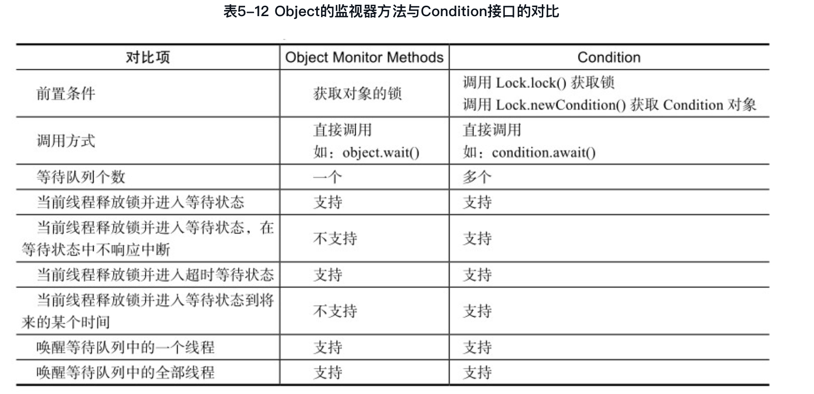

​		Condition定义了等待/通知两种类型的方法，**当前线程调用这些方法时，需要提前获取到Condition对象关联的锁**。Condition对象是由Lock对象（调用Lock对象的newCondition()方法）创建出来的，换句话说，Condition是依赖Lock对象的。

​		获取一个Condition必须通过Lock的`newCondition()`方法。下面通过一个有界队列的示例来深入了解Condition的使用方式。==有界队列==是一种特殊的队列，**当队列为空时，队列的获取操作将会阻塞获取线程，直到队列中有新增元素，当队列已满时，队列的插入操作将会阻塞插入线程，直到队列出现“空位”**，如代码所示。

```java
//condition实现有界队列

```

### 2.6.1 Condition实现分析


### 2.6.2 Demo演示

​		下面一个例子来介绍一下condition的使用，同时串一下上面讲的内容，首先看demo:

```java
//模拟线程A等待某个condition场景
public class ConditionWait implements Runnable {
    private Lock lock;
    private Condition condition;

    public ConditionWait(Lock lock, Condition condition) {
        this.lock = lock;
        this.condition = condition;
    }

    @Override
    public void run() {
        //获取锁
        lock.lock();
        try {
            try {
                System.out.println("begin - ConditionWait");
                //等待某个条件，进入等待队列
                condition.await();
                System.out.println("end - ConditionWait");
            } catch (InterruptedException e) {
                e.printStackTrace();
            }
        }finally {
            //释放锁
            lock.unlock();
        }
    }
}

//模拟线程B通知等待conditon条件的线程A
public class ConditionNotify implements Runnable {
    private Lock lock;
    private Condition condition;

    public ConditionNotify(Lock lock, Condition condition) {
        this.lock = lock;
        this.condition = condition;
    }

    @Override
    public void run() {
        //获取锁
        lock.lock();
        try {
            System.out.println("begin - ConditionNotify");
            //从等待队列中唤醒等待的线程（将会进入到同步队列，再次争夺锁）
            condition.signal();
            System.out.println("end - ConditionNotify");
        }finally {
            //释放锁
            lock.unlock();
        }
    }
}

//测试主方法
public class ConditionDemo {
    public static void main(String[] args) {
        Lock lock = new ReentrantLock();
        Condition condition = lock.newCondition();

        //
        new Thread(new ConditionWait(lock, condition),"conditionWaitThread").start();

        new Thread(new ConditionNotify(lock, condition), "conditionNotifyThread").start();

    }
}

```

程序输出结果：

```
begin - ConditionWait
begin - ConditionNotify
end - ConditionNotify
end - ConditionWait
```


------

==**TIP：Condition使用时需要注意在调用方法前获取锁**==

------


# 3.Java并发容器和框架

## 3.1 CurrentHashMap


## 3.2 阻塞队列

阻塞队列（BlockingQueue）是一个支持两个附加操作的队列。这两个附加的操作**支持阻塞的插入和移除方法**。

1. 支持阻塞的插入方法：意思是当队列满时，队列会阻塞插入元素的线程，直到队列不满。
2. 支持阻塞的移除方法：意思是在队列为空时，获取元素的线程会等待队列变为非空。

阻塞队列**常用于生产者和消费者的场景**，生产者是向队列里添加元素的线程，消费者是从队列里取元素的线程。**阻塞队列就是生产者用来存放元素、消费者用来获取元素的容器**。

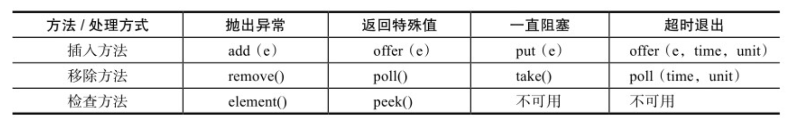

- 抛出异常：当队列满时，如果再往队列里插入元素，会抛出IllegalStateException （"Queue full"）异常。当队列空时，从队列里获取元素会抛出NoSuchElementException异常。
- 返回特殊值：当往队列插入元素时，会返回元素是否插入成功，成功返回true。如果是移除方法，则是从队列里取出一个元素，如果没有则返回null。
- 一直阻塞：当阻塞队列满时，如果生产者线程往队列里put元素，队列会一直阻塞生产者线程，直到队列可用或者响应中断退出。当队列空时，如果消费者线程从队列里take元素，队列会阻塞住消费者线程，直到队列不为空。
-  超时退出：当阻塞队列满时，如果生产者线程往队列里插入元素，队列会阻塞生产者线程一段时间，如果超过了指定的时间，生产者线程就会退出。

### 3.2.1 Java中的阻塞队列

​    JDK 7提供了7个阻塞队列，如下。

- ArrayBlockingQueue：一个由数组结构组成的有界阻塞队列。
-  LinkedBlockingQueue：一个由链表结构组成的有界阻塞队列。
-  PriorityBlockingQueue：一个支持优先级排序的无界阻塞队列。
- DelayQueue：一个使用优先级队列实现的无界阻塞队列。
-  SynchronousQueue：一个不存储元素的阻塞队列。
-  LinkedTransferQueue：一个由链表结构组成的无界阻塞队列。
- LinkedBlockingDeque：一个由链表结构组成的双向阻塞队列。

#### 1.ArrayBlockingQueue

​		ArrayBlockingQueue是一个用==**数组**==实现的有界阻塞队列。此队列按照**先进先出（FIFO）**的原则对元素进行排序。

​		==**默认情况下不保证线程公平**==的访问队列，所谓公平访问队列是指阻塞的线程，可以按照阻塞的先后顺序访问队列，即先阻塞线程先访问队列。非公平性是对先等待的线程是非公平的，当队列可用时，阻塞的线程都可以争夺访问队列的资格，有可能先阻塞的线程最后才访问队列。为了保证公平性，通常会降低吞吐量。

```java
//以公平的方式创建一个ArrayBlockingQueue 
ArrayBlockingQueue<Integer> integers = new ArrayBlockingQueue<Integer>(100,true);

//其底层是通过可重入锁来保证公平与非公平
public ArrayBlockingQueue(int capacity, boolean fair) {
    if (capacity <= 0)
      throw new IllegalArgumentException();
    this.items = new Object[capacity];
    lock = new ReentrantLock(fair);
    notEmpty = lock.newCondition();
    notFull =  lock.newCondition();
}
```

#### 2.LinkedBlockingQueue

​		`LinkedBlockingQueue`是一个用**链表**实现的有界阻塞队列。此队列的默认和最大长度为Integer.MAX_VALUE。**此队列按照先进先出(FIFO)的原则对元素进行排序**。

#### 3.PriorityBlockingQueue

​		`PriorityBlockingQueue`是一个支持优先级的无界阻塞队列。**默认情况下元素采用自然顺序升序排列**。也可以自定义类实现`compareTo()`方法来指定元素排序规则，或者初始化PriorityBlockingQueue时，指定构造参数Comparator来对元素进行排序。**需要注意的是不能保证同优先级元素的顺序**。

#### 4.DelayQueue

​		DelayQueue是一个**支持延时获取元素的无界阻塞队列**。队列使用PriorityQueue来实现。队列中的元素必须实现Delayed接口，**在创建元素时可以指定多久才能从队列中获取当前元素。只有在延迟期满时才能从队列中提取元素**。DelayQueue非常有用，可以将DelayQueue运用在以下应用场景：

- **缓存系统的设计**：可以用DelayQueue保存缓存元素的有效期，使用一个线程循环查询DelayQueue，一旦能从DelayQueue中获取元素时，表示缓存有效期到了。
- **定时任务调度**：使用DelayQueue保存当天将会执行的任务和执行时间，一旦从DelayQueue中获取到任务就开始执行，比如TimerQueue就是使用DelayQueue实现的。

#### 5. SynchronousQueue

​		SynchronousQueue是一个**不存储元素的阻塞队列**。**每一个put操作必须等待一个take操作，否则不能继续添加元素**。它支持公平访问队列。**默认情况下线程采用非公平性策略访问队列**。使用以下构造方法可以创建公平性访问的SynchronousQueue，如果设置为true，则等待的线程会采用先进先出的顺序访问队列。

```java
public SynchronousQueue(boolean fair) {
		transferer = fair ? new TransferQueue<E>() : new TransferStack<E>();
}
```

​		**SynchronousQueue可以看成是一个传球手，负责把生产者线程处理的数据直接传递给消费者线程。队列本身并不存储任何元素，非常适合传递性场景**。SynchronousQueue的吞吐量高于LinkedBlockingQueue和ArrayBlockingQueue。

#### 6.LinkedTransferQueue

​		LinkedTransferQueue是一个由**链表**结构组成的**无界阻塞**TransferQueue队列。相对于其他阻塞队列，LinkedTransferQueue多了tryTransfer和transfer方法。

**（1）transfer方法**

​		如果当前有消费者正在等待接受元素（消费者使用take()方法或带时间限制的poll()方法时），transfer方法可以把生产者传入的元素立刻transfer（传输）给消费者。如果没有消费者在等待接收元素，transfer方法会将元素存放在队列的tail节点，并等到该元素被消费者消费了才返回。

**（2）tryTransfer方法**

​		tryTransfer方法是**用来试探生产者传入的元素是否能直接传给消费者**。如果没有消费者等待接收元素，则返回false。**和transfer方法的区别**是：tr**yTransfer方法无论消费者是否接收，方法立即返回，而transfer方法是必须等到消费者消费了才返回**。

​		对于带有时间限制的tryTransfer（E e，long timeout，TimeUnit unit）方法，试图把生产者传入的元素直接传给消费者，但是如果没有消费者消费该元素则等待指定的时间再返回，如果超时还没消费元素，则返回false，如果在超时时间内消费了元素，则返回true。

#### 7. LinkedBlockingDeque

​		`LinkedBlockingDeque`是一个由链表结构组成的**双向阻塞队列**。所谓双向队列指的是可以从队列的两端插入和移出元素。双向队列因为多了一个操作队列的入口，在多线程同时入队时，也就减少了一半的竞争。相比其他的阻塞队列，LinkedBlockingDeque多了addFirst、addLast、offerFirst、offerLast、peekFirst和peekLast等方法，以First单词结尾的方法，表示插入、获取（peek）或移除双端队列的第一个元素。以Last单词结尾的方法，表示插入、获取或移除双端队列的最后一个元素。另外，插入方法add等同于addLast，移除方法remove等效于removeFirst。但是take方法却等同于takeFirst，不知道是不是JDK的bug，使用时还是用带有First和Last后缀的方法更清楚。

​		在初始化`LinkedBlockingDeque`时可以设置容量防止其过度膨胀。另外，双向阻塞队列可以运用在“工作窃取”模式中。

### 3.2.2 阻塞队列的实现原理

​	当生产者添加元素时，消费者是如何知道当前队列有元素的呢？阻塞队列使用**通知模式**实现。就是当生产者往满的队列里添加元素时会阻塞住生产者，当消费者消费了一个队列中的元素后，会通知生产者当前队列可用。底层也是通过`Conditon`来实现的，下面以ArrayBlockingQueue为例，看起底层实现细节：

```java
final ReentrantLock lock;

/** Condition for waiting takes */
private final Condition notEmpty;

/** Condition for waiting puts */
private final Condition notFull;
```


## 3.3 Fork/Join框架

### 3.3.1 什么是Fork/Join思想

​		Fork/Join框架是一个用于并行执行任务的框架，是一个把大任务分割成若干个小任务，最终汇总每个小任务结果后得到大任务结果的框架（归并的思想）。**Fork就是把一个大任务切分为若干子任务并行的执行，Join就是合并这些子任务的执行结果，最后得到这个大任务的结果**。

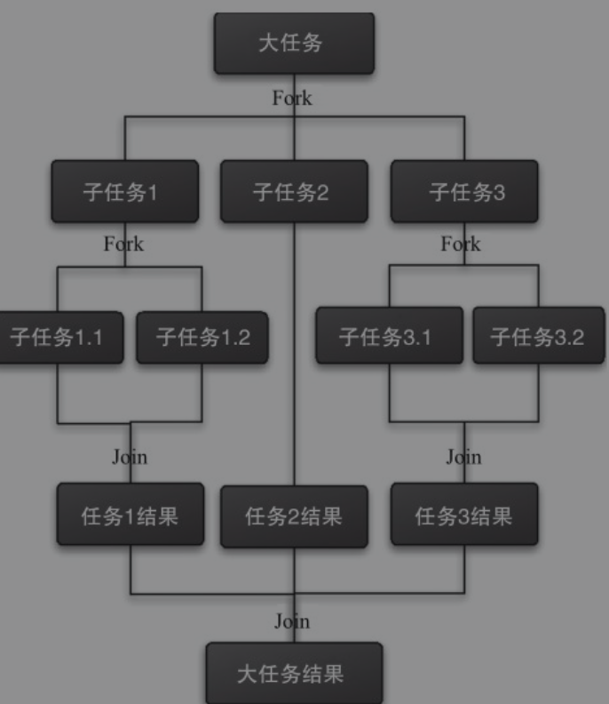

### 3.3.2 什么是工作窃取算法

​		**工作窃取算法是指某个线程从其他队列里窃取任务来执行**。什么场景下需要使用工作窃取模式呢？假如需要完成一个比较大的任务，可以把这个任务分割为若干互不依赖的子任务，将不同的子任务分别放到不同的队列中，每个队列有单独的线程执行队列中的任务（为了减少线程间的竞争）。但是，有的线程会先把自己队列里的任务干完，干完活的线程与其等着，不如去帮其他线程干活，于是它就去其他线程的队列里窃取一个任务来执行。

​		**如何减少窃取任务线程和被窃取任务线程之间的竞争？**。通常会使用双端队列，被窃取任务线程永远从双端队列的头部拿任务执行，而窃取任务的线程永远从双端队列的尾部拿任务执行。

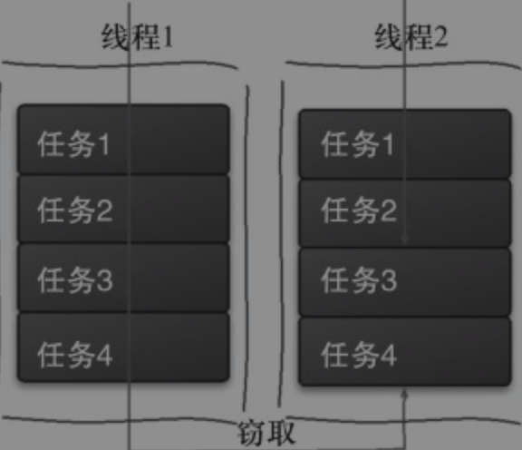

工作窃取的优点：

- 充分利用线程进行并行计算，减少了线程间的竞争

工作窃取的缺点：

- 在某些情况下还是存在竞争，比如双端队列里只有一个任务时。
- 该算法会消耗了更多的系统资源，比如创建多个线程和多个双端队列

### 3.3.3 Fork/join的设计思路

**步骤1: 拆分子任务**。需要有一个fork类来把大任务分割成子任务，有可能子任务还是很大，所以还需要不停地分割，直到分割出的子任务足够小，分割的子任务分别放在双端队列里。

**步骤2：执行子任务并被合并结果。**启动几个线程分别从双端队列里获取任务执行。子任务执行完的结果都统一放在一个队列里，启动一个合并结果线程从队列里拿数据，然后合并这些数据。

Fork/Join使用两个类来完成以上两件事情：

**1.ForkJoinTask**：首先需要创建一个ForkJoin任务，它提供在任务中执行fork()和join()操作的机制。不需要直接继承ForkJoinTask类，只需要继承它的子类，Fork/Join框架提供了以下两个子类。

- **RecursiveAction**：用于没有返回结果的任务。
- **RecursiveTask**：用于有返回结果的任务。

**2.ForkJoinPool**：ForkJoinPool来执行子任务。

任务分割出的子任务会添加到当前工作线程所维护的双端队列中，进入队列的头部。当一个工作线程的队列里暂时没有任务时，它会随机从其他工作线程的队列的尾部获取一个任务

​		下面通过计算1+2+3...+100来展示Fork/Join的使用。方法继承RecursiveTask实现了其computer()方法，在这个方法里，首先需要判断任务是否足够小，如果足够小就直接执行任务。如果不足够小，就必须分割成两个子任务，每个子任务在调用fork方法时，又会进入compute方法，看看当前子任务是否需要继续分割成子任务，如果不需要继续分割，则执行当前子任务并返回结果。使用join方法会等待子任务执行完并得到其结果

```java
/**
 * 使用fork/join框架，计算1+2+3...+100
 * -因为每次拆后是有返回值的，所及需要继承RecursiveTask
 *
 * @author machen
 */
public class ForkJoinDemo extends RecursiveTask<Integer> {
    /**
     * 拆分的每个子任务的大小(每10个的相加)
     */
    private final Integer THRESHOLD = 10;

    private Integer start;
    private Integer end;

    public ForkJoinDemo(Integer start, Integer end) {
        this.start = start;
        this.end = end;
    }

    /**
     * 使用归并的思想实现计算逻辑
     *
     * @return the result of the computation
     */
    @Override
    protected Integer compute() {
        //记录子任务的结果
        int sum = 0;
        //子任务大小如果满足阀值，则进行计算逻辑；不满足则继续进行拆分
        if ((end - start) <= THRESHOLD) {
            for (int i = start; i <= end; i++) {
                sum += i;
            }
        } else {
            //继续拆分子任务
            int middle = (start + end) / 2;
            ForkJoinDemo leftFork = new ForkJoinDemo(start, middle);
            ForkJoinDemo rightFork = new ForkJoinDemo(middle + 1, end);

            //执行子任务
            leftFork.fork();
            rightFork.fork();

            //获取子任务的执行结果
            Integer leftJoinResult = leftFork.join();
            Integer rightJoinResult = rightFork.join();

            //合并子任务的结果
            sum = leftJoinResult + rightJoinResult;
        }
        return sum;
    }

    public static void main(String[] args) {
        ForkJoinPool forkJoinPool = new ForkJoinPool();
        System.out.println("poolSize: " + forkJoinPool.getPoolSize());

        //执行任务
        ForkJoinDemo forkJoinDemo = new ForkJoinDemo(1, 100);
        ForkJoinTask<Integer> submit = forkJoinPool.submit(forkJoinDemo);
        try {
          //在执行的时候可能会抛出异常，但是我们没办法在主线程里直接捕获异常
          //isCompletedAbnormally()方法来检查任务是否已经抛出异常或已经被取消了
           if(submit.isCompletedAbnormally()) {
            		//isCompletedAbnormally()方法来检查任务是否已经抛出异常或已经被取消了
                System.out.println("error:"+ submit.getException());
            }
            System.out.println(submit.get());
        } catch (InterruptedException e) {
            e.printStackTrace();
        } catch (ExecutionException e) {
            e.printStackTrace();
        }
    }
}
```

### 3.3.4 Fork/Join的实现原理【todo】


# 4. Java并发工具类

## 4.1 CountDownLatch 等待多线程完成

==**CountDownLatch： 允许一个或多个线程等待其他线程完成操作。**==

​		在日常开发中经常会遇到需要**在主线程中开启多个线程去并行执行任务**，并且**主线程需要等待所有子线程执行完毕后再进行汇总的场景**。在CountDownLatch出现之前一般都使用线程的**join（）**方法来实现这一点，但是**join方法不够灵活，不能够满足不同场景的需要**，所以JDK开发组提供了CountDownLatch这个类，我们前面介绍的例子使用CountDownLatch会更优雅。

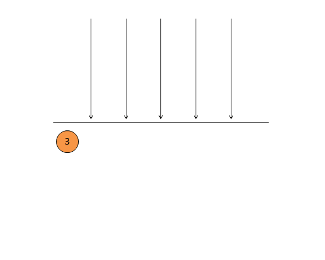

​		假如我们要解析一个excel，一个excel可能有多个sheet，所有主线程中开辟多个子线程去解析不同的sheet，个个子线程执行完毕后，主线程在做最后的处理，这里就需要主线程等待所有子线程执行完毕。下面通过`join()`来演示这个过程：

```java
public static void main(String[] args) throws InterruptedException {
        Thread thread1 = new Thread(()->{
            System.out.println("thread1 parse1 sheet1");
        });

        Thread thread2 = new Thread(()->{
            System.out.println("thread2 parse2 sheet2");
        });

        thread1.start();
        thread2.start();
        thread1.join();
        thread2.join();

        System.out.println("主线程解析excel完成");
    }
```

------

**join()的实现原理**：

​		其实现原理是不停检查join线程是否存活，如果join线程存活则让当前线程永远等待。其中，wait（0）表示永远等待下去。直到join线程中止后，线程的this.notifyAll()方法会被调用，调用notifyAll()方法是在JVM里实现的，所以在JDK里看不到

```java
while (isAlive()) {
  	wait(0);
}
```

------

### 4.1.1 操作指南

- **new CountDownLatch(int count);**

  创建`CountDownLatch`对象，初始化同步状态数量。注意：如果初始化的数量大实际的数量，主线程将会一直处于等待状态。

-  **countDownLatch.countDown();**

  子线程每次完成任务后执行`countDown()`方法，同步状态将会减1，直到减为0，主线程将会被唤醒。

- **countDownLatch.await()**

  主线程执行`awai()`方法将会一直处于等待状态，直到同步状态为0是，才会被唤醒。

### 4.1.2 实现原理【todo】


## 4.2 回环屏障CyclicBarrier

**==CyclicBarrier==: 成为回环屏障，它可以让一组线程全部达到一个状态后再全部同时执行。之所以叫作回环是因为当所有等待线程执行完毕，并重置CyclicBarrier的状态后它可以被重用；之所以叫作屏障是因为线程调用await方法后就会被阻塞，这个阻塞点就称为屏障点，等所有线程都调用了await方法后，线程们就会冲破屏障，继续向下运行。**


### 4.2.1 操作指南

```java
//其参数表示屏障拦截的线程数量
CyclicBarrier(int parties)
 
//创建一个新的 CyclicBarrier，它将在给定数量的参与者（线程）处于等待状态时启动，并在启动 barrier 时执行给定的屏障操作，该操作由最后一个进入 barrier 的线程执行。
CyclicBarrier(int parties, Runnable barrierAction)
 
//所有参与者调用await方法，将会一直等待。
int await()
 
//所有参与者调用await方法，将会一直等待。或者超出了指定的等待时间。
int await(long timeout, TimeUnit unit)
 
//返回当前在屏障处等待的参与者数目。
int getNumberWaiting()
 
//返回要求启动此 barrier 的参与者数目。
int getParties()
 
//查询此屏障是否处于损坏状态。
boolean isBroken()
 
//将屏障重置为其初始状态
void reset()
```


### 4.2.2 CyclicBarrier的应用场景

**场景1演示: 只有当多个线程都到达同一个功能点时，所有的线程才能继续执行。**

```java
public class CyclicBarrierDemo {
    private static CyclicBarrier cyclicBarrier = new CyclicBarrier(5);

    public static void main(String[] args) {
        for (int i = 0; i < 5; i++) {
            new InnerThread().start();
        }

    }
    static class InnerThread extends Thread{
        @Override
        public void run() {
            try {
                System.out.println(Thread.currentThread().getName() + " wait for CyclicBarrier.");

                // cout计数器减1，直到减到0
                cyclicBarrier.await();

                // cb的参与者数量等于5时，才继续往后执行
                System.out.println(Thread.currentThread().getName() + " continued.");
            } catch (BrokenBarrierException e) {
                e.printStackTrace();
            } catch (InterruptedException e) {
                e.printStackTrace();
            }
        }
    }
}

//输出
Thread-0 wait for CyclicBarrier.
Thread-1 wait for CyclicBarrier.
Thread-2 wait for CyclicBarrier.
Thread-3 wait for CyclicBarrier.
Thread-4 wait for CyclicBarrier.
Thread-4 continued.
Thread-0 continued.
Thread-1 continued.
Thread-2 continued.
Thread-3 continued.
```

### 

### 4.2.3 CyclicBarrier的实现原理【todo画图解析过程】

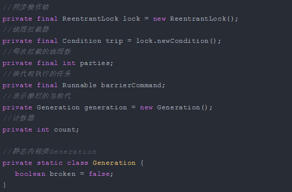

 	可以看到CyclicBarrier内部是通过**条件队列trip**来对线程进行阻塞的，并且其内部维护了两个int型的变量 `parties` 和` count` ，parties表示**每次拦截的线程数**，该值在构造时进行赋值。count是**内部计数器**，**它的初始值和parties相同，以后随着每次await方法的调用而减1，直到减为0就将所有线程唤醒**。 

​    在CyclicBarrier中，同一批的线程属于同一代，即同一个`Generation`，该类的对象代表栅栏的当前代，就像玩游戏时代表的本局游戏，**利用它可以实现循环等待**。**当有parties个线程到达barrier，generation就会被更新换代。**

​    `barrierCommand`表示**换代前执行的任务**，**当count减为0时表示本局游戏结束，需要转到下一局。在转到下一局游戏之前会将所有阻塞的线程唤醒**，在唤醒所有线程之前你可以通过指定barrierCommand来执行自己的任务。


核心方法`awit()`解析

```java
//wait()方法内部调用的是dowait()方法
private int dowait(boolean timed, long nanos)
    throws InterruptedException, BrokenBarrierException,
           TimeoutException {
 
    final ReentrantLock lock = this.lock;
    // 获取“独占锁(lock)”
    lock.lock();
    try {
        // 保存“当前的generation”
        final Generation g = generation;
 
        // 若“当前generation已损坏”，则抛出异常。
        if (g.broken)
            throw new BrokenBarrierException();
 
        // 如果当前线程被中断，则通过breakBarrier()终止CyclicBarrier，唤醒CyclicBarrier中所有等待线程。
        if (Thread.interrupted()) {
            breakBarrier();
            throw new InterruptedException();
        }
 
       // 将“count计数器”-1
       int index = --count;
       // 如果index=0，表示有parties个线程到达barrier。
       if (index == 0) {  // tripped
           boolean ranAction = false;
           try {
               // 如果barrierCommand不为null，则执行该动作。
               final Runnable command = barrierCommand;
               if (command != null)
                   command.run();
               ranAction = true;
               // 唤醒所有等待线程，并更新generation。
               nextGeneration();
               return 0;
           } finally {
               if (!ranAction)
                   breakBarrier();
           }
       }
 
        // 当前线程一直阻塞，直到有parties个线程到达barrier 或 当前线程被中断 或 超时这3者之一发生，
        // 当前线程才继续执行。
        for (;;) {
            try {
                // 如果不是“超时等待”，则调用awati()进行等待；否则，调用awaitNanos()进行等待。
                if (!timed)
                    trip.await();
                else if (nanos > 0L)
                    nanos = trip.awaitNanos(nanos);
            } catch (InterruptedException ie) {
                // 如果等待过程中，线程被中断，则执行下面的函数。
                if (g == generation && ! g.broken) {
                    breakBarrier();
                    throw ie;
                } else {
                    Thread.currentThread().interrupt();
                }
            }
 
            // 如果“当前generation已经损坏”，则抛出异常。
            if (g.broken)
                throw new BrokenBarrierException();
 
            // 如果“generation已经换代”，则返回index。
            if (g != generation)
                return index;
 
            // 如果是“超时等待”，并且时间已到，则通过breakBarrier()终止CyclicBarrier，唤醒CyclicBarrier中所有等待线程。
            if (timed && nanos <= 0L) {
                breakBarrier();
                throw new TimeoutException();
            }
        }
    } finally {
        // 释放“独占锁(lock)”
        lock.unlock();
    }
}
```


## 4.3 CyclicBarrier和CountDownLatch的区别 

-   **CountDownLatch的作用是允许1或N个线程等待其他线程完成执行；而CyclicBarrier则是允许N个线程相互等待**。
- **CountDownLatch的计数器无法被重置；CyclicBarrier的计数器可以被重置后使用，因此它被称为是循环的barrier**。

这两个类都可以实现一组线程在到达某个条件之前进行等待，它们内部都有一个计数器，当计数器的值不断的减为0的时候所有阻塞的线程将会被唤醒。


## 4.4 控制并发线程数的Semaphore


## 4.5 线程间交换数据的Exchanger


# 5. Java线程池

几乎所有需要异步或并发执行任务的程序都可以使用线程池，合理地使用线程池能够带来3个好处。

- **降低资源消耗**。通过重复利用已创建的线程降低线程创建和销毁造成的消耗。
- **提高响应速度**。当任务到达时，任务可以不需要等到线程创建就能立即执行
- **提高线程的可管理性**。线程是稀缺资源，如果无限制地创建，不仅会消耗系统资源，还会降低系统的稳定性，使用线程池可以进行统一分配、调优和监控。但是，要做到合理利用线程池，必须对其实现原理了如指掌。


## 5.1 线程池的实现原理

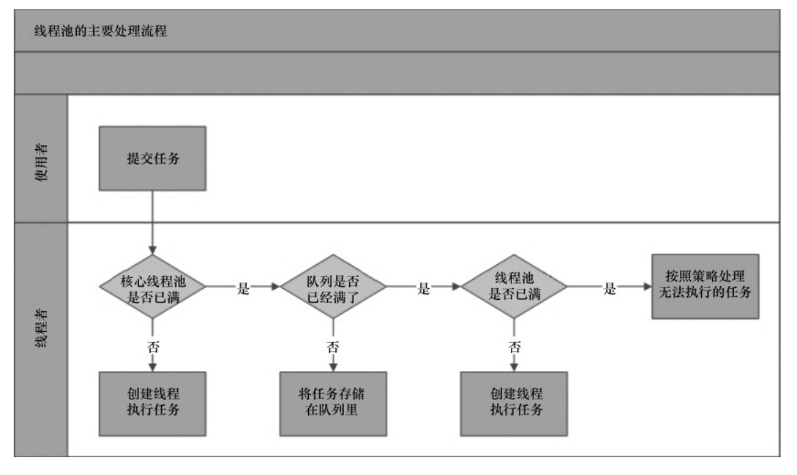

从图中可以看出，当提交一个新任务到线程池时，线程池的**主要处理流程**如下：

1. **线程池判断核心线程池是否已经满**。如果不是，则创建一个新的工作线程来执行任务。如果核心线程池里的线程都在执行任务，则进入下个流程
2. **核心线程池满了，判断工作队列是否已经满了**。如果工作队列没有满，则将新提交的任务添加到工作队列里。如果工作队列满了，则进入下个流程。
3. **如果工作队列也满了**，则交给饱和策略来处理这个任务。

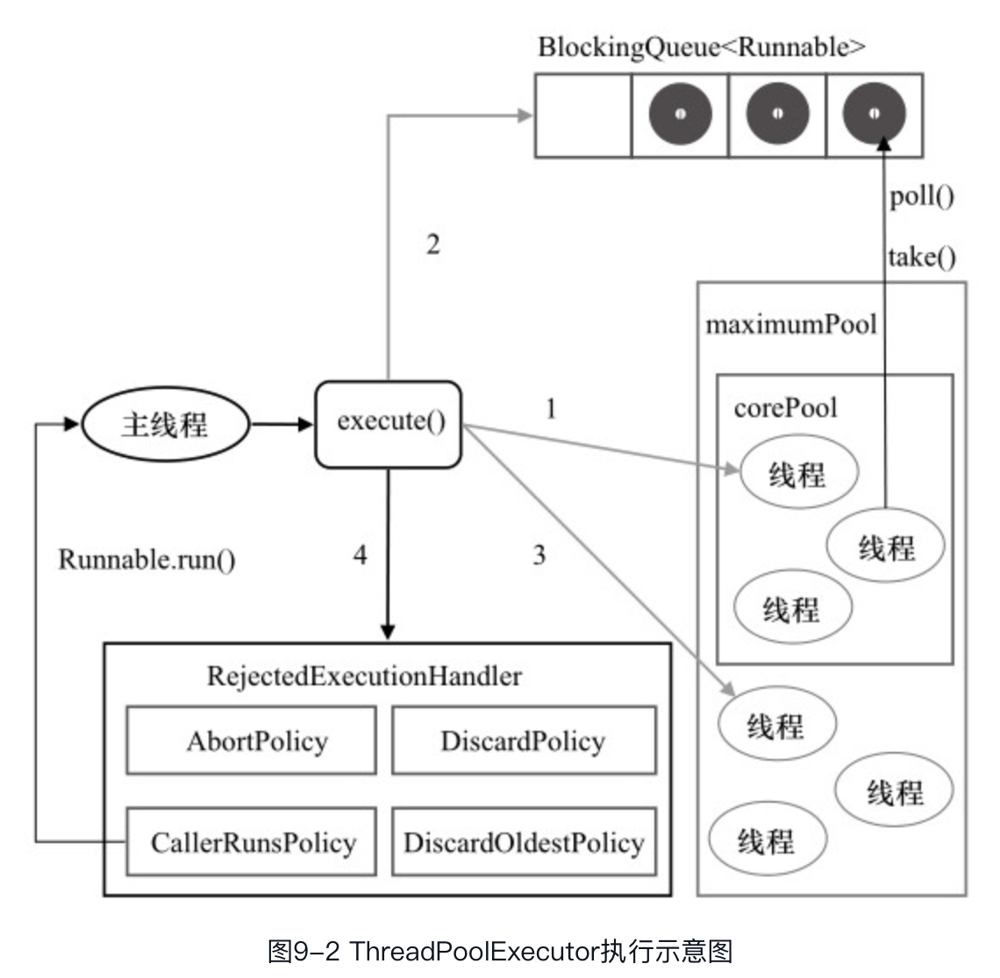

==**ThreadPoolExecutor执行execute的详细执行过程**：==

1）**线程池运行的线程数小于corePoolSize**。则创建新线程来执行任务，（注意，执行这一步骤需要获取全局锁）

2）**线程池运行的线程数等于或大于corePoolSize**。则将任务加入BlockingQueue。

3）**如果阻塞队列已经满了**，则创建新的线程来处理任务，（注意，执行这一步骤需要获取全局锁）

4）**如果创建新线程将使当前运行的线程超出maximumPoolSize**，任务将被拒绝，并调用RejectedExecutionHandler.rejectedExecution()方法。


​		ThreadPoolExecutor采取上述步骤的总体设计思路，是为了在执行execute()方法时，尽可能地避免获取全局锁（那将会是一个严重的可伸缩瓶颈）。在ThreadPoolExecutor完成预热之后（当前运行的线程数大于等于corePoolSize），几乎所有的execute()方法调用都是执行步骤2，而步骤2不需要获取全局锁。


## 5.2 操作指南

### 1.线程池的创建

```java
new ThreadPoolExecutor(coreThreadSize, maxPoolSize, keepAliveTime, 	      TimeUnit.MILLISECONDS, new LinkedBlockingQueue<Runnable>(),handler);
```

参数说明：

**1）corePoolSize（线程池的基本大小）**：当提交一个任务到线程池时，线程池会创建一个线程来执行任务，即使其他空闲的基本线程能够执行新任务也会创建线程，等到需要执行的任务数大于线程池基本大小时就不再创建。

**2）maximumPoolSize（线程池最大数量）**：线程池允许创建的最大线程数。如果队列满了，并且已创建的线程数小于最大线程数，则线程池会再创建新的线程执行任务。值得注意的是，如果使用了无界的任务队列这个参数就没什么效果。

**3）runnableTaskQueue（任务队列）**：用于保存等待执行的任务的阻塞队列。

- ​	`ArrayBlockingQueue`：是一个基于数组结构的有界阻塞队列，此队列按FIFO（先进先出）原则对元素进行排序。
- `LinkedBlockingQueue`：一个基于链表结构的阻塞队列，此队列按FIFO排序元素，吞吐量通常要高于ArrayBlockingQueue。静态工厂方法Executors.newFixedThreadPool()使用了这个队列。
- `SynchronousQueue`：一个不存储元素的阻塞队列。每个插入操作必须等到另一个线程调用移除操作，否则插入操作一直处于阻塞状态，吞吐量通常要高于Linked-BlockingQueue，静态工厂方法Executors.newCachedThreadPool使用了这个队列。
- `PriorityBlockingQueue`：一个具有优先级的无限阻塞队列。

**4）ThreadFactory**：用于设置创建线程的工厂，可以通过线程工厂给每个创建出来的线程设置更有意义的名字。

**5）RejectedExecutionHandler（饱和策略）**：当队列和线程池都满了，将会采取一种策略处理提交的新任务。这个策略默认情况下是AbortPolicy，表示无法处理新任务时抛出异常。在JDK 1.5中Java线程池框架提供了以下4种策略。

- **AbortPolicy**：直接抛出异常。
- **CallerRunsPolicy**：只用调用者所在线程来运行任务。
- **DiscardOldestPolicy**：丢弃队列里最近的一个任务，并执行当前任务。
- **DiscardPolicy**：不处理，丢弃掉。

**6）keepAliveTime（线程活动保持时间）**：线程池的工作线程空闲后，保持存活的时间。所以，如果任务很多，并且每个任务执行的时间比较短，可以调大时间，提高线程的利用率。

**7）TimeUnit（线程活动保持时间的单位）**：可选的单位有天（DAYS）、小时（HOURS）、分钟（MINUTES）、毫秒（MILLISECONDS）、微秒（MICROSECONDS，千分之一毫秒）和纳秒（NANOSECONDS，千分之一微秒）。


### 2.线程池提交任务

可以使用两个方法向线程池提交任务，分别为`execute()`和`submit()`方法。两者的区别在于：

- **execute()**：用于提交不需要返回值的任务，所以无法判断任务是否被线程池执行成功。
- **submit()**：用于提交需要返回值的任务，线程池会返回一个future类型的对象，通过这个future对象可以判断任务是否执行成功，并且可以通过future的get()方法来获取返回值，**get()方法会阻塞当前线程直到任务完成**。


### 3.关闭线程

​	可以通过调用线程池的`shutdown`或`shutdownNow`方法来关闭线程池。它们的原理是遍历线程池中的工作线程，然后逐个调用线程的interrupt方法来中断线程，所以无法响应中断的任务可能永远无法终止。他们的区别在于：

- **shutdownNow()**: 首先将线程池的状态设置成STOP，然后尝试停止所有的正在执行或暂停任务的线程，并返回等待执行任务的列表
- **shutdown()**：只是将线程池的状态设置成SHUTDOWN状态，然后**中断所有没有正在执行任务的线程**。通常调用shutdown方法来关闭线程池。

------

**注意：**

​		**使用线程池创建线程后，一定要关闭线程池。**

------


### 4.线程池的监控

​		如果在系统中大量使用线程池，则有必要对线程池进行监控，方便在出现问题时，可以根据线程池的使用状况快速定位问题。可以通过线程池提供的参数进行监控，在监控线程池的时候可以使用以下属性。

-  **taskCount**：线程池需要执行的任务数量。
- **completedTaskCount**：线程池在运行过程中已完成的任务数量，小于或等于taskCount。
- **largestPoolSize**：线程池里曾经创建过的最大线程数量。通过这个数据可以知道线程池是否曾经满过。如该数值等于线程池的最大大小，则表示线程池曾经满过。
- **getPoolSize**：线程池的线程数量。如果线程池不销毁的话，线程池里的线程不会自动销毁，所以这个大小只增不减。
- **getActiveCount**：获取活动的线程数。

​      通过扩展线程池进行监控。可以通过继承线程池来自定义线程池，重写线程池的`beforeExecute`、`afterExecute`和`terminated`方法，**也可以在任务执行前、执行后和线程池关闭前执行一些代码来进行监控**。例如，监控任务的平均执行时间(线程执行后的时间减去执行前的时间)、最大执行时间和最小执行时间等。这几个方法在线程池里是空方法。


# 6. Exector框架

​		在Java中，使用线程来异步执行任务。Java线程的创建与销毁需要一定的开销，如果我们为每一个任务创建一个新线程来执行，这些线程的创建与销毁将消耗大量的计算资源。同时，为每一个任务创建一个新线程来执行，这种策略可能会使处于高负荷状态的应用最终崩溃。

​	Java的线程既是工作单元，也是执行机制。从**JDK 5开始，把工作单元与执行机制分离开来**。**工作单元包括Runnable和Callable，而执行机制由Executor框架提供**。

## 6.1 Executor框架介绍

### 6.1.1 Executor框架的两极调度模型

​		在**HotSpot VM**的线程模型中，**Java线程（java.lang.Thread）被一对一映射为本地操作系统线程**。**Java线程启动时会创建一个本地操作系统线程**；当该Java线程终止时，这个操作系统线程也会被回收。操作系统会调度所有线程并将它们分配给可用的CPU。

​		**在上层**，Java多线程程序**通常把应用分解为若干个任务**，然后使用用户级的**调度器**（Executor框架）**将这些任务映射为固定数量的线程**；在**底层**，**操作系统内核将这些线程映射到硬件处理器上**。这种调度模式就如同下面这样：

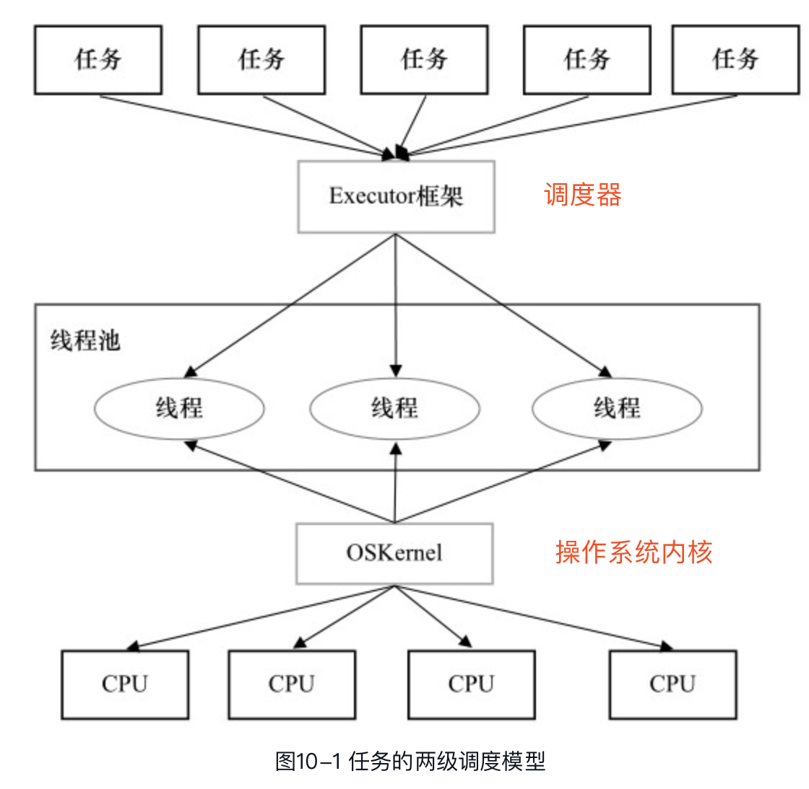

### 6.1.2 Executor框架结构和成员

Executor框架主要由3大部分组成如下:

- **Task(任务)**：包括被执行任务需要。实现的接口：Runnable接口或Callable接口。
- **任务的执行**：包括任务执行机制的核心接口Executor，以及继承自Executor的ExecutorService接口和ThreadPoolExecutor和ScheduledThreadPoolExecutor。
- **异步计算的结果**：包括接口Future和实现Future接口的FutureTask类

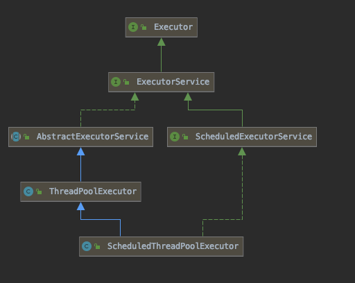

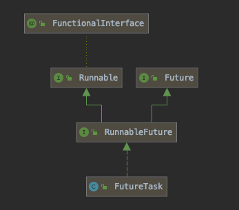

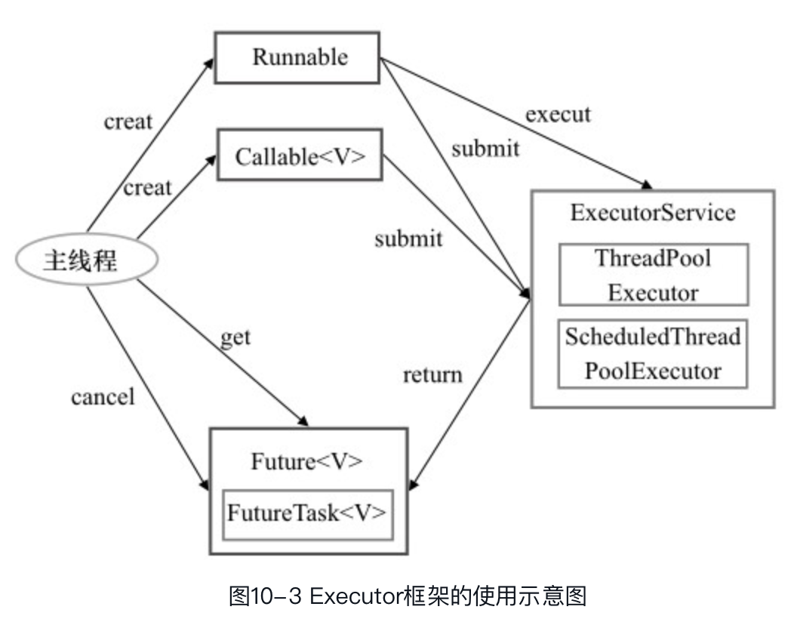

Executor的主要成员有如下：

- 