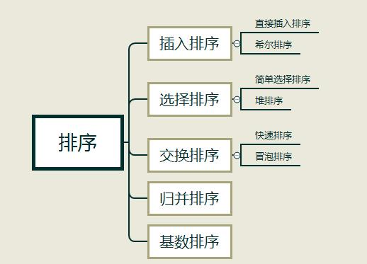
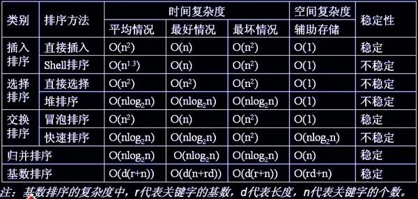
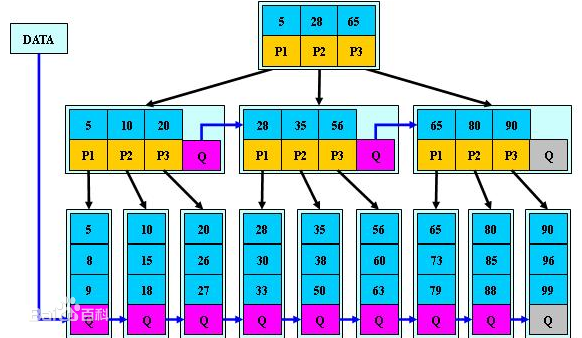
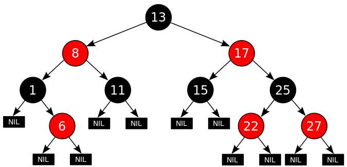
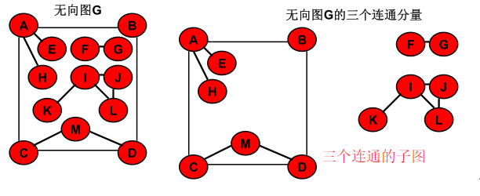
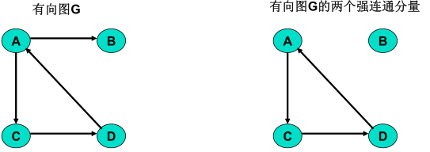
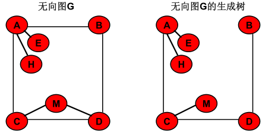
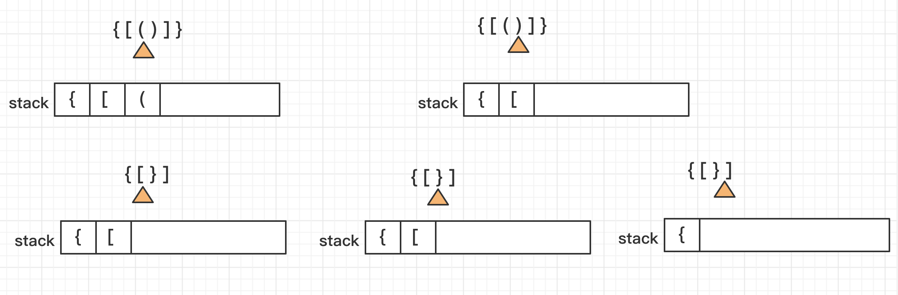

# 一.数据结构






当n较大，则应采用时间复杂度为**O(nlog2n)**的排序方法：**快速排序、堆排序或归并排序序。**

**快速排序**：是目前基于比较的内部排序中被认为是最好的方法，当待排序的关键字是随机分布时，快速排序的平均时间最短；

## 1.1排序算法

###  基础排序-冒泡排序O(n^2)

==**思想：**==

​		冒泡的思想很简单，他是**比较相邻**的两个数据，如果前面的数据比较大就交换（可以为了稳定性考虑大小相同的不考虑），这样第一次遍历完所有的数据时，最大值放到最后位置N。下一次的再遍历一次数据次最大的就会放在N-1的位置。依次类推。。。

```java
//冒泡排序升序（考虑的稳定性的原因：当元素相同时可以不交换其相对位置）
public static void maoPaoSort(int[] array) {
    for(int i = 0 ; i < array.length - 1; i++){
      for(int j = i + 1; j < array.length; j++) {
        if(array[i] > array[j]) {
          swap(array, i, j);
        }
      }
    }
}
```

## 1.2. 二叉树

### 1.2.1 B树

二叉树的深度较大，在查找时会造成I/O读写频繁，查询效率低下，所以引入了多叉树的结构，也就是**B树。**

**阶为M**的B树具有以下性质：

- 根节点在不为叶子节点的情况下儿子数为 2 ~ M

- 除根结点以外的非叶子结点的儿子数为 M/2（向上取整） ~ M

- 拥有 K 个孩子的非叶子节点包含 **k-1** 个keys(关键字)，且递增排列

- 所有叶子结点在同一层，即深度相同

（叶节点可以看成是一种外部节点，不包含任何关键字信息）


​		在B-树中，每个结点中关键字从小到大排列，并且当该结点的孩子是非叶子结点时，该k-1个关键字正好是k个孩子包含的关键字的值域的分划。

因为叶子结点不包含关键字，所以可以把叶子结点看成在树里实际上并不存在外部结点，指向这些外部结点的指针为空，叶子结点的数目正好等于树中所包含的关键字总个数加1。


### 1.2.2 B+树

B+ 树通常用于[数据库](https://m.2cto.com/database/)和操作[系统](https://m.2cto.com/os/)的文件系统中。特点是**能够保持数据稳定有序**，其插入与修改拥有较稳定的对数时间复杂度。**B+ 树元素自底向上插入**。

B+树是B-树的变体，也是一种多路搜索树，其定义基本与B-树相同，不同如下：

- 拥有 K 个孩子的非叶子节点包含 **k** 个keys(关键字)，且递增排列。每个关键字不保存数据，只用来索引。

- 所有的**叶子结点**中包含了**全部关键字的信息**，及指向含有这些关键字记录的指针，且叶子结点本身依关键字的大小自小而大顺序链接。

- 所有的**非叶子结点**可以看成是**索引**部分，结点中仅含有其子树（根结点）中最大（或最小）关键字

- 非叶子结点的子树指针P[i]，指向关键字值属于[ K[i], K[i+1] )的子树

- 为所有叶子结点增加一个**链指针**



### 1.2.3 红黑树

一棵二叉树如果满足下面的红黑性质，则为一棵红黑树：

- 每个结点或是红的，或是黑的。

- 根结点是黑的。

- 每个叶结点 (NIL) 是黑的。

- 如果一个结点是红的，则它的两个儿子都是黑的。

- 对每个结点，从该结点到其子孙结点的所有路径上包含相同数目的黑结点。



红黑树的应用：

1. 广泛用在C++的STL中。map和set都是用红黑树实现的。
2. 著名的linux进程调度Completely Fair Scheduler,用红黑树管理进程控制块
3. epoll在内核中的实现，用红黑树管理事件块
4. nginx中，用红黑树管理timer等
5. [Java](https://m.2cto.com/kf/ware/Java/)的TreeMap实现


### 1.2.4 B树和B+对比

B/B+树用在磁盘文件组织、数据索引和数据库索引中。其中B+树比B 树更适合实际应用中操作系统的文件索引和数据库索引，因为：

**1、B+树的磁盘读写代价更低**

B+树的内部结点并没有指向关键字具体信息的指针。所以其内部结点相对B 树更小。如果把所有同一内部结点的关键字存放在同一盘块中，盘块所能容纳的关键字数量也就越多。一次性读入内存中的需要查找的关键字也就越多。相对来说IO读写次数也就降低了。

举个例子，假设磁盘中的一个盘块容纳16bytes，而一个关键字2bytes，一个关键字具体信息指针2bytes。一棵9阶B-tree(一个结点最多8个关键字)的内部结点需要2个盘快。而B+ 树内部结点只需要1个盘快。当需要把内部结点读入内存中的时候，B 树就比B+ 树多一次盘块查找时间(在磁盘中就是盘片旋转的时间)。

**2、B+-tree的查询效率更加稳定**

由于非终结点并不是最终指向文件内容的结点，而只是叶子结点中关键字的索引。所以任何关键字的查找必须走一条从根结点到叶子结点的路。所有关键字查询的路径长度相同，导致每一个数据的查询效率相当。

**3、B树在元素遍历的时候效率较低**

B+树只要遍历叶子节点就可以实现整棵树的遍历。在数据库中基于范围的查询相对频繁，所以此时B+树优于B树。


## 1.3 图论

### 1.3.1 图的基础概念

**简单回路或简单环**：除第一个顶点和最后一个顶点之外，其余顶点不重复出现的回路

**连通图：**无向图图 G  的任意两点之间都是连通的，则称 G 是连通图

**连通分量**：极大连通子图

**强连通图**：有向图图 G  的任意两点之间都是连通的，则称 G 是强连通图。

**强连通分量**：极大连通子图

**生成树**：极小连通子图。包含图的所有 n  个结点，但只含图的 n-1 条边。在生成树中添加一条边之后，必定会形成回路或环

**无向完全图**：无向图中，任意两个顶点都存在边。还有n个定点的无向完全图有n(n-1)/2条边

**有向完全图：**任意两个顶点之间都存在方向互为相反的两条弧。含有 **n\*(n-1)**条边。








# 二.LeetCode实战

## 2.1.数组

### 121. 买卖股票的最佳时机[简单]

给定一个数组，它的第 i 个元素是一支给定股票第 i 天的价格。

如果你最多只允许完成一笔交易（即买入和卖出一支股票），设计一个算法来计算你所能获取的最大利润。

注意你不能在买入股票前卖出股票。

```java
输入: [7,1,5,3,6,4]
输出: 5
解释: 在第 2 天（股票价格 = 1）的时候买入，在第 5 天（股票价格 = 6）的时候卖出，最大利润 = 6-1 = 5 。
     注意利润不能是 7-1 = 6, 因为卖出价格需要大于买入价格。

输入: [7,6,4,3,1]
输出: 0
解释: 在这种情况下, 没有交易完成, 所以最大利润为 0。
```

**解法：**

1.暴力破解

求数组中两个数据的差值，不过有个条件时必须后面的数减去前面的数结果大于0的有效差值。直接的思路就是暴力计算，两层循环，时间复杂度为O(n^2)

```java
 //时间复杂度O(n^2)
class Solution {
    public int maxProfit(int[] prices) {
        int max = 0;
        for(int i = 0; i < prices.length - 1 ; i++ ) {
            for(int j = i+1; j < prices.length; j++) {
                int primit = prices[j] - prices[i];
                if(primit > max) {
                    max = primit;
                } 
            }
        }
        return max;
    }
}
```

2.一层循环


```java

```


------

发散思维：

​          滑动窗口模式（连续子序问题），最大子序列和

------


### 1013. 将数组分成和相等的三个部分

给你一个整数数组 A，只有可以将其划分为三个和相等的非空部分时才返回 true，否则返回 false。

形式上，如果可以找出索引 i+1 < j 且满足 (A[0] + A[1] + ... + A[i] == A[i+1] + A[i+2] + ... + A[j-1] == A[j] + A[j-1] + ... + A[A.length - 1]) 就可以将数组三等分。

```java
示例 1：
  输出：[0,2,1,-6,6,-7,9,1,2,0,1]
  输出：true
  解释：0 + 2 + 1 = -6 + 6 - 7 + 9 + 1 = 2 + 0 + 1
  
示例 2：
  输入：[0,2,1,-6,6,7,9,-1,2,0,1]
	输出：false

示例 3：
  输入：[3,3,6,5,-2,2,5,1,-9,4]
	输出：true
	解释：3 + 3 = 6 = 5 - 2 + 2 + 5 + 1 - 9 + 4

提示：
  3 <= A.length <= 50000
	-10^4 <= A[i] <= 10^4
```

## 2.栈

### 20. 括号匹配

给定一个只包括 '('，')'，'{'，'}'，'['，']' 的字符串，判断字符串是否有效。有效字符串需满足：

- 左括号必须用相同类型的右括号闭合。
- 左括号必须以正确的顺序闭合。
- 注意空字符串可被认为是有效字符串。

```java
//事例1
输入: "()"
输出: true
//事例2
输入: "()[]{}"
输出: true
//事例3
输入: "(]"
输出: false
//事例4
输入: "([)]"
输出: false
//事例5
输入: "{[]}"
输出: true
```



**思路一：**

​		使用辅助的栈。依次遍历数组，遇到左边括号，将其压入栈中，如果与栈顶元素相匹配的右边括号，则推出栈顶元素。如果中间遇到匹配失败，则返回false。如果最后栈中还有剩余的元素未匹配上，则返回false。

------

==思考：栈顶元素反应了在嵌套层次关系中，最近的需要匹配的元素。如果在嵌套的关系中要找到最近的元素，可以使用栈这种数据结构。==	

------


```java
public boolean isValid(String s) {
        //定义辅助的栈
        Stack<Character> stack = new Stack<>();

        for(int i = 0; i < s.length(); i++) {
            //如果是左半边的括号，则入栈
            if(s.charAt(i) == '{' || s.charAt(i) == '(' || s.charAt(i) == '[') {
                stack.push(s.charAt(i));
            }else{
                //没有左括号情况下
                if(stack.size() == 0) {
                    return false;
                }
                //如果是右半边的括号，则进行括号匹配。如果匹配，则匹配上的左半边括号出栈
                boolean isMatch = s.charAt(i) == matchChar(stack.pop());
                if(!isMatch) {
                    return false;
                }
            }
           
        }

        //循环结束后，如果栈为空，说明都匹配上了。否则，失败
        return stack.empty();

    }

    private char matchChar(char s) {
       switch (s){
           case '{':
               return '}';
           case '(':
               return ')';
           case '[':
               return ']';
           default:
               return ' ';
       }
    }
```

### 150. 逆波兰表达式求值

根据[逆波兰表示法](https://baike.baidu.com/item/逆波兰式/128437)，求表达式的值。

有效的运算符包括 `+`, `-`, `*`, `/` 。每个运算对象可以是整数，也可以是另一个逆波兰表达式。

说明：

- 整数除法只保留整数部分。
- 给定逆波兰表达式总是有效的。换句话说，表达式总会得出有效数值且不存在除数为 0 的情况。

```java
//示例
输入: ["2", "1", "+", "3", "*"]
输出: 9
解释: ((2 + 1) * 3) = 9
  
输入: ["4", "13", "5", "/", "+"]
输出: 6
解释: (4 + (13 / 5)) = 6
  
输入: ["10", "6", "9", "3", "+", "-11", "*", "/", "*", "17", "+", "5", "+"]
输出: 22
解释: 
  ((10 * (6 / ((9 + 3) * -11))) + 17) + 5
= ((10 * (6 / (12 * -11))) + 17) + 5
= ((10 * (6 / -132)) + 17) + 5
= ((10 * 0) + 17) + 5
= (0 + 17) + 5
= 17 + 5
= 22
```

------

思路：

​		经典的使用栈来解决的问题，使用栈来保存数据，遇到运算符，则栈顶的前两个数据出栈，结合运算符进行计算，将计算的结果再次压入栈中，直到栈中没有元素为止

------

```java
public int evalRPN(String[] tokens) {
        //前提是逆波兰表达式的正确性
        Stack<Integer> stack = new Stack<>();
        for(int i = 0; i < tokens.length; i++) {
            if(isCalculateSignal(tokens[i])) {
                int a = stack.pop();
                int b = stack.pop();
                stack.push(calculate(tokens[i], b, a));
            }else{
                stack.push(Integer.parseInt(tokens[i]));
            }
        }
        return stack.pop();
    }
    
    private int calculate(String calculateSignal, int a, int b) {
        switch (calculateSignal){
            case "+":
                return a + b;
            case "-":
                return a - b;
            case "*":
                return a * b;
            case "/":
                return a / b;
            default:
                return 0;
        }
    }
    private boolean isCalculateSignal(String s) {
        if(s.equals("+") || s.equals("-") || s.equals("*") || s.equals("/")) {
            return true;
        }
        return false;
    }
```


## 3.队列

队列的基本应用：广度优先遍历

- 树：层序遍历
- 图：无权图的最短路径


## 4.二叉树操作

思考递归问题主要关注两点：

- 递归终止条件
- 递归过程

------

**思考**：

- 递归是个自底向上的过程

------

