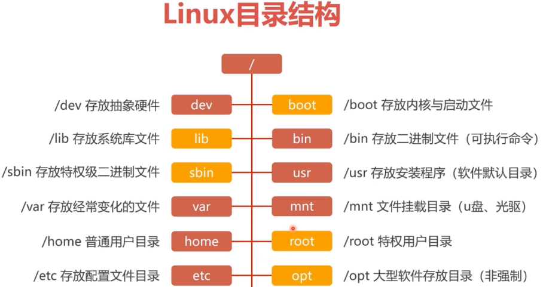
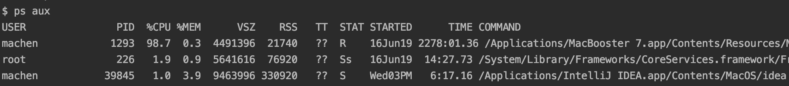

# Linux文件权限和目录管理

​	linux一般可以将文件可存取的身份分为三类：owner/group/others，并且这三类都有read/write/execute等权限。

## linux 文件属性


**文件类型权限：**


第一个字符表示文件的类型：

```properties
[d]: 表示目录
[-]: 表示文件
[l]: 表示连结党（link file）
[b]: 表示可供存储的接口设备
[c]: 表示一次性读取设备，例如：键盘、鼠标
```


## 改变文件属性和权限

```properties
chgrp: 改变文件所属群组 （change group）
chown: 改变文件拥有者
chmod: 改变文件的权限
```

例如：

```properties
chgrp [-R] 文件名/目录名
	—R: 进行递归的持续变更，变更某一目录内所有文件情况
```

```properties
chown [-R] 账户名称 文件/目录
chown [-R] 账户名称：组名  文件/目录
	-R:递归的持续变更，变更某一目录内所有文件情况

例如：
	#将 initial.cfg的拥有者改为bin这个账户 
	hown bin initial.cfg   
	
	# 将initial.cfg的拥有者与群组改回为root
	chown root：root initial.cfg
```

改变权限：

```properties
# 数字类型改变文件权限
	r: 4
	w: 2
	x: 1 （表示用户是否可用进入该目录或者文件的权利）
	比如：rwx=7

chomd [-R] 700 文件/目录

# 符号类型改变文件权限
	了解就行了，感觉不好用
```

**注意：**

**像这样的```r--```的权限，表面上用户具有读取的权限，但是因为没有x的权限，用户是不能进入该目录的，所有即使有read的权限也是没有用的（所以要开放目录给任何人浏览时，最少要具有r和w的权限）。 **


## linux目录结构




## 执行文件路径变量$PATH

也就是windows环境变量中的path变量，打印path变量：```echo $PATH```，例如：输入一个ls命令，系统通过趴会他这个变量里面的内容所记录的路径顺序来搜寻执行令，如果找到ls这个指令，就会出现 【command not found】

## 文件/目录的指令集合

```properties
- : 代表前一个工作目录
~ : 当前用户的home目录
~account: account这个用户的家目录
###########文件夹创建###########################
cd : 切换目录

pwd: 显示当前目录（绝对路径） （print work directory）
	[-P]: 显示出确实路径，而非link路径
	
mkdir: 建立一个新的目录
	[-m]: 配置文件的权限，例如：mkdir -m 711 test
	[-p]: 递归的创建多层目录结构
	
rmdir: 删除一个空的目录（只能删除空文件夹）
	[-p]: 低估操作
#############文件删除、移动、复制#########################
ls: 查看文件名或者目录
	[-a]: 全部文件，连同隐藏文件
	[-d]: 仅列出目录，文件数据不显示
cp: 复制文件
	[-r]: 递归操作
	[-p]: 连同文件的属性一起复制过去
	[-i]: 如果目标文件已经存在，在覆盖之前会先询问
	
rm: 删除文件
	[-f]: 忽略不存的文件，不会出现警告信息（force）
	[-r]: 递归操作
	[-i]: 互动模式，删除前会询问使用者
	
mv: 移动文件
	[-f]:强制的意思，如果目标文件已经存在，不会询问而直接覆盖
	[-i]:如果目标文件存在，询问是否覆盖
	


```

## 文件创建和内容查询 less

```properties
######### cat(Concatenate：连续) ###########
cat: 直接查询文件的内容
	[-n]: 列出行号(包含空白行)

tac: 由最后一行开始显示（与cat相反）
###########################################
more: 一页一页显示文件内容（缺点：无法向前翻页）
	空格: 向下翻一页
	enter: 向下翻一页
	/字符串: 向下搜索字符串关键字
	：f: 立刻显示出文件名以及目前显示的行数
	q: 退出，不在显示文件内容
	
less: 与more类似，但是可以往前翻页
	空格: 向下翻一页
	pagedown: 向下翻一页
	pageup: 向上翻一页
	/字符串: 向下搜索【关键字】
	？字符串: 向上搜索【关键字】
	n: 向下重复搜索关键字
	N: 向上重复搜索关键字
	g: 跳转到第一行
	G: 跳转到最后一行
	q: 退出
##########################################
head: 只看头几行 【 head [-n number] 文件 】
	[-n]: 后面接的数字，代表显示几行的意思
tail: 只看尾巴几行 【 tail [-n number] 文件 】,默认显示最后10行
	[-n]: 后面接的数字，代表显示几行的意思

############# 文件创建 touch ###############
touch 文件名
```

## 文件搜索 find

## 


# 什么是Base

## shell（计算机壳层）

**Shell俗称壳** ，是指“为使用者提供操作界面”的软件（命令解析器）。它类似于[DOS](https://baike.baidu.com/item/DOS)下的command.com和后来的cmd.exe。它接收用户命令，然后调用相应的应用程序 。其实**壳程序的功能只是提供用户操作系统的一个接口**。

**bash是Linux预设的shell**，当然linux上支持多种shell，具体可以参考```/etc/shells```文件，**那么使用者什么时候可以取得shell来工作，而且使用者会取预设的那个shell呢？**，当我们进行登录操作的时候，系统就会给我们一个shell来让我们工作，而这个登录取得shell就记录在**```/etc/passwd```** 中


当以root身份登录，就会使用bash这个shell。


# shell Script


# 进程管理


# Linux 账户管理

## 账户管理

linux主机并不识别账户名称，他只识别id，id分为两种，一种是**用户id**，另一种是**群组id**。每个用户的id与账户都保存在```/etc/passwd```中。

### 新增和删除用户

#### **添加用户：**

```properties
useradd [-u UID] [-g 初始群组] [-G 次要群组] 使用者账户名
- g: 该群组的GID会被防止到 /etc/passwd 第四个字段内
- G: 这个账户还可以加入的群组，会修改 /etc/group 内相关内容

例如：
[root@localhost etc]# useradd machen
[root@localhost etc]# ll -d /home/macehn
drwx------. 2 machen machen 59 1月  30 15:06 /home/machen
# 默认会建立用户家目录，且权限为700
```

# 进程管理

## 查看进程

### ps命令

```properties
ps -aux: 观察系统中所有线程的数据
ps -lA:  效果同上
ps -l: 仅观察bash相关的进程

参数说明：
-A:显示所有的进程
-u:显示使用者
x: 列出较为完整的信息
```



```properties
字段说明：
%CPU: cau资源占用百分比
%MEM: 物理内存占用百分比
STAT: 进程目前状态
	s(sleep): 睡眠，可以被唤醒（signal）
	R(running):运行
	D:不可被唤醒的睡眠状态，通常在等待IO操作
	T:停止状态（stop）
	Z(zombie):僵尸状态，进程终止但无法移除内存外。
```

### top命令

```properties

```

### kill命令

```properties

```


