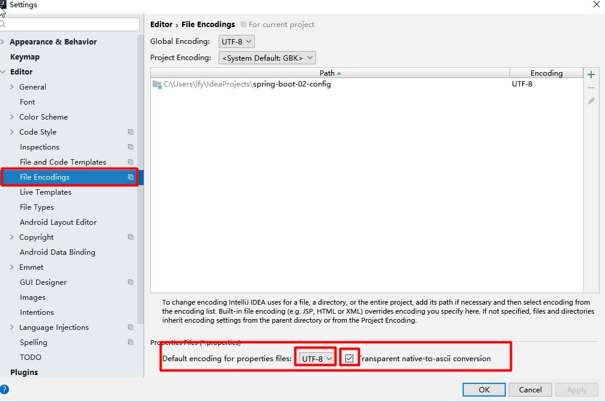

# 前言

此学习笔记是参考与springboot2.1.2官方文档的，然后他的系统需要：

|          | 版本              |
| -------- | ----------------- |
| Maven    | 3.3以上           |
| Java SDK | Java8，兼容Java11 |
| Tomcat 9 | 4.0               |
| Jetty9.4 | 3.1               |

我们都使用Maven来管理包结构，新创建的springboot的pom.xml都有什么内容

```xml
<?xml version="1.0" encoding="UTF-8"?>
<project xmlns="http://maven.apache.org/POM/4.0.0" xmlns:xsi="http://www.w3.org/2001/XMLSchema-instance" xsi:schemaLocation="http://maven.apache.org/POM/4.0.0                   	           							http://maven.apache.org/xsd/maven-4.0.0.xsd">
    <modelVersion>4.0.0</modelVersion>
    
    <parent>
        <groupId>org.springframework.boot</groupId>
        <artifactId>spring-boot-starter-parent</artifactId>
        <version>2.1.1.RELEASE</version>
        <relativePath/> <!-- lookup parent from repository -->
    </parent>
    
    <groupId>com.machen</groupId>
    <artifactId>demo</artifactId>
    <version>0.0.1-SNAPSHOT</version>
    <name>hellowrold</name>
    <description>Demo project for Spring Boot</description>

    <properties>
        <java.version>1.8</java.version>
    </properties>

    <dependencies>
        <dependency>
            <groupId>org.springframework.boot</groupId>
            <artifactId>spring-boot-starter</artifactId>
        </dependency>

        <dependency>
            <groupId>org.springframework.boot</groupId>
            <artifactId>spring-boot-starter-test</artifactId>
            <scope>test</scope>
        </dependency>
    </dependencies>

    <build>
        <plugins>
            <plugin>
                <groupId>org.springframework.boot</groupId>
                <artifactId>spring-boot-maven-plugin</artifactId>
            </plugin>
        </plugins>
    </build>

</project>
```

​	springboot提供了一系列的```starters```来添加你的```jars```到```classpath```，所以只需要导入相应的starter，比如导入开发web项目，导入web环境，只需要导入```spring-boot-starter-web```，其中就会包含web环境所需要的依赖，就像下面这样。

​	每个项目在创建好之后都已经导入```spring-boot-starter-parent```在你的pom文件中，这是一个特殊的starter，它提供了一些很有用的maven的默认配置，

```xml
<!--spring-boot-starter-web中的依赖 -->
<dependencies>
    <dependency>
      <groupId>org.springframework.boot</groupId>
      <artifactId>spring-boot-starter</artifactId>
      <version>2.1.1.RELEASE</version>
      <scope>compile</scope>
    </dependency>
    <dependency>
      <groupId>org.springframework.boot</groupId>
      <artifactId>spring-boot-starter-json</artifactId>
      <version>2.1.1.RELEASE</version>
      <scope>compile</scope>
    </dependency>
    <dependency>
      <groupId>org.springframework.boot</groupId>
      <artifactId>spring-boot-starter-tomcat</artifactId>
      <version>2.1.1.RELEASE</version>
      <scope>compile</scope>
    </dependency>
    <dependency>
      <groupId>org.hibernate.validator</groupId>
      <artifactId>hibernate-validator</artifactId>
      <version>6.0.13.Final</version>
      <scope>compile</scope>
    </dependency>
    <dependency>
      <groupId>org.springframework</groupId>
      <artifactId>spring-web</artifactId>
      <version>5.1.3.RELEASE</version>
      <scope>compile</scope>
    </dependency>
    <dependency>
      <groupId>org.springframework</groupId>
      <artifactId>spring-webmvc</artifactId>
      <version>5.1.3.RELEASE</version>
      <scope>compile</scope>
    </dependency>
  </dependencies>
```

# 1、常用注解说明

```java
@RestController
@EnableAutoConfiguration
public class HellowroldApplication {

    @RequestMapping("/")
    String home() {
        return "Hello World!";
    }

    public static void main(String[] args) {
        SpringApplication.run(HellowroldApplication.class, args);
    }
}
```

## **@RestController**

**就是@Controller和@ResponseBody的结合**，作用就是直接将```String```类型的返回值，直接返回给请求者。就像上面的代码一样，页面就会显示“Hello World”的字段。

```java
@Target(ElementType.TYPE)
@Retention(RetentionPolicy.RUNTIME)
@Documented
@Controller          //这是一个Controller-bean
@ResponseBody        //将返回结果直接返回给请求者
public @interface RestController {
```


## @SpringBootApplication

```java
/**
 *  @SpringBootApplication 来标注一个主程序类，说明这是一个Spring Boot应用
 */
@SpringBootApplication
public class HelloWorldMainApplication {

    public static void main(String[] args) {
        // Spring应用启动起来
        SpringApplication.run(HelloWorldMainApplication.class,args);
    }
}
```

@**SpringBootApplication**: 

​	  Spring Boot应用标注在某个类上说明这个类是SpringBoot的主配置类，SpringBoot就应该运行这个类的main方法来启动SpringBoot应用.


```@SpringbootApplication```相当于```@Configuration，``````@EnableAutoConfiguration```和``` @ComponentScan``` 并具有他们的默认属性值。

```java
@Target(ElementType.TYPE)
@Retention(RetentionPolicy.RUNTIME)
@Documented
@Inherited
@SpringBootConfiguration
@EnableAutoConfiguration
@ComponentScan(excludeFilters = {
		@Filter(type = FilterType.CUSTOM, classes = TypeExcludeFilter.class),
		@Filter(type = FilterType.CUSTOM, classes = AutoConfigurationExcludeFilter.class) })
public @interface SpringBootApplication {

```

### @Configuration

作用：**在配置类上使用这个注解**。

配置类 《===》  配置文件，**配置类也是容器中的一个组件（@Component）**


## @EnableAutoConfiguration

作用：**开启自动配置功能**。这是class和interface级别的注解.

比如在开发web项目时，如果使用spring框架，需要一些配置文件，而这个注解时告诉springboot你想如何配置spring，它是基于你添加的jar依赖项。如果```spring-boot-starter-web```已经添加Tomcat和Spring MVC,这个注释自动将假设您正在开发一个web应用程序并添加相应的spring设置 。

```java
@AutoConfigurationPackage
@Import(EnableAutoConfigurationImportSelector.class)
public @interface EnableAutoConfiguration {
    .......
}
```

### **@AutoConfigurationPackage**

作用：自动配置包

```java
@Target(ElementType.TYPE)
@Retention(RetentionPolicy.RUNTIME)
@Documented
@Inherited
@Import(AutoConfigurationPackages.Registrar.class)
public @interface AutoConfigurationPackage {

}
```

**@Import(AutoConfigurationPackages.Registrar.class)**

​	@Import是给容器中导入一个组件，将会调用AutoConfigurationPackages中的**Registrar方法**，目的是：**将主配置类（@SpringBootApplication标注的类）的所在包及下面所有子包里面的所有组件扫描到Spring容器**。


### @Import(EnableAutoConfigurationImportSelector.class)

​	开启自动配置导入选择器，将所有需要导入的组件以全类名的方式返回，这些组件就会被添加到容器中。

​	会给容器中导入非常多的自动配置类（xxxAutoConfiguration），就是给容器中导入这个场景需要的所有组件，并配置好这些组件。有了自动配置类，免去了我们手动编写配置注入功能组件等的工作

​	Spring Boot在启动的时候从类路径下的META-INF/spring.factories中获取EnableAutoConfiguration指定的值，将这些值作为自动配置类导入到容器中，自动配置类就生效，帮我们进行自动配置工作；以前我们需要自己配置的东西，自动配置类都帮我们完成了。


## 主程序类（入口类）的位置

​	spring通常建议我们将```main```方法**所在的类放到一个root包**下,```@EnableAutoConfiguration```（开启自动配置）注解通常都放到```main```所在类的上面，下面是一个典型的结构布局 :


# 2、使用Springboot

## 2.1、spring-boot-starter-parent

创建springboot项目一般都会继承```spring-boot-starter-parent```pom文件，这个文件内定义了一下Maven的默认属性，资源过滤器和插件等。比如：**java默认使用1.8版本**，使用**UTF-8**作为编码集。

```xml
<parent>
    <groupId>org.springframework.boot</groupId>
    <artifactId>spring-boot-starter-parent</artifactId>
    <version>1.5.9.RELEASE</version>
</parent>

他的父项目是
<parent>
  <groupId>org.springframework.boot</groupId>
  <artifactId>spring-boot-dependencies</artifactId>
  <version>1.5.9.RELEASE</version>
  <relativePath>../../spring-boot-dependencies</relativePath>
</parent>
他来真正管理Spring Boot应用里面的所有依赖版本；
```


## 2.2、资源过滤配置

​	使用springboot 不再像使用spring框架那样，需要定义一些列的xml文件，springboot的配置都是写下**配置文件中的**。springboot支持两种配置文件，一种是```properties```，另一种是```yml```文件。下面是spring-boot-starter-parent.xml中的资源过滤的配置，其中定义了配置文件的location和配置文件的名称。

```xml
<resources>
    <resource>
        <filtering>true</filtering>
        <directory>${basedir}/src/main/resources</directory>
        <includes>
            <include>**/application*.yml</include>
            <include>**/application*.yaml</include>
            <include>**/application*.properties</include>
        </includes>
    </resource>
    <resource>
        <directory>${basedir}/src/main/resources</directory>
        <excludes>
            <exclude>**/application*.yml</exclude>
            <exclude>**/application*.yaml</exclude>
            <exclude>**/application*.properties</exclude>
        </excludes>
    </resource>
 </resources>
```

​	在真正开发中，可能需要不知一个配置文件。比如：开发、测试、上线都可能有个配置文件。但是springboot默认的配置文件是```application.properties```，可以在其中定义一些共有的配置属性，还可以在其中配置我们不同环境所需要的配置文件，比如下面这样：

```properties
spring.profiles.active=dev
```

这就会激活```application-dev.properties```配置文件，注意这个配置文件需要和```application.properties```在同一个目录级别下。

## 2.3、如何不继承parent.Pom

 并不是所有人都需要继承```spring-boot-starter-parent```，可能会用到公司自己定义的或者自己定义maven配置。

??????

## 2.4、@Configuration配置类

SpringBoot使用 **配置类《====》xml配置文件**。如果想要配置文件生效，需要使用```@Configuration```注解。

​	 不用将你的所有的```@Configuration```导入到一个类中，可以使用```@Import```注解来**导入配置类**。或者可以使用```@ComponentScan```来**自动扫描所有的spring组件**，当然包括```@Configuration```配置类。

​	如果必须要**导入基于xml的配置文件**，可以使用```@ImportResource```注解。


## 2.5、@ComponentScanner

​	Spring是一个依赖注入框架。所有的内容都是关于bean的定义及其依赖关系。定义Spring Beans的第一步是使用正确的注解```@Component```或```@Service```或```@Repository```。但是，Spring不知道你定义了某个bean除非它知道从哪里可以找到这个bean。

- **```@ComponentScan```做的事情就是告诉Spring从哪里找到bean。**
- 如果你的其他包都在使用了@SpringBootApplication注解的main app所在的包及其下级包，则**你什么都不用做**，SpringBoot会自动帮你把其他包都扫描了
- 如果你有一些bean所在的包，不在main app的包及其下级包，那么你需要手动加上```@ComponentScan```注解并指定那个bean所在的包

```java

/*
	@ComponentScan:扫描“com.machen.xxx”下的所有组件
*/
@ComponentScan("com.machen")
@SpringBootApplication
public class HellowroldApplication {

    @RequestMapping("/")
    String home() {
        return "Hello World!";
    }

    public static void main(String[] args) {
        ConfigurableApplicationContext run = SpringApplication.run(HellowroldApplication.class, args);

        System.out.println(run.getBean("helloController"));
        System.out.println(run.getBean("helloService" ));
    }
}
```


​	

**所有组件默认的别名都是以其名字的开头小写字母。**


## 2.6、Springboot Devtools介绍

结合博客和案例代码试试

？？？？？？？？？？？？？？？？？？？？？？？？？？？？？？？？？？？？？


## 2.7、resources文件夹中目录结构

- **static**：保存所有的静态资源；例如js css  images。

- **templates**：保存所有的模板页面。Spring Boot默认jar包使用嵌入式的Tomcat，默认不支持JSP页面，但是可以使用模板引擎（freemarker、thymeleaf）

- **application.properties**：Spring Boot应用的配置文件，可以修改一些默认设置。

  

  **默认服务器访问的地址是8080，如何修改这个端口号？**

  ```properties
  # 项目的根路径
  server.servlet.context-path=/machen
  # 服务器访问端口号
  server.port=8080
  ```

  

# 3、配置文件

SpringBoot使用一个全局的配置文件，配置**文件名是固定的**，默认使用两种配置文件；

​	•   **application.properties**

​	•   **application.yml**

**配置文件的作用**：修改SpringBoot自动配置的默认值；SpringBoot在底层都给我们自动配置好。


## 3.1、yaml

 yml是YAML（YAML Ain't Markup Language）语言的文件，以数据为中心，比json、xml更适合做配置文件

​	YAML ：是一个标记语言

​	YAML  不是一个标记语言；

标记语言：

​	以前的配置文件；大多都使用的是  **xxxx.xml**文件；

​	YAML：**以数据为中心**，比json、xml等更适合做配置文件；

**YAML配置例子：**

```yaml
server:
  port: 8081
```

相比如xml的配置文件：

```xml
<server>
	<port>8081</port>
</server>
```

### 3.1.1、yaml基本语法

`k:(空格)v`：表示一对键值对（空格必须有）；

以**空格**的缩进来控制层级关系；只要是左对齐的一列数据，都是同一个层级的。

```yaml
server:
    port: 8081
    path: /hello
```

注意：**属性和值也是大小写敏感**。

### 3.1.2、值的写法

#### 3.1.2.1、字面量：普通的值

k: v：字面直接来写，字符串默认不用加上单引号或者双引号；

​	" "：双引号：**不会转义字符串里面的特殊字符**；特殊字符会作为本身想表示的意思

​				name:   "zhangsan \n lisi"：输出；zhangsan 换行  lisi

​	'  '：单引号：**会转义特殊字符**，特殊字符最终只是一个普通的字符串数据

​				name:   ‘zhangsan \n lisi’：输出；zhangsan \n  lisi


#### 3.1.2.2、对象、Map(属性和值)(键值对)

k: v：在下一行来写对象的属性和值的关系；注意缩进

​		对象还是k: v的方式

```yaml
friends:
		lastName: zhangsan
		age: 20
```

**行内写法**：

```yaml
friends: {lastName: zhangsan,age: 18}
```

#### 3.1.2.3、数组(List、Set)

用   **-**  值表示数组中的一个元素

```yaml
pets:
 - cat
 - dog
 - pig
```

**行内写法**：

```yaml
pets: [cat,dog,pig]
```

### 3.1.3、yml配置文件注入

yaml配置文件：

```yaml
person:
    lastName: hello
    age: 18
    boss: false
    birth: 2017/12/12
    maps: {k1: v1,k2: 12}
    lists:
      - lisi
      - zhaoliu
    dog:
      name: 小狗
      age: 12
```

JavaBean：

```java
/**
 * 将配置文件中配置的每一个属性的值，映射到这个组件中
 * @ConfigurationProperties：告诉SpringBoot将本类中的所有属性和配置文件中相关的配置进行绑定；
 *      prefix = "person"：配置文件中哪个下面的所有属性进行一一映射
 *
 * 只有这个组件是容器中的组件Component，才能容器提供的@ConfigurationProperties功能；
 */
@Component
@ConfigurationProperties(prefix = "person")
public class Person {

    private String lastName;
    private Integer age;
    private Boolean boss;
    private Date birth;

    private Map<String,Object> maps;
    private List<Object> lists;
    private Dog dog;
```

导入**配置文件处理器**，编写配置的时候会有提示信息

```xml
<!--导入配置文件处理器，配置文件进行绑定就会有提示-->
<dependency>
    <groupId>org.springframework.boot</groupId>
    <artifactId>spring-boot-configuration-processor</artifactId>
    <optional>true</optional>
</dependency>
```

### 3.1.4、yml多文档块方式

在yml中使用**多文档块**的方式，使用```---``` 来区分不同的文档块，可以使用如下的方式激活不同的文档块：

```yaml
spring:
	profiles:
	  active: dev
```

```yaml
# 文档块1
server:
  port: 8081
# 指定激活的文档块
spring:
  profiles:
    active: prod

---
# 文档块2
server:
  port: 8083
spring:
  profiles: dev


---
# 文档块3
server:
  port: 8084
spring:
  profiles: prod  #指定属于哪个环境
```


### 3.1.5、properties配置文件乱码问题



### 3.1.6、@Value和@ConfigurationProperties比较

​	在xml配置中，经常使用**value**来给属性赋值，例如这样，当然在SpringBoot中也可以使用注解**@Value**的方式来给属性赋值。

``` xml
<bean id="persion" class="">
    <property name="age" value="18"></property>
</bean>
```

|                      | @ConfigurationProperties | @Value     |
| -------------------- | ------------------------ | ---------- |
| 功能                 | 批量注入配置文件中的属性 | 一个个指定 |
| 松散绑定（松散语法） | 支持                     | 不支持     |
| SpEL                 | 不支持                   | 支持       |
| **JSR303数据校验**   | 支持                     | 不支持     |
| 复杂类型封装         | 支持                     | 不支持     |

​	bu不管配置文件是yml还是properties，他们都能获取值。但是，**如果我们只是在某个业务逻辑中需要获取一下配置文件中的某个值**，还是建议使用 ```@Value

··  @ConfigurationProperties  @Value  功能  批量注入配置文件中的属性  一个个指定  松散绑定（松散语法）  支持  不支持  SpEL  不支持  支持  **JSR303数据校验**?????????  支持  不支持  复杂类型封装  支持  不支持

```java
/**
 * RestController : 相当于就是Controller和ResponseBody
 */
@RestController
public class HelloController {

    @Value("${person.name}")
    private String name;

    @ResponseBody
    @RequestMapping("/hello")
    public String hello(){
        return "Hello "+name;
    }

}
```

### 3.1.7、配置文件参数校验@Validated

```java
/**
     * <bean class="Person">
     *      <property name="lastName" value="字面量/${key}从环境变量、配置文件中获取值/#{SpEL}"/>
     * <bean/>
 */
@Component
@ConfigurationProperties(prefix = "person")
@Validated
public class Person {

   //lastName必须是邮箱格式
    @Email
    //@Value("${person.last-name}")
    private String lastName;
    //@Value("#{11*2}")
    private Integer age;
    //@Value("true")
    private Boolean boss;

    private Date birth;
    private Map<String,Object> maps;
    private List<Object> lists;
    private Dog dog;
```

​	如果说，我们专门编写了一个javaBean来和配置文件进行映射，我们就直接使用```@ConfigurationProperties```，另外```@ConfigurationProperties```默认从全局的配置文件中获取值，如果要从局部的配置文件获取值，就要是使用**@PropertySource**来加载局部的配置文件。

## 3.2、@PropertySource

作用：**加载指定的配置文件**。

```java
/**
 *@PropertySource：加载指定的配置文件
 */
@PropertySource(value = {"classpath:person.properties"})
@Component
@ConfigurationProperties(prefix = "person")
//@Validated
public class Person {
    //lastName必须是邮箱格式
   // @Email
    //@Value("${person.last-name}")
    private String lastName;
    //@Value("#{11*2}")
    private Integer age;
    //@Value("true")
    private Boolean boss;
```

## 3.3、@ImportResource

作用：导入Spring的配置文件，让配置文件里面的内容生效；

Spring Boot里面没有Spring的配置文件，我们自己编写的配置文件，也不能自动识别，如果想让Spring的配置文件生效，加载进来；@**ImportResource**标注在一个配置类上，例如这样：

```java
@ImportResource(locations = {"classpath:beans.xml"})
导入Spring的配置文件让其生效
```

```xml
<?xml version="1.0" encoding="UTF-8"?>
<beans xmlns="http://www.springframework.org/schema/beans"
       xmlns:xsi="http://www.w3.org/2001/XMLSchema-instance"
       xsi:schemaLocation="http://www.springframework.org/schema/beans http://www.springframework.org/schema/beans/spring-beans.xsd">


    <bean id="helloService" class="com.atguigu.springboot.service.HelloService"></bean>
</beans>
```

是在SpringBoot中推荐使用全注解的方式，所以使用 **注解类《===》配置文件**

1、配置类**@Configuration**------>Spring配置文件

2、使用**@Bean**给容器中添加组件

```java
/**
 * @Configuration：指明当前类是一个配置类；就是来替代之前的Spring配置文件
 * 使用@Bean来代替<bean>标签，其返回值会添加到容器中去，默认使用方法名作为组件的id
 */
@Configuration
public class MyAppConfig {

    //将方法的返回值添加到容器中；容器中这个组件默认的id就是方法名
    @Bean
    public HelloService helloService(){
        System.out.println("配置类@Bean给容器中添加组件了...");
        return new HelloService();
    }
}
```

## 3.4、Profile

​	profile是Spring对不同环境提供不同配置功能的支持，比如开发使用开发环境的配置，发布使用发布环境，测试使用测试环境。

​	我们在主配置文件编写的时候，文件名可以是   **application-{profile}.properties/yml**

**默认使用application.properties的配置；**

### 3.4.1、如何激活指定的Profile

- 在配置文件中指定  **spring.profiles.active=dev**

```properties
server.port=8081
# 激活application-dev.properties的配置文件
spring.profiles.active=dev
```

命令行

```java
java -jar spring-boot-02-config-0.0.1-SNAPSHOT.jar --spring.profiles.active=dev
```

虚拟机参数

```properties
-Dspring.profiles.active=dev
```

.png)


## 3.4、配置文件占位符

 ### 3.4.1、随机数

```java
${random.value}、${random.int}、${random.long}
${random.int(10)}、${random.int[1024,65536]}
```

### 3.4.2、占位符获取之前配置的值

占位符可以获取之前配置的值，如果没有可以是用 **:** 指定默认值

```properties
# 使用一个随机的UUID作为name
person.last-name=张三${random.uuid}
person.age=${random.int}
person.birth=2017/12/15
person.boss=false
person.maps.k1=v1
person.maps.k2=14
person.lists=a,b,c
# 获取之前配置中的值
perso.cat.name=${person.last-name}
# 如果hello没有值，就是使用默认值
person.dog.name=${person.hello:Tom}_dog
person.dog.age=15
```


## 3.5、配置文件加载位置

​	springboot 启动会扫描以下位置的 ```application.properties```或者```application.yml```文件作为Spring boot的默认配置文件。

```properties
# 根目录下的config文件夹下的application文件
–file:./config/
# 根目录下的application文件
–file:./
# 类路径下的config文件夹下的application文件
–classpath:/config/
# 类路径下的application文件
–classpath:/
```

**优先级由高到底**，**高优先级的配置会覆盖低优先级的配置**；

.png)

 ### 3.5.1、改变默认配置文件的位置

我们还可以通过 ```spring.config.location``` 来改变默认的配置文件位置

```properties
server.servlet.context-path=/machen
server.port=8080
# 指定配置文件的位置
spring.config.location=/
```

**项目打包好以后，我们可以使用命令行参数的形式，启动项目的时候来指定配置文件的新位置；指定配置文件和默认加载的这些配置文件共同起作用形成互补配置；**

```properties
java -jar spring-boot-02-config-02-0.0.1-SNAPSHOT.jar --spring.config.location=G:/application.properties
```

## 3.6、外部配置文件加载顺序

**SpringBoot也可以从以下位置加载配置； 优先级从高到低；高优先级的配置覆盖低优先级的配置，所有的配置会形成互补配置**。

- **命令行参数**

  所有的配置都可以在命令行上进行指定

java -jar spring-boot-02-config-02-0.0.1-SNAPSHOT.jar --server.port=8087  --server.context-path=/abc

​	**多个配置用空格分开； --配置项=值**

- 来自java:comp/env的JNDI属性
- Java系统属性（System.getProperties()）
- 操作系统环境变量
- RandomValuePropertySource配置的random.*属性值


==**优先加载带profile**==

- **jar包外部的application-{profile}.properties或application.yml(带spring.profile)配置文件**
- **jar包内部的application-{profile}.properties或application.yml(带spring.profile)配置文件**


==**再来加载不带profile**==

- **jar包外部的application.properties或application.yml(不带spring.profile)配置文件**
- **jar包内部的application.properties或application.yml(不带spring.profile)配置文件**


- @Configuration注解类上的@PropertySource
- 通过SpringApplication.setDefaultProperties指定的默认属性


# 4、Springboot的特性

## 4.1、自定义的彩蛋

## 4.2、ApplicationRunner和ComandLineRunner 

如果想要在SpringApplication启动后执行一次特殊的代码，只需要继承ApplicationRunner或者ComandLineRunner接口，实现其run方法。‘

？？？？？？？？？？？？？？？？？？？？？？？？？？


# 5、日志

## 5.1、常用日志框架介绍

现在市面上有很多的日志框架，比如：JUL（java.util.logging），JCL（Apache Commons Logging），Log4j，Log4j2，Logback、SLF4j、jboss-logging....

- **log4j**：是Apache的一种基于Java日志工具（出生于1996年）

- **log4j2**：是log4j的升级版（出生于2012年）

- **JUL**： Java Util Logging，自Java1.4以来的官方日志实现。 （出生于2002年）

- **Logback**：是sl4j阵营的一套日志组件的实现。

- **Commons Logging**：同样也是Apache的一套基于java日志接口，之前叫Jakarta Commons Logging，后更名为Commons Logging 。

- **sl4J**：Simple Logging Facade for Java ，类似于Commons Logging，是一套简易Java**日志门面**，本身并无日志的实现 。

  

		现今，Java日志领域被划分为两大阵营：**Commons Logging**阵营和**Slf4j**阵营。 Commons Logging在Apache大树的笼罩下，有很大的用户基数 。但是sl4j目前发展的比较好。所以推荐使用sl4j。

		Commons Logging和Sl4j是门面接口，而Log4j和Logback是具体的实现。比较常见的组合是**```logback + sl4j```** 和**```Commons Loggin + log4j```**。**Logback必须配合Slf4j使用。由于Logback和Slf4j是同一个作者，其兼容性不言而喻** 。

[日志框架的前世今生](https://www.cnblogs.com/chenhongliang/p/5312517.html)

## 5.2、springboot日志框架

Spring Boot在框架内容部使用**```Java Commons Loggin```**，**```spring-boot-starter-logging```**采用了**```slf4j+logback```**的形式，Spring Boot也能自动适配（jul、log4j2、logback） 并简化配置

| 日志门面      | 日志实现       |
| ------------- | -------------- |
| JCL           | Log4j JUL      |
| slf4j         | Logback log4j2 |
| jboss-logging |                |

| 日志系统 | 日志文件名                                                  |
| -------- | ----------------------------------------------------------- |
| Logback  | ```logback.xml```、```logback-spring.xml```、logback.groovy |
| Log4j    | ```log4j2.xml```、```log4j-spring.xml```/                   |
| JUL      | logging.properties                                          |


## 5.3、控制台输入日志

springboot默认选用的日志门面是```Commons Logging```，默认的日志级别是```INFO```。来看一下springboot默认的日志输出格式：

```java
2014-03-05 10:57:51.112 INFO 45469 --- [ main] org.apache.catalina.core.StandardEngine :
Starting Servlet Engine: Apache Tomcat/7.0.52
2014-03-05 10:57:51.253 INFO 45469 --- [ost-startStop-1] o.a.c.c.C.[Tomcat].[localhost].[/] :
Initializing Spring embedded WebApplicationContext
2014-03-05 10:57:51.253 INFO 45469 --- [ost-startStop-1] o.s.web.context.ContextLoader :
Root WebApplicationContext: initialization completed in 1358 ms
2014-03-05 10:57:51.698 INFO 45469 --- [ost-startStop-1] o.s.b.c.e.ServletRegistrationBean :
Mapping servlet: 'dispatcherServlet' to [/]
2014-03-05 10:57:51.702 INFO 45469 --- [ost-startStop-1] o.s.b.c.embedded.FilterRegistrationBean :
Mapping filter: 'hiddenHttpMethodFilter' to: [/*]
```

默认的输出格式是由以下组成：

- 日期和时间
- 日志级别：error、warn、info、debug、trace
- 进程id
- 进程名称
- 日志名：通常是源类名
- 日志信息

**如何自定义自己的日志格式呢？**

这个需要配置字节的日志文件，设置自己想要的日志格式

？？？？

**日志颜色渲染？**

**26.2章节**，要使用```%clr```，

```java
%clr(%d{yyyy-MM-dd HH:mm:ss.SSS}){yellow}
```

| Level | Color |
| ----- | ----- |
| error | red   |
| warn  | yello |
| info  | green |
| debug | green |
| trace | green |
|       |       |

springboot默认使用logback，其默认使用base.xml配置文件

```xml
<included>
	<include resource="org/springframework/boot/logging/logback/defaults.xml" />
	<property name="LOG_FILE"        value="${LOG_FILE:-${LOG_PATH:-${LOG_TEMP:-${java.io.tmpdir:-/tmp}}}/spring.log}"/>
	<include resource="org/springframework/boot/logging/logback/console-appender.xml" />
	<include resource="org/springframework/boot/logging/logback/file-appender.xml" />
	<root level="INFO">
		<appender-ref ref="CONSOLE" />
		<appender-ref ref="FILE" />
	</root>
</included>
```


## 5.3、日志级别控制

Spring Boot使用**Commons Logging**进行所有内部日志记录 ，默认情况下，如果您使用“Starters”，则使用Logback进行日志记录 。

```xml
<!--
	springboot-dependencies中定义了两个starters,默认底层支持两种日志实现，一种是logback，另一种是		log2j2。
默认使用sl4j日志框架
-->
 <slf4j.version>1.7.25</slf4j.version>

  <log4j2.version>2.11.1</log4j2.version>
  <logback.version>1.2.3</logback.version>

<dependency>
    <groupId>org.springframework.boot</groupId>
    <artifactId>spring-boot-starter-log4j2</artifactId>
    <version>2.1.1.RELEASE</version>
<dependency>
<dependency>
    <groupId>org.springframework.boot</groupId>
    <artifactId>spring-boot-starter-logging</artifactId>
    <version>2.1.1.RELEASE</version>
</dependency>
```


所有的日志系统都可以设置包结构的日志级别，比如在springboot应用中可以通过```logging.level.<logger-name>=<level>```，就如下面这样：

```properties
# springboot的根日志级别
logging.level.root=WARN
# 设置org.springframework.web包下的所有文件的日志级别为debug
logging.level.org.springframework.web=DEBUG
logging.level.org.hibernate=ERROR
```

## 5.4、自定义日志配置文件

一个日志系统可以被激活通过**相关的```lib```**和一个classpath下的配置文件或者指定路径下的**配置文件**，通过```logging.config```属性，例如这样：

```properties
logging.config="the location of the logging configuration"
```

根据不同的日志系统，会加载以下相应的配置文件：

| 日志系统 | 日志文件名                                      |
| -------- | ----------------------------------------------- |
| Logback  | logback.xml、logback-spring.xml、logback.groovy |
| Log4j    | log4j2.xml、log4j-spring.xml                    |
| JUL      | logging.properties                              |

**springboot官方推荐使用```-spring```的配置文件名，例如：```logback-spring.xml```。**

除了这些，还需要介绍一下spring环境下有关log的其他属性，如下面的表格所示：

| 日志属性                              | 属性说明                 |
| ------------------------------------- | ------------------------ |
| **logging.exception-conversion-word** |                          |
| **logging.file**                      |                          |
| **logging.file.max-size**             | 日志输出文件大小的最大值 |
| **logging.file.max-history**          | 日志文件保留的最大时间   |
| **logging.path**                      |                          |
| **logging.pattern.console**           | 控制台的日志格式         |
| **logging.pattern.dateformat**        |                          |
| **logging.pattern.file**              |                          |
| **loggin.pattern.level**              |                          |

springboot默认的配置文件：

[Logback](https://github.com/spring-projects/spring-boot/tree/master/spring-boot-project/spring-boot/src/main/resources/org/springframework/boot/logging/logback)

[log4j2](https://github.com/spring-projects/spring-boot/blob/master/spring-boot-project/spring-boot/src/main/resources/org/springframework/boot/logging/log4j2/log4j2.xml)

[Java Util Logging](https://github.com/spring-projects/spring-boot/blob/master/spring-boot-project/spring-boot/src/main/resources/org/springframework/boot/logging/java/logging-file.properties)


## 5.4、日志输入文件

默认情况下，springboot只是将日志打印到控制台，并不输出到文件。如果你想将日志输入到文件中保存，需要在配置文件中设置```logging.file```和```logging.path```。

```properties

```

 日志文件每10M将会循环记录一次，默认会记录```error```，```warn```，```info```级别的日志。如果想要**改变日志文件的大小限制**可以使用```logging.file.max-size```属性。默认情况下，**日志记录操作将会无限期的进行下去，除非**设置了```logging.file.max-history```属性（默认值为0）。


**注意：日志系统初始化操作早与应用的生命周期**，所以可以通过```@PropertySource```注解来获取属性文件没有加载进来的日志属性。

# 6、MVC

springboot可以通过内嵌的tomcat、jetty、Netty来创建一个http服务，大多数的web应用都可以使用```spring-boot-starter-web```模块建立起来。当然你也选择建立相关的应用通过使用```spring-boot-starter-webflux```模块**（这是spring5.x的新特性）**。

## springMVC 自动配置

spring MVC自动配置添加了很多的特性，下面列举几个：

- 包含了```ContentNegotiatingViewResolver```和```BeanNameViewResolver```beans。
- 支持静态资源，也支持```webjar```
- 自动注册了```Converter```，```GenericConverter```和```Formatter```这些bean
- 支持```HttpMessageConverters```
- 自动注册了```MessageCodesResolver```

**如果你想保留spring MVC的这些默认的特性，而且还想添加自己MVC配置**（比如拦截器、格式转换器、视图映射器等），**可以自己添加配置类使用```@Configuration```注解，并实现````WebMvcConfigurer`  ```接口**。

**如果你想完全掌控MVC，你可以添加```@Configuration```和```@EnableWebMvc```注解**，但是不建议这样做。因为你可能没有人家springboot做的那么好。


## HttpMessageConverters

spring MVC 使用```HttpMessageConverter```接口去转换http的请求和响应。其中的默认值是开箱就可以用的，比如对象Objects可以自动转换成Json或者xml的格式，默认使用```UTF-8```的编码格式。


## 序列换和反序列化

springboot提供了```@JsonComponent```注解，

```java

```

## 加载静态资源

springboot的```ResourceProperties```中定义了**静态资源的映射规则**。下面是默认的加载静态的Location

```properties
classpath:/META-INF/resources/
classpath:/resources/
classpath:/static/
classpath:/public/

"/"：当前项目的根路径
```

当然这个类中也定义一些静态资源先关的参数，比如缓存时间等，可以通过配置类来设置这些值:

```java
/*
	可以看到配置文件的前缀是spring.resources	
*/
@ConfigurationProperties(prefix = "spring.resources", ignoreUnknownFields = false)
public class ResourceProperties {
    ......
}
```

默认资源被映射到```/**```，当然可以通过```spring.mvc.static-path-pattern```来进行设置，springboot会跟根据这种默认来寻找资源，比如这样：

```properties
spring.mvc.static-path-pattern=/resources/**
```

当然也可以指定静态的location，通过```spring.resources.static-locations```注解，默认值为上面所提到的location值。 

## **自定义图标？**

springboot使用```favicon.ico```来作为网站logo，在开发公司的项目的时候,需要换成公司的logo


## 错误处理


## 内嵌的servlet容器


# 7、springboot开发者工具

Spring Boot包含了一些额外的工具集，用于提升Spring Boot应用的开发体验 。```spring-boot-devtools```模块可以被包含到任何的项目中，来提供一些节约开发时间的特性。只需将该模块的依赖添加进项目中即可。

```xml
<dependencies>
	<dependency>
		<groupId>org.springframework.boot</groupId>
		<artifactId>spring-boot-devtools</artifactId>
        <!-- 表示不依赖传递 -->
		<optional>true</optional>
	</dependency>
</dependencies>
```

```xml
备注：<optional>true</optional>标签的意思是，A依赖B，B依赖C。
为true意思是A如果没有显示的引入C，则A就不会依赖C。
默认为false，即子类必须依赖父类。
```

​	在运行一个完整的打包过的应用时，开发者工具（devtools）会被自动禁用。如果应以`java -jar`或特殊的类加载器启动，都会被认为是一个产品级的应用（production application），从而禁用开发者工具。为了防止devtools传递到项目中的其他模块，设置该依赖级别为```optional```是个不错的实践。如果想确保devtools绝对不会包含在一个产品级构建中，你可以使用`excludeDevtools`构建属性彻底移除该JAR，Maven和Gradle都支持该属性 。

# springboot热部署

**热部署的优点：**

- 线上线下都可以使用
- 无需重启服务器

**热部署和热加载的区别和联系？**

- 热部署和热加载都不需要重启服务器可是实现编辑/部署项目
- 都是基于Java的类加载器实现的
- 热部署侧重的是**重新的部署项目**，在**服务器运行时**都可以实现部署工作
- 热加载侧重于**运行时重新加载class**，将修改并编译后的字节码文件提交到服务器，程序自动加载修改后的字节码文件（**侧重于加载重新修改后的类或者class文件**）。 

**热部署和热加载在实现原理的区别？**

​	热部署**直接加载整个应用**，会释放内存，比热加载更加彻底，当同时也消耗时间。

​	热加载**直接加载改变的class文件**，主要依赖Java的类加载器。在后台启动一个后台线程，主要**检测类文件的时间戳变化**，如果时间戳发生变化， 就将类重新加载。


# 7、错误处理机制

## SpringBoot默认的错误处理机制

-  浏览器，默认返回一个错误页面


-  如果是其他客户端，默认响应一个json数据


****

**原理：可以参照ErrorMvcAutoConfiguration；错误处理的自动配置；**

步骤：

​	》一但系统出现4xx或者5xx之类的错误；

​	》ErrorPageCustomizer就会生效（定制错误的响应规则），并触发/error 请求

​	》**BasicErrorController**来处理/error请求；


在ErrorMvcAutoConfiguration中给容器添加了这几个组件：

**1、DefaultErrorAttributes**：帮我们在页面共享信息

**2、BasicErrorController**：处理默认/error请求

```java
//默认处理/error请求，否则处理server.error.path中定义的请求
@Controller
@RequestMapping("${server.error.path:${error.path:/error}}")
public class BasicErrorController extends AbstractErrorController {
  	//产生HTML错误数据（浏览器发送的请求，通过请求头识别是否是浏览器请求）
    @RequestMapping(produces = MediaType.TEXT_HTML_VALUE)
	public ModelAndView errorHtml(HttpServletRequest request,
			HttpServletResponse response) {
        //获取状态信息
		HttpStatus status = getStatus(request);
		Map<String, Object> model = Collections.unmodifiableMap(getErrorAttributes(
				request, isIncludeStackTrace(request, MediaType.TEXT_HTML)));
		response.setStatus(status.value());
        //去哪个页面作为错误页面
		ModelAndView modelAndView = resolveErrorView(request, response, status, model);
        return (modelAndView != null) ? modelAndView : new ModelAndView("error", model);
	}
   
    //产生json数据（其他客户端发送的请求）
    @RequestMapping
	public ResponseEntity<Map<String, Object>> error(HttpServletRequest request) {
		Map<String, Object> body = getErrorAttributes(request,
				isIncludeStackTrace(request, MediaType.ALL));
		HttpStatus status = getStatus(request);
		return new ResponseEntity<>(body, status);
	}
}
```


**3、ErrorPageCustomizer**：

系统出现错误以后定制error的响应规则，哪些错误跳转到哪些页面之类的

```java
private static class ErrorPageCustomizer implements ErrorPageRegistrar, Ordered {
		private final ServerProperties properties;
		private final DispatcherServletPath dispatcherServletPath;
       	//构造函数
		protected ErrorPageCustomizer(ServerProperties properties,
				DispatcherServletPath dispatcherServletPath) {
			this.properties = properties;
			this.dispatcherServletPath = dispatcherServletPath;
		}
		//注册错误页面
		@Override
		public void registerErrorPages(ErrorPageRegistry errorPageRegistry) {
			//从ErrorProperties中获取error路径
            ErrorPage errorPage = new ErrorPage(this.dispatcherServletPath
					.getRelativePath(this.properties.getError().getPath()));
			errorPageRegistry.addErrorPages(errorPage);
		}
}

/**
 * Path of the error controller.
 */
@Value("${error.path:/error}")
private String path = "/error";

```

**4、DefaultErrorViewResolver**：

错误后跳转到哪个页面是由他来决定的。

```java
@Override
public ModelAndView resolveErrorView(HttpServletRequest request, HttpStatus status,
                                     Map<String, Object> model) {
    //根据status决定返回哪个错误页面
    ModelAndView modelAndView = resolve(String.valueOf(status.value()), model);
    if (modelAndView == null && SERIES_VIEWS.containsKey(status.series())) {
        modelAndView = resolve(SERIES_VIEWS.get(status.series()), model);
    }
    return modelAndView;
}

private ModelAndView resolve(String viewName, Map<String, Object> model) {
   //获取/error路径下响应错误码的页面，比如/error/404
    String errorViewName = "error/" + viewName;
    TemplateAvailabilityProvider provider = this.templateAvailabilityProviders
        .getProvider(errorViewName, this.applicationContext);
   //如果有可用的模板引擎， 返回模板引擎下的视图
    if (provider != null) {
        return new ModelAndView(errorViewName, model);
    }
    //否则返回静态路径下的视图，/META-INF/resources/,/resources/, /static/, /public/
    return resolveResource(errorViewName, model);
}
```

## 如何定制错误响应

### 如何定制错误的页面

**》如果有模板引擎的情况下**，直接创建**/error/状态码**，如/error/404

我们可以使用**4xx**和**5xx**作为错误页面的文件名来匹配这种类型的所有错误，**优先寻找精确的状态码.html**；		


页面能获取的信息；

​	timestamp：时间戳·	

​	status：状态码

​	error：错误提示

​	exception：异常对象

​	message：异常消息

​	errors：JSR303数据校验的错误都在这里

**》没有模板引擎**（模板引擎找不到这个错误页面），静态资源文件夹下找；

**》以上都没有错误页面**，就是默认来到SpringBoot默认的错误提示页面；

 ```html
<main role="main" class="col-md-9 ml-sm-auto col-lg-10 pt-3 px-4">
    <h1>500</h1>
    <h2>status：[[${status}]]</h2><br/>
    <h2>timestamp：[[${timestamp}]]</h2><br/>
    <h2>error：[[${error}]]</h2><br/>
    <h2>exception：[[${exception}]]</h2><br/>
    <h2>message：[[${message}]]</h2><br/>
 </main>
 ```


### 如何定制错误的json数据

**1)可以定制自己的异常处理器。**

 ```java
/**
 * ControllerAdvice：控制器增强器
   但是这种并不是自适应的，浏览器和客户端返回的都是json数据
 */
@ControllerAdvice
public class MyExceptionHandler {
    private Logger logger = LoggerFactory.getLogger(MyExceptionHandler.class);

    /**
     * UserException：抛出来的异常会被此拦截器拦截
     * @return
     */
    @ResponseBody
    @ExceptionHandler(UserException.class)
    public Map<String,Object> handlerException(UserException e){
        HashMap<String, Object> map = new HashMap<>();
        map.put("message",e.getMessage());
        map.put("code","500");
        logger.info(map.toString());
        return map;
    }
}

备注：ControllerAdvicez注解
@Target(ElementType.TYPE)
@Retention(RetentionPolicy.RUNTIME)
@Documented
@Component
public @interface ControllerAdvice {......}
 ```

可以通过**```@ExceptionHandler```**来拦截自定义的异常**UserException**，然后通过@ResponseBody将异常数据返回去。

缺点：

​	这种方式浏览器请求和客户端请求返回都是json数据，并没有做到自适应的效果。


**2)转发到/error进行错误处理【推荐】**

```java
@ResponseBody
@ExceptionHandler(UserException.class)
public String  handlerException(UserException e, HttpServletRequest request){
    HashMap<String, Object> map = new HashMap<>();
    map.put("message",e.getMessage());
    map.put("code","500");
    //需要设置错误status，这样Handler就会跳转到响应的错误页面
    request.setAttribute("javax.servlet.error.status_code",400);
    //转发到/error请求，BasicErrorController就会处理错误请求
    return "redirect:/error";
 }
```

可以参考BasicErrorController中的这段代码：

```java
@RequestMapping(produces = MediaType.TEXT_HTML_VALUE)
public ModelAndView errorHtml(HttpServletRequest request,
                              HttpServletResponse response) {
    //获取错误状态码，决定将要跳转到那个错误页面
    HttpStatus status = getStatus(request);
    Map<String, Object> model = Collections.unmodifiableMap(getErrorAttributes(
        request, isIncludeStackTrace(request, MediaType.TEXT_HTML)));
    response.setStatus(status.value());
    ModelAndView modelAndView = resolveErrorView(request, response, status, model);
    return (modelAndView != null) ? modelAndView : new ModelAndView("error", model);
}

protected HttpStatus getStatus(HttpServletRequest request) {
    //从这个属性中获取错误代码
    Integer statusCode = (Integer) request
        .getAttribute("javax.servlet.error.status_code");
    if (statusCode == null) {
        return HttpStatus.INTERNAL_SERVER_ERROR;
    }
    try {
        return HttpStatus.valueOf(statusCode);
    }
    catch (Exception ex) {
        return HttpStatus.INTERNAL_SERVER_ERROR;
    }
}
```

上面这用方式返回的数据，并没有携带我们自己定义的错误属性数据，如果想要携带自己定义的错误属性，需要借助于**```DefaultErrorAttributes```**，分析一下这个过程：

》错误拦截器Handler拦截错误后，携带上错误状态码属性```javax.servlet.error.status_code```，将请求转发```/error```

》BasicErrorController来处理```/error```请求，其中的```errorHtml()```和```error()```分别处理浏览器请求和客户端请求，一个返回到错误页面，一个返回json数据。

》这两个方法中的错误属性都是通过```ErrorAttribute```接口中的```getErrorAttributes```获取的，所以可自定义ErrorAttribute组件来自定义自己的错误属性

```java
//自定义错误拦截器
@ControllerAdvice
public class MyExceptionHandler {
  
    @ResponseBody
    @ExceptionHandler(UserException.class)
    public String  handlerException(UserException e, HttpServletRequest request){
        HashMap<String, Object> map = new HashMap<>();
        map.put("message",e.getMessage());
        map.put("code","500");

        request.setAttribute("error",map);
        //需要设置错误status，这样Handler就会跳转到响应的错误页面
        request.setAttribute("javax.servlet.error.status_code",400);

        //转发到/error请求，BasicErrorController就会处理错误请求
        return "redirect:/error";
    }

}

//自定义ErrorAttributes组件
@Component
public class MyErrorAttributes extends DefaultErrorAttributes {
    @Override
    public Map<String, Object> getErrorAttributes(WebRequest webRequest, boolean includeStackTrace) {
        Map<String, Object> map = super.getErrorAttributes(webRequest, includeStackTrace);
        map.put("company","guazi");
        //获取异常处理器携带的数据,0代表的是request作用域
        webRequest.getAttribute("error",0);
        return map;
    }
}
```


# 8、配置嵌入式的Servlet容器

SpringBoot默认使用Tomcat作为嵌入式的Servlet容器；


### 8.1、如何定制和修改Servlet容器的相关配置；

1、修改和server有关的配置（可以参考【**ServerProperties**】类）；

```properties
server.port=8081
server.context-path=/crud

server.tomcat.uri-encoding=UTF-8

//通用的Servlet容器设置
server.xxx
//Tomcat的设置
server.tomcat.xxx
```


### 8.2、注册Servlet三大组件【Servlet、Filter、Listener】

以前可以开webapp下的web.xml进行注册，springboot为了满足这个要求提供了三大组件：

 - **ServletRegistrationBean**

```java
//自定义Servlet
public class MyServlet extends HttpServlet {
    @Override
    protected void doGet(HttpServletRequest req, HttpServletResponse resp) throws ServletException, IOException {
        super.doPost(req, resp);
    }
    @Override
    protected void doPost(HttpServletRequest req, HttpServletResponse resp) throws ServletException, IOException {
        resp.getWriter().print("hello Servlet");
    }
}

//注册三大组件
@Bean
public ServletRegistrationBean myServlet(){
    ServletRegistrationBean registrationBean = new ServletRegistrationBean(new MyServlet(),"/myServlet");
    return registrationBean;
}
```

 - **FilterRegistrationBean**

```java
//自定义filter
public class MyFilter implements Filter {
    @Override
    public void init(FilterConfig filterConfig) throws ServletException {}

    @Override
    public void doFilter(ServletRequest request, ServletResponse response, FilterChain chain) throws IOException, ServletException {
        System.out.println("MyFilter process...");
        chain.doFilter(request,response);
    }
    @Override
    public void destroy() {}
}
//filter注册组件
@Bean
public FilterRegistrationBean myFilter(){
    FilterRegistrationBean registrationBean = new FilterRegistrationBean();
    registrationBean.setFilters(new MyFilter());
    registrationBean.setUrlPatterns(Arrays.asList("/hello","/myServlet"));
    return registrationBean;
}
```


 - **ServletListenerRegistrationBean**

```java
//自定义监听器
public class MyListener implements ServletContextListener {
    @Override
    public void contextInitialized(ServletContextEvent sce) {
        System.out.println("contextInitialized...web应用启动");
    }

    @Override
    public void contextDestroyed(ServletContextEvent sce) {
        System.out.println("contextDestroyed...当前web项目销毁");
    }
}
//监听器注册组件
@Bean
public ServletListenerRegistrationBean myListener(){
    ServletListenerRegistrationBean<MyListener> registrationBean = new ServletListenerRegistrationBean<>(new MyListener());
    return registrationBean;
}
```

springboot 在启动的时候会自动注册DispatcherServlet，也是同样的道理，同样使用了监听器。可以在**```DispatcherServletAutoConfiguration```**得到参考。

```java
@Bean(name = DEFAULT_DISPATCHER_SERVLET_REGISTRATION_BEAN_NAME)
@ConditionalOnBean(value = DispatcherServlet.class, name = DEFAULT_DISPATCHER_SERVLET_BEAN_NAME)
public ServletRegistrationBean dispatcherServletRegistration(
      DispatcherServlet dispatcherServlet) {
   
    //默认拦截： /  所有请求；包静态资源，但是不拦截jsp请求；   /*会拦截jsp
    //可以通过server.servletPath来修改SpringMVC前端控制器默认拦截的请求路径
    ServletRegistrationBean registration = new ServletRegistrationBean(
         dispatcherServlet, this.serverProperties.getServletMapping());
    
   registration.setName(DEFAULT_DISPATCHER_SERVLET_BEAN_NAME);
   registration.setLoadOnStartup(
         this.webMvcProperties.getServlet().getLoadOnStartup());
   if (this.multipartConfig != null) {
      registration.setMultipartConfig(this.multipartConfig);
   }
   return registration;
}
```

## 8.3、替换嵌入式Servlet容器


从嵌入式容器中可以看到springboot支持三种Servlet容器：

- **Tomcat(默认)**

```xml
<dependency>
   <!-- 引入web模块默认就是使用嵌入式的Tomcat作为Servlet容器； -->
    <groupId>org.springframework.boot</groupId>
   <artifactId>spring-boot-starter-web</artifactId>
</dependency>
```

- **Jetty**

```xml
<!--首先需要排除掉Tomcat容器-->
<dependency>
   <groupId>org.springframework.boot</groupId>
   <artifactId>spring-boot-starter-web</artifactId>
   <exclusions>
      <exclusion>
         <artifactId>spring-boot-starter-tomcat</artifactId>
         <groupId>org.springframework.boot</groupId>
      </exclusion>
   </exclusions>
</dependency>

<!--然后在引入其他Servlet容器-->
<dependency>
   <artifactId>spring-boot-starter-jetty</artifactId>
   <groupId>org.springframework.boot</groupId>
</dependency>
```


- **Undertow**

```xml
<!-- 引入web模块 -->
<dependency>
   <groupId>org.springframework.boot</groupId>
   <artifactId>spring-boot-starter-web</artifactId>
   <exclusions>
      <exclusion>
         <artifactId>spring-boot-starter-tomcat</artifactId>
         <groupId>org.springframework.boot</groupId>
      </exclusion>
   </exclusions>
</dependency>

<!--引入其他的Servlet容器-->
<dependency>
   <artifactId>spring-boot-starter-undertow</artifactId>
   <groupId>org.springframework.boot</groupId>
</dependency>
```

## 8.4 、嵌入式Servlet容器自动配置原理

可以参考```EmbeddedServletContainerAutoConfiguration```，但是自从Springboot2.0开始这个类已经被**```ServletWebServerFactoryAutoConfiguration```** 代替了。

```java
/*
	@link EnableAutoConfiguration Auto-configuration} for servlet web servers.
*/
@Configuration
@AutoConfigureOrder(Ordered.HIGHEST_PRECEDENCE)
@ConditionalOnClass(ServletRequest.class)
@ConditionalOnWebApplication(type = Type.SERVLET)
//ServerPropoerties中可以获取关于Server的一些配置，其中也包括tomcat,Jetty,netty等属性
@EnableConfigurationProperties(ServerProperties.class) 
//导入
@Import({ ServletWebServerFactoryAutoConfiguration.BeanPostProcessorsRegistrar.class,
         //EmbeddedTomcat等都是ServletWebServerFactoryConfiguration的静态类
		ServletWebServerFactoryConfiguration.EmbeddedTomcat.class,
		ServletWebServerFactoryConfiguration.EmbeddedJetty.class,
		ServletWebServerFactoryConfiguration.EmbeddedUndertow.class })
public class ServletWebServerFactoryAutoConfiguration {

	@Bean
	public ServletWebServerFactoryCustomizer servletWebServerFactoryCustomizer(
			ServerProperties serverProperties) {
		return new ServletWebServerFactoryCustomizer(serverProperties);
	}
	
    //ConditionalOnClass:如果类路径中有tomcat,将会通过TomcatServlet工厂创建Tomcat容器
	@Bean
	@ConditionalOnClass(name = "org.apache.catalina.startup.Tomcat")
	public TomcatServletWebServerFactoryCustomizer tomcatServletWebServerFactoryCustomizer(
			ServerProperties serverProperties) {
		return new TomcatServletWebServerFactoryCustomizer(serverProperties);
	}

	public static class BeanPostProcessorsRegistrar
			implements ImportBeanDefinitionRegistrar, BeanFactoryAware {
		private ConfigurableListableBeanFactory beanFactory;

		@Override
		public void setBeanFactory(BeanFactory beanFactory) throws BeansException {
			if (beanFactory instanceof ConfigurableListableBeanFactory) {
				this.beanFactory = (ConfigurableListableBeanFactory) beanFactory;
			}
		}
		。。。。。
	}
}
```

**```ServletWebServerFactoryConfiguration```**中定义了很多静态类，都是tomcat、Jett、Undertow有关的静态内部类。大体的思路都是相同的：**判断类路径中有没有tomcat class文件或者Jetty的Class文件，如果有，创建相应的web容器工厂，在由工厂创建出具体的web容器**。其中就 拿tomcat为例：

```java
@Configuration
class ServletWebServerFactoryConfiguration {

	@Configuration
	@ConditionalOnClass({ Servlet.class, Tomcat.class, UpgradeProtocol.class })
	@ConditionalOnMissingBean(value = ServletWebServerFactory.class, search = SearchStrategy.CURRENT)
    //内嵌的Tomcat，如果类路径中有Tomcat等，但是没有用户自定义的ServletWebServerFactory就会创建Tomcat容器工厂，由工厂在创建Tomcat web容器
	public static class EmbeddedTomcat {
		@Bean
		public TomcatServletWebServerFactory tomcatServletWebServerFactory() {
			return new TomcatServletWebServerFactory();
		}
	。。。。。。

}
    
 /*
 下面是TomcatServletWebServerFactory中的部分代码片段
 */
public class TomcatServletWebServerFactory extends AbstractServletWebServerFactory
    implements ConfigurableTomcatWebServerFactory, ResourceLoaderAware {
    。。。。。
   
    @Override
	public WebServer getWebServer(ServletContextInitializer... initializers) {
		//创建Tomcat
        Tomcat tomcat = new Tomcat();
        //获取Tomcat的一些属性
		File baseDir = (this.baseDirectory != null) ? this.baseDirectory
				: createTempDir("tomcat");
		tomcat.setBaseDir(baseDir.getAbsolutePath());
		Connector connector = new Connector(this.protocol);
		tomcat.getService().addConnector(connector);
		customizeConnector(connector);
		tomcat.setConnector(connector);
		tomcat.getHost().setAutoDeploy(false);
		configureEngine(tomcat.getEngine());
		for (Connector additionalConnector : this.additionalTomcatConnectors) {
			tomcat.getService().addConnector(additionalConnector);
		}
		prepareContext(tomcat.getHost(), initializers);
          //将配置好的Tomcat传入进去，返回一个TomcatWebServer；并且启动Tomcat服务器
		return getTomcatWebServer(tomcat);
	}
    。。。。。
}  
```

**AbstractServletWebServerFactory**：web容器抽象工厂【工厂模式】


**我们对嵌入式容器的配置修改是怎么生效？**

ServletWebServerFactoryAutoConfiguration的中的静态类**BeanPostProcessorsRegistrar**，工厂创建后，会执行后处理功能，其主要功能是给容器导入了BeanPostProcessorsRegistrar。

```java
//导入BeanPostProcessorsRegistrar：bean后处理，给容器导入了一些组件
public static class BeanPostProcessorsRegistrar
			implements ImportBeanDefinitionRegistrar, BeanFactoryAware {

		private ConfigurableListableBeanFactory beanFactory;
		。。。。。。
            
         //主体给容器导入了WebServerFactoryCustomizerBeanPostProcessor组件
		@Override
		public void registerBeanDefinitions(AnnotationMetadata importingClassMetadata,
				BeanDefinitionRegistry registry) {
			if (this.beanFactory == null) {
				return;
			}
            //WebServerFactoryCustomizerBeanPostProcessor:
			registerSyntheticBeanIfMissing(registry,
					"webServerFactoryCustomizerBeanPostProcessor",
					BeanPostProcessorsRegistrar.class);
			registerSyntheticBeanIfMissing(registry,
					"errorPageRegistrarBeanPostProcessor",
					ErrorPageRegistrarBeanPostProcessor.class);
		}
		。。。。。

	}
```

**BeanPostProcessorsRegistrar它主要是干什么？**

将其主要代码粘贴在下面，

```java
@Override
public Object postProcessBeforeInitialization(Object bean, String beanName)
    throws BeansException {
    //如果当前初始化的是一个WebServerFactory类型的组件
    if (bean instanceof WebServerFactory) {
        postProcessBeforeInitialization((WebServerFactory) bean);
    }
    return bean;
}

private void postProcessBeforeInitialization(WebServerFactory webServerFactory) {
    LambdaSafe
        .callbacks(WebServerFactoryCustomizer.class, getCustomizers(),
                   webServerFactory)
        .withLogger(WebServerFactoryCustomizerBeanPostProcessor.class)
        .invoke((customizer) -> customizer.customize(webServerFactory));
}

```


# 9、springboot应用开发

## SpringBoot整合mybatis


# 10. Web Socket

# 11. 集成定时任务


# CRUD 后台管理系统

## 1、引入sl4j+logback日志系统


## 2、登录功能如何防止表单重复提交

页面表单以post的方式将请求提交到后台，后台对传递的参数进行校验，进行相应的处理。如果刷新登录页面，会造成表**单重复提交**，所以为了防止表单重复提交，可以登录成功后直接**重定向**到主页中。

```java
/*@PostMapping: 说明这是一个post请求*/
@PostMapping("/user/login")
public String login(@RequestParam("username") String username,
                    @RequestParam("password") String password,
                    HttpSession session,
                    Map<String,Object> map){
    if(!StringUtils.isEmpty(username) && "123".equals(password)){
        session.setAttribute("userId",username);
        //登录成功,防止表单重复提交，可以重定向到主页
        return "redirect:/main.html";
    }else{
        //登录失败
        map.put("msg","用户名或密码错误！");
        return "login";
    }
 }
```

为了防止一些非法的请求，需要过滤掉一些url，所以需要定制拦截器，拦截处理请求。

```java
public class LoginHandlerInterceptor implements HandlerInterceptor {
    private Logger logger = LoggerFactory.getLogger(LoginHandlerInterceptor.class);

    @Override
    public boolean preHandle(HttpServletRequest request, HttpServletResponse response, Object handler) throws Exception {

        String userId = (String)request.getSession().getAttribute("userId");
        if(!StringUtils.isEmpty(userId)){
            //已登录，放行
           return true;
        }else{
            //未登录，返回登录页面
            request.setAttribute("msg","没有权限请先登录！");
            request.getRequestDispatcher("/index.html").forward(request,response);
            logger.info("请求url："+request.getRequestURI()+" ["+request.getAttribute("msg")+"]");
            return false;
        }
    }

    @Override
    public void postHandle(HttpServletRequest request, HttpServletResponse response, Object handler, ModelAndView modelAndView) throws Exception {

    }

    @Override
    public void afterCompletion(HttpServletRequest request, HttpServletResponse response, Object handler, Exception ex) throws Exception {

    }
}
```


定义了拦截操作，还需要将拦截器注册到我们容器中：

```java
@Configuration
public class MyMvcConfig implements WebMvcConfigurer {
    //注册拦截器
    @Override
    public void addInterceptors(InterceptorRegistry registry) {
        //拦截所有请求，需要过滤掉访问登录页面的请求
        registry.addInterceptor(new LoginHandlerInterceptor()).addPathPatterns("/**")
                .excludePathPatterns("/","/index.html","/user/login");
    }

}
```


## 3、国际化处理


## Restful 风格

1）Restful - CRUD：CRUD满足Rest风格；

URI：  /资源名称/资源标识       HTTP请求方式区分对资源CRUD操作

|      | 普通CRUD（uri来区分操作） | RestfulCRUD       |
| ---- | ------------------------- | ----------------- |
| 查询 | getEmp                    | emp---GET         |
| 添加 | addEmp?xxx                | emp---POST        |
| 修改 | updateEmp?id=xxx&xxx=xx   | emp/{id}---PUT    |
| 删除 | deleteEmp?id=1            | emp/{id}---DELETE |

2）实验的请求架构;

| 实验功能                             | 请求URI | 请求方式 |
| ------------------------------------ | ------- | -------- |
| 查询所有员工                         | emps    | GET      |
| 查询某个员工(来到修改页面)           | emp/1   | GET      |
| 来到添加页面                         | emp     | GET      |
| 添加员工                             | emp     | POST     |
| 来到修改页面（查出员工进行信息回显） | emp/1   | GET      |
| 修改员工                             | emp     | PUT      |
| 删除员工                             | emp/1   | DELETE   |

**思考： 为什么开发中要使用restful风格呢？？？？？？？？？？？？？**


## thymeleaf公共页面公共元素抽取

```html
1、抽取公共片段
<div th:fragment="copy">
&copy; 2011 The Good Thymes Virtual Grocery
</div>

2、引入公共片段
<div th:insert="~{footer :: copy}"></div>
~{templatename::selector}：模板名::选择器
~{templatename::fragmentname}:模板名::片段名
```

## 员工添加功能

日期的格式化

springboot默认的日期格式为```dd/MM/yyyy```，具体的可以参考 ```WebMvcAutoConfiguration```

```java
@Bean
@Override
public FormattingConversionService mvcConversionService() {
    WebConversionService conversionService = new WebConversionService(
        this.mvcProperties.getDateFormat()); //从配置文件或获取日期格式否则使用默认值
    addFormatters(conversionService);
    return conversionService;
}
```

当然我们也可以自定义日志的格式，这需要修改配置文件的属性


**员工编辑功能**


# Docker

## 1、 简介

**Docker**是一个开源的**应用容器引擎**；是一个轻量级容器技术；Docker支持将软件编译成一个镜像；然后在镜像中各种软件做好配置，将镜像发布出去，其他使用者可以直接使用这个镜像；运行中的这个镜像称为容器，容器启动是非常快速的。

## 2、Docker 核心概念 

**docker主机(Host)**：安装了Docker程序的机器（Docker直接安装在操作系统之上）；

**docker客户端(Client)**：连接docker主机进行操作；

**docker仓库(Registry)**：用来保存各种打包好的软件镜像；

**docker镜像(Images)**：软件打包好的镜像；放在docker仓库中；

**docker容器(Container)**：镜像启动后的实例称为一个容器；容器是独立运行的一个或一组应用


**使用Docker的步骤**：

1）安装Docker

2）去Docker仓库寻找相应软件的镜像

3）使用Docker运行这个镜像，这个镜像就会生成一个Docker容器；

4）对容器的启动停止就是对软件的启动停止；

## Docker 安装

Docker要求Centos的内核版本高于3.10

查看Centos的内核版本：

```properties
uname -r
# 如果内核版本过低，可以使用生升级
yum update 

# 安装docker
yum install docker
# 启动docker
systemctl start docker
```


# 难题思考

**1、Jackson json json-b的区别和联系**

**思考： 为什么开发中要使用restful风格呢？？？？？？？？？？？？？**