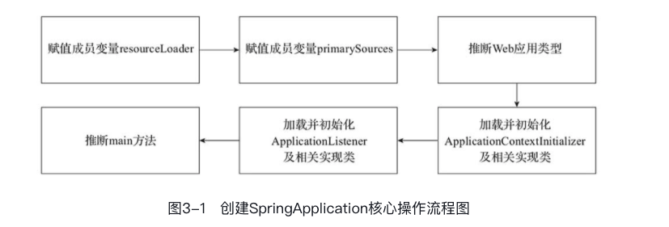

# Spring IOC 容器原理

IOC的设计思想，是通过专门的对象容器来创建和维护对象。依赖注入（DI，Dependency Injection）是Spring实现IoC容器的一种重要手段。**依赖注入将对象间的依赖的控制权从开发人员转移到了容器**，降低了开发成本。

**控制反转是一种软件设计模式，其遵循了软件工程中的依赖倒置原则；依赖注入是Spring框架实现控制反转的一种方式**。

## 核心容器介绍

### BeanFactory


`BeanFacoty`：顶级的接口类，定义了IOC容器的基本功能规范，其还有三个重要的子类，分别是：

- `ListableBeanFactory`：表示这些Bean可列表化
- `HierarchicalBeanFactory`：表示这写Bean有集成关系
- `AutowireCapableBeanFactory`：定义了Bean的自动装配规则
- **`DefaultListableBeanFactory`**：这个接口挺重要的，默认的IOC容器

这三个借口共同定义了Bean的集合、Bean之间的关系以及Bean的行为

·

### IOC容器

`ApplicationContext`是Spring 提供的高级的IOC容器，他能提供IOC容器的基本功能


### BeanDefinition

Spring IOC 容器中还需要定义各种Bean对象以及相互之间的关系，在Spring中Bean 对象是以`BeanDefinition`来描述的。其集成体系图如下：


### BeanDefinitonReader

`BeanDefinitonReader`主要对Bean的解析过程。类结构图如下：


BeanDefinitionReader的工作都有哪些：

- 首先要找到描述对象关系的问题
- 加载bean对象，并封装成一个`BeanDefinition`


定义对象关系的配置文件，spring使用**策略模式**来进行解析？

​	举个例子，ApplicationContext就有很多的策略

- ClassPathXmlApplicationContext
- AnnotionConfigApplicationContext
- WebApplicationContext


核心组件关系的一个总结：

- BeanDefinition：用来描述一个bean对象

- BeanDefinitionReader：主要用来对Bean对象的解析过程

- ApplicationContext：IOC容器，`DefaultListableBeanFactory`，会将所有的bean封装在`beanDefinitionMap`的map集合中。

  

# SpringBoot 核心运行原理

Spring Boot最核心的功能就是自动配置，功能的实现都是基于**“约定优于配置”**的原则。**那么Spring Boot是如何约定，又是如何实现自动配置功能的呢？**


自动状态的基本流程：

- Spring Boot通过**`@EnableAutoConfiguration`**注解开启自动配置，
- 扫描加载**`spring.factories`**中注册的各种**`AutoConfiguration`**类，
- 当某个**`AutoConfiguration`**类满足其注解**`@Conditional`**指定的生效条件（Starters提供的依赖、配置或Spring容器中是否存在某个Bean等）时，实例化该**`AutoConfiguration`**类中定义的Bean（组件等），并注入Spring容器，就可以完成依赖框架的自动配置


下面简单介绍一下上面各个组件或者注解的作用：

- **`@EnableAutoConfiguration`**：扫描各个jar包下的s`pring.factories`文件，并加载文件中注册的AutoConfiguration类等。
- **`spring.factories`**：配置文件，位于META-INF目录下，按照指定格式注册了自动配置的`AutoConfiguration`类。
-  **`AutoConfiguration`**：自动配置类，代表了`XXAutoConfiguration`命名的自动配置类
- **`@Conditional`**：条件注解及其衍生注解，当满足该条件注解时才会实例化AutoConfiguration类。
- **`Starters`**：三方组件的依赖及配置，如果是自定义的starter，该项目还需包含spring.factories文件、AutoConfiguration类和其他配置类


## 自动装配的过程

`@SpringBootApplication`注解是Spring Boot项目核心的注解，它里面组合了`@EnableAutoConfiguration`，这用于开启自动装配。下面看一下`@SpringBootApplication`注解组合的结构图：

**注意一点：`@EnableAutoConfiguration`注解所在类具有特定的意义，通常会被作为扫描注解@Entity的根路径。**


```java
@Target(ElementType.TYPE)
@Retention(RetentionPolicy.RUNTIME)
@Documented
@Inherited
@AutoConfigurationPackage
@Import(AutoConfigurationImportSelector.class)
public @interface EnableAutoConfiguration {

	String ENABLED_OVERRIDE_PROPERTY = "spring.boot.enableautoconfiguration";
	
  Class<?>[] exclude() default {};
	
  String[] excludeName() default {};
}
```

**`@EnableAutoConfiguration`的关键功能是通过`@Import`注解导入的`ImportSelector`来完成的。**

- **`@Improt`**

  主要提供导入配置类的功能，也可以导入实现了`ImportSelector`和`ImportBeanDefinitionRegistrar`的类，还可以通过@Import导入普通的POJO。

- **`ImportSelector`**

  `@Import`的许多功能都需要借助接口`ImportSelector`来实现，`ImportSelector`决定可引入哪些`@Configuration`。


下面通过流程图来整体描述一下自动装配的过程：


```java
public class AutoConfigurationImportSelector implements DeferredImportSelector, 		 
			BeanClassLoaderAware,ResourceLoaderAware, BeanFactoryAware, EnvironmentAware, Ordered{
     ....
       
   @Override
	 public String[] selectImports(AnnotationMetadata annotationMetadata) {
      //是否开启自动装配，默认开启
       if (!isEnabled(annotationMetadata)) {
        return NO_IMPORTS;
      }
       
      //加载元数据配置，默认加载类路径 META-INF/spring-autoconfigure-metadata.properties配置
      //元数据中配置了自动加载的条件，spring boot会在第5步 将收集好的配置类进行一次过滤
      AutoConfigurationMetadata autoConfigurationMetadata = AutoConfigurationMetadataLoader
          .loadMetadata(this.beanClassLoader);
      AutoConfigurationEntry autoConfigurationEntry = getAutoConfigurationEntry(autoConfigurationMetadata, annotationMetadata);
      
       return StringUtils.toStringArray(autoConfigurationEntry.getConfigurations());
	}
        
}
```


```java
protected AutoConfigurationEntry getAutoConfigurationEntry(AutoConfigurationMetadata autoConfigurationMetadata,
			AnnotationMetadata annotationMetadata) {
   	//检查自动装配是否开启
		if (!isEnabled(annotationMetadata)) {
			return EMPTY_ENTRY;
		}
  	//获取@EnableAutoConfiguration注解的属性 exclude 和 excludeName
		AnnotationAttributes attributes = getAttributes(annotationMetadata);
    //1.获取所有META-INF目录下的 spring.factories文件中 EnableAutoConfiguration 的所有配置类列表
		List<String> configurations = getCandidateConfigurations(annotationMetadata, attributes);
    //2.对上面获取到的注册配置类去重
		configurations = removeDuplicates(configurations);
		//3.获取注解属性中 exclude 和 excluedName 指定的要排除的配置列列表
    Set<String> exclusions = getExclusions(annotationMetadata, attributes);
		//检查被排除的类是否是 auto-configuration 类，不是抛出异常
    checkExcludedClasses(configurations, exclusions);
		//4.从加载的自动配类列表中移除要排除的配置类
    configurations.removeAll(exclusions);
    //5.根据autoConfigurationMetadata定义的条件，在对配置类进行一次过滤
		configurations = filter(configurations, autoConfigurationMetadata);
    //6.将配置类和要排除的类传入监听器中
		fireAutoConfigurationImportEvents(configurations, exclusions);
		return new AutoConfigurationEntry(configurations, exclusions);
	}

```


>  **在排除了`exclude`和`excludeName`指定的配置类后，还要在进行一个过滤，这次过滤是为了什么？**

首先明确参加过滤的数据有：

- configurations：List，经过初次过滤去重后的自动配置组件列表

- autoConfigurationMetadata：元数据文件`META-INF/spring-autoconfigure-metadata.properties`中配置对应实体类

- Auto-ConfigurationImportFilter：`META-INF/spring.factories`中配置key为`Auto-ConfigurationImportFilter`的Filters列表

对自动配置组件列表进行再次过滤，过滤条件为该列表中自动配置类的注解得包含在`OnBeanCondition`、`OnClassCondition`和`OnWebApplicationCondition`中指定的注解，依次包含`@ConditionalOnBean`、`@ConditionalOnClass`和`@ConditionalOnWebApplication`。


在`spring-boot-autoconfigure`中默认配置了3个筛选条件，它们都实现了`AutoConfigurationImportFilter`接口：

- `OnBeanCondition`
- `OnClassCondition`
- `OnWebApplicationCondition`


Spring Boot了**`@Conditional`**注解，可根据**是否满足指定条件来决定是否进行Bean的实力化配置**。`@Conditional`注解来提供了很多衍生的注解：

- **`@ConditionalOnBean`**：容器中有指定Bean的条件下。
- **`@ConditionalOnClass`**：在classpath类路径下有指定类的条件下。
- **`@ConditionalOnMissingBean`**：当容器里没有指定Bean的条件时
- **`@ConditionalOnProperty`**：在指定的属性有指定值的条件下。
- `@ConditionalOnResource`：在指定的属性有指定值的条件下。
- `@ConditionalOnCloudPlatform`：当指定的云平台处于active状态时。
- `@ConditionalOnExpression`：基于SpEL表达式的条件判断。
- `@ConditionalOnJava`：基于JVM版本作为判断条件
- `@ConditionalOnJndi`：在JNDI存在的条件下查找指定的位置。
- `@ConditionalOnWebApplication`：在项目是一个Web项目的条件下。
- `@ConditionalOnNotWebApplication`：在项目不是一个Web项目的条件下。


`spring-autoconfigure-metadata.properties`文件内的配置格式如下:

> 自动配置类的权限定名.注解名称 = 值


以上完成了自动配置类的读取和筛选


## Spring Boot 构造流程分析

有个遗留问题：扫描到了自动配置了，IOC容器到底是个什么？Map？

### SpringApplication实例化流程



```java
@SpringBootApplication
public class GiantServerApplication {

    public static void main(String[] args) {
        SpringApplication.run(GiantServerApplication.class, args);
    }
}

//SpringApplication对象的构造方法
//primarySources：springboot入口引导类
public SpringApplication(ResourceLoader resourceLoader, Class<?>... primarySources) {
    this.resourceLoader = resourceLoader;
		Assert.notNull(primarySources, "PrimarySources must not be null");
		this.primarySources = new LinkedHashSet<>(Arrays.asList(primarySources));
		//推断Web应用类型
    this.webApplicationType = WebApplicationType.deduceFromClasspath();
		//加载并初始化ApplicationContextInitialize类型的所有配置类，并赋值成员变量List<ApplicationContextInitializer<?>> initializers
    setInitializers((Collection) getSpringFactoriesInstances(ApplicationContextInitializer.class));
		//加载并初始化ApplicationListener
    setListeners((Collection) getSpringFactoriesInstances(ApplicationListener.class));
		//推断main方法Class类
    this.mainApplicationClass = deduceMainApplicationClass();
	}
```


#### web应用类型判断原则：

- 当`DispatcherHandler`存在，并且`DispatcherServlet`和`ServletContainer`都不存在，则返回类型为**`WebApplicationType.REACTIVE`**

- 当`SERVLET`或`ConfigurableWebApplicationContext`任何一个不存在时，说明当前应用为非Web应用，返回**`WebApplicationType.NONE`。**

- 当应用不为`REACTIVE Web`应用，并且`SERVLET`和`ConfigurableWebApplicationContext`都存在的情况下，则为`SERVLET的Web`应用，返回**`WebApplicationType.SERVLET`。**

  

#### ApplicationContextInitializer加载并初始化

`ApplicationContextInitializer`是Spring IOC容器提供的一个接口，**它是一个回调接口，主要目的是允许用户在`ConfigurableApplicationContext`类型（或其子类型）的`ApplicationContext`做`refresh`方法调用刷新之前，对`ConfigurableApplicationContext`实例做进一步的设置或处理，通常用于应用程序上下文进行编程初始化的Web应用程序中**。


在完成了Web应用类型推断之后，`ApplicationContextInitializer`便开始进行加载工作，**Spring boot会加载并实例化 META-INF/spring.factories文件中`ApplicationContextInitializer`的所有配置类（并排序，去重）。**

```java
private <T> Collection<T> getSpringFactoriesInstances(Class<T> type) {
		return getSpringFactoriesInstances(type, new Class<?>[] {});
}

private <T> Collection<T> getSpringFactoriesInstances(Class<T> type, Class<?>[] parameterTypes, Object... args) {
    ClassLoader classLoader = getClassLoader();
    //还是获取META-INF/spring.factories文件中注册的ApplicationContextInitializer类型对应配置类的权限定名，并去重 
    Set<String> names = new LinkedHashSet<>(SpringFactoriesLoader.loadFactoryNames(type, classLoader));
    //获取到配置类的全限定名后，进行实例化操作
    List<T> instances = createSpringFactoriesInstances(type, parameterTypes, classLoader, args, names);
    //排序
    AnnotationAwareOrderComparator.sort(instances);
    //返回排序后的实例化后的配置类集合（ApplicationContextInitializer类型集合）
    return instances;
}

```

下面贴一段META-INF/spring.factories目录中，ApplicationContextInitialize配置类：

```properties
org.springframework.context.ApplicationContextInitializer=\
org.springframework.boot.autoconfigure.SharedMetadataReaderFactoryContextInitializer,\
org.springframework.boot.autoconfigure.logging.ConditionEvaluationReportLoggingListener

```


#### ApplicationListener加载

当容器初始化完成之后，需要处理一些如数据的加载、初始化缓存、特定任务的注册等操作， 可以通过Spring的事件传播机制来实现。


Spring事件传播机制是基于**观察者模式（Observer）**实现的。比如，在`ApplicationContext`管理`Bean`生命周期的过程中，会将一些改变定义为事件（**`ApplicationEvent`**）。`ApplicationContext`通过`ApplicationListener`监听`ApplicationEvent`，当事件被发布之后，`ApplicationListener`用来对事件做出具体的操作。

如果容器中存在`ApplicationListener`的Bean，当`ApplicationContext`调用`publishEvent`方法时，对应的Bean会被触发。

`ApplicationListener`的加载过程同`ApplicationContextInitializer`一样，这里不在过多的重复。


### Spring Boot运行流程分析

当`SpringApplication`对象被创建之后，通过调用其`run`方法来进行`Spring Boot`的启动和运行，至此正式开启了`SpringApplication`的生命周期。


可以看出`run`方法的核心操作都有；

- 获取监听器和参数配置
- 打印Banner信息
- 创建并初始化容器
- 监听发送通知

```java
public ConfigurableApplicationContext run(String... args) {
		StopWatch stopWatch = new StopWatch();
		stopWatch.start();
		ConfigurableApplicationContext context = null;
		Collection<SpringBootExceptionReporter> exceptionReporters = new ArrayList<>();
    //配置headless属性
		configureHeadlessProperty();
    //获取并META-INF/spring.factories配置的SpringApplicationRunListener监听器列表，并启动所有的监听器
		SpringApplicationRunListeners listeners = getRunListeners(args);
		listeners.starting();
		try {
      //创建ApplicationArgument对象
			ApplicationArguments applicationArguments = new DefaultApplicationArguments(args);
      //加载属性配置（application.properties和外部属性），策略模式（根据不同的web环境类型）
			ConfigurableEnvironment environment = prepareEnvironment(listeners, applicationArguments);
			configureIgnoreBeanInfo(environment);
      //打印banner
			Banner printedBanner = printBanner(environment);
			//创建IOC容器
      context = createApplicationContext();
			//异常报告器
      exceptionReporters = getSpringFactoriesInstances(SpringBootExceptionReporter.class,
					new Class[] { ConfigurableApplicationContext.class }, context);
			//准备容器，对象之间进行关联
      prepareContext(context, environment, listeners, applicationArguments, printedBanner);
			//初始化容器
      refreshContext(context);
			afterRefresh(context, applicationArguments);
			stopWatch.stop();
			if (this.logStartupInfo) {
				new StartupInfoLogger(this.mainApplicationClass).logStarted(getApplicationLog(), stopWatch);
			}
      //通知监听器：容器启动完成
			listeners.started(context);
			//调用ApplicationRunner和CommandRunner的运行方法
      callRunners(context, applicationArguments);
		}
		catch (Throwable ex) {
			handleRunFailure(context, ex, exceptionReporters, listeners);
			throw new IllegalStateException(ex);
		}

		try {
      //通知监听器：容器正在运行
			listeners.running(context);
		}
		catch (Throwable ex) {
			handleRunFailure(context, ex, exceptionReporters, null);
			throw new IllegalStateException(ex);
		}
		return context;
	}
```

下面逐步详细的介绍`run`方法的细节：

#### 1. 创建ConfigurableEnvironment对象

ConfigurableEnvironment接口的主要作用是：

​			提供当前运行环境的公开接口，比如配置文件`profiles`各类系统属性和变量的设置、添加、读取、合并等功能

```java
private ConfigurableEnvironment prepareEnvironment(SpringApplicationRunListeners listeners,
			ApplicationArguments applicationArguments) {
		//使用策略模式，获取或者创建ConfigurableEnvironment环境对象（根据当前webApplication的类型）
		ConfigurableEnvironment environment = getOrCreateEnvironment();
    //配置环境，主要包括PropertySources和activeProfile的配置
		configureEnvironment(environment, applicationArguments.getSourceArgs());
		ConfigurationPropertySources.attach(environment);
		//环境准备已经完成，通知对应的监听器
    listeners.environmentPrepared(environment);
    //将环境绑定到SpringApplication上
		bindToSpringApplication(environment);
    //判断是否是定制环境，如果不是将其转换成StandardEnviroment
		if (!this.isCustomEnvironment) {
			environment = new EnvironmentConverter(getClassLoader()).convertEnvironmentIfNecessary(environment,
					deduceEnvironmentClass());
		}
		ConfigurationPropertySources.attach(environment);
		return environment;
}
```


```java
//1.配置环境
protected void configureEnvironment(ConfigurableEnvironment environment, String[] args) {
		//如果为true，则获取并设置转换服务
   	if (this.addConversionService) {
      //以单例模式创建ConversionService对象，并设置转换服务
			ConversionService conversionService = ApplicationConversionService.getSharedInstance();
			environment.setConversionService((ConfigurableConversionService) conversionService);
		}
  	//配置PropertySources（描述参数的优先级处理和默认参数与命令参数之间的关系。）
		configurePropertySources(environment, args);
  	//配置Profiles（设置激活生效的配置文件，对应spring.profile.active参数）
		configureProfiles(environment, args);
}


protected void configurePropertySources(ConfigurableEnvironment environment, String[] args) {
		//获取环境中属性资源信息
  	MutablePropertySources sources = environment.getPropertySources();
		//如果默认属性配置存在则将其放在属性资源的最后
   	if (this.defaultProperties != null && !this.defaultProperties.isEmpty()) {
			sources.addLast(new MapPropertySource("defaultProperties", this.defaultProperties));
		}
  	//如果命令行属性存在
		if (this.addCommandLineProperties && args.length > 0) {
			String name = CommandLinePropertySource.COMMAND_LINE_PROPERTY_SOURCE_NAME;
			//默认属性和命令行属性冲突，则将命令行属性替换默认属性
      if (sources.contains(name)) {
				PropertySource<?> source = sources.get(name);
				CompositePropertySource composite = new CompositePropertySource(name);
				composite.addPropertySource(
						new SimpleCommandLinePropertySource("springApplicationCommandLineArgs", args));
				composite.addPropertySource(source);
				sources.replace(name, composite);
			}
			else {
        //默认属性与命令行不冲突，将命令行属性放入第一位
				sources.addFirst(new SimpleCommandLinePropertySource(args));
			}
		}
}

protected void configureProfiles(ConfigurableEnvironment environment, String[] args) {
    //如果存在而外的配置文件，则将其放在第一位（LinkHashList）
		Set<String> profiles = new LinkedHashSet<>(this.additionalProfiles);
  	//获取并设置激活的配置文件
		profiles.addAll(Arrays.asList(environment.getActiveProfiles()));
		environment.setActiveProfiles(StringUtils.toStringArray(profiles));
}
```


#### 2.创建SpringApplicationContext（IOC容器）

```java
//同样使用策略模式，根据不同web环境，创建不同的IOC容器
protected ConfigurableApplicationContext createApplicationContext() {
		Class<?> contextClass = this.applicationContextClass;
		if (contextClass == null) {
			try {
				switch (this.webApplicationType) {
           //servlet容器，AnnotationConfigServletWebServerApplicationContex
            case SERVLET:
              contextClass = Class.forName(DEFAULT_SERVLET_WEB_CONTEXT_CLASS);
              break;
            //reactive容器，AnnotationConfigReactiveWebServerApplicationContext
            case REACTIVE:
              contextClass = Class.forName(DEFAULT_REACTIVE_WEB_CONTEXT_CLASS);
              break;
            //默认，AnnotationConfigApplicationContext
            default:
              contextClass = Class.forName(DEFAULT_CONTEXT_CLASS);
				}
			}
			catch (ClassNotFoundException ex) {
				throw new IllegalStateException(
						"Unable create a default ApplicationContext, please specify an ApplicationContextClass", ex);
			}
		}
		return (ConfigurableApplicationContext) BeanUtils.instantiateClass(contextClass);
	}
```


#### 3.SpringApplication对象的准备操作

首先通过流程图了解一下核心流程：

```java
private void prepareContext(ConfigurableApplicationContext context, ConfigurableEnvironment environment,
      SpringApplicationRunListeners listeners, ApplicationArguments applicationArguments, Banner printedBanner) {
   //设置上下文的环境
   context.setEnvironment(environment);
   //applicationContext的后置处理
   postProcessApplicationContext(context);
   //context刷新之前，ApplicationContextInitializer初始化context
   applyInitializers(context);
   //通知监听器context准备完成，该方法上为上下文准备阶段，以下为上下文加载阶段
   listeners.contextPrepared(context);
   
   //1.打印日志，启动profile
   if (this.logStartupInfo) {
      logStartupInfo(context.getParent() == null);
      logStartupProfileInfo(context);
   }
   //2.获得ConfigurableListableBeanFactory并注册单例对象
   ConfigurableListableBeanFactory beanFactory = context.getBeanFactory();
   beanFactory.registerSingleton("springApplicationArguments", applicationArguments);
   //3.注册打印日志对象
   if (printedBanner != null) {
      beanFactory.registerSingleton("springBootBanner", printedBanner);
   }
   if (beanFactory instanceof DefaultListableBeanFactory) {
      ((DefaultListableBeanFactory) beanFactory)
            .setAllowBeanDefinitionOverriding(this.allowBeanDefinitionOverriding);
   }
   if (this.lazyInitialization) {
      context.addBeanFactoryPostProcessor(new LazyInitializationBeanFactoryPostProcessor());
   }
   //4.获取所有的配置源，并将配置源的所有bean加载到context中，最后通知监听器加载完成
   Set<Object> sources = getAllSources();
   Assert.notEmpty(sources, "Sources must not be empty");
   load(context, sources.toArray(new Object[0]));
   listeners.contextLoaded(context);
}
```


```java
//ApplicationContext后置处理流程
protected void postProcessApplicationContext(ConfigurableApplicationContext context) {
   //将当前的BeanNameGenerator（Bean对象命名策略）按照默认名字进行注册
   if (this.beanNameGenerator != null) {
     context.getBeanFactory().registerSingleton(AnnotationConfigUtils.CONFIGURATION_BEAN_NAME_GENERATOR,
            this.beanNameGenerator);
   }
   if (this.resourceLoader != null) {
      if (context instanceof GenericApplicationContext) {
         ((GenericApplicationContext) context).setResourceLoader(this.resourceLoader);
      }
      if (context instanceof DefaultResourceLoader) {
         ((DefaultResourceLoader) context).setClassLoader(this.resourceLoader.getClassLoader());
      }
   }
   //获取并设置转换服务
   if (this.addConversionService) {
      context.getBeanFactory().setConversionService(ApplicationConversionService.getSharedInstance());
   }
}
```


应用上下文加载阶段包含以下步骤：

- 打印日志和Profile的设置
- 设置是否允许覆盖注册
- 获取全部配置源
- 将配置源加载入上下文
- 通知监控器context加载完成

BeanDefinitionLoader加载支持的范围包括：`Class`、`Resource`、`Package`和`CharSequence`四种。


#### SpringApplicationRunListener监听器

这里有必要介绍一下`SpringApplicationRunListener`接口，它是`SpringApplication`的`run`方法监听器，为`run`方法提供了各个运行阶段的监听事件处理功能。


```java
class SpringApplicationRunListeners {

  //run方法第一次被调用，会被立即调用，可以用于非常早期的初始化操作
	void starting() {}
	
  //当environment准备完成，在ApplicationContext创建之前，该方法被调用
	void environmentPrepared(ConfigurableEnvironment environment) {}
	
  //当ApplicationContext创建完成，资源未被加载时，该方法被调用
	void contextPrepared(ConfigurableApplicationContext context) {}
	
  //当ApplicationContext加载完成，未被刷新之前，调用该方法
	void contextLoaded(ConfigurableApplicationContext context) {}
	
  //当ApplicationContext刷新启动之后，CommandRunner和ApplicationRunner未被调用之前，调用该方法
	void started(ConfigurableApplicationContext context) {
	
  //当所有准备工作就绪，run方法执行完成之前，该方法被调用
	void running(ConfigurableApplicationContext context) {}
	
  //当程序出现错误时，该方法被调用
	void failed(ConfigurableApplicationContext context, Throwable exception) {}
	}
} 
```


