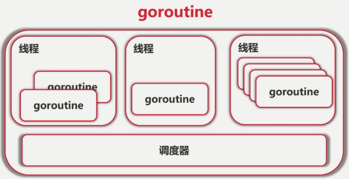
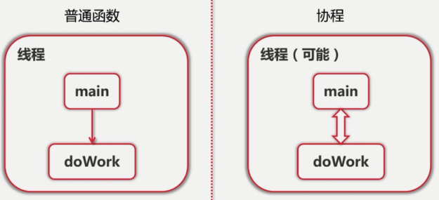
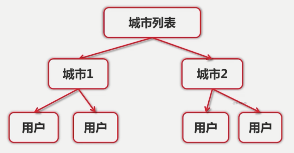
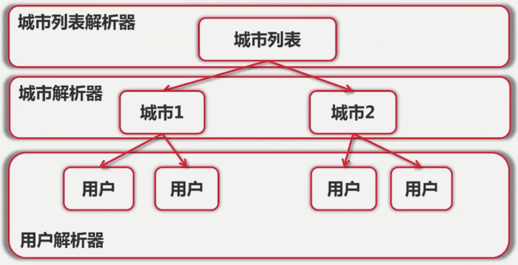
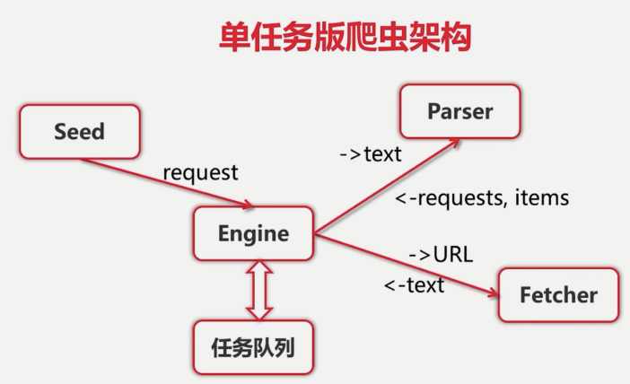

## 值接收者 和 指针接收者

想要改变值就要使用指针接受


## 包

每个目录一个包

main包包含可执行入口

为结构定义的方法必须放在同一包内，可以不同一个文件中

## 扩充类型

go中没有继承，如果想要扩充别人的方法，可以使用**组合**的方式和**定义别名**的方式

# 2. 面向接口

interface{}： 表示任何类型

type assertion

type switch


# 3. 函数式编程

​     函数是一等公民：变量，参数，返回值都可以是函数。在c++中只有函数指针，在Java中函数只是个名字，没有办法将函数传递给别人。

​		高阶函数：函数的参数可以是函数

​		闭包：

# 4.测试

## 传统测试

go语言使用的是表格测试的方式，那么传统的测试方法和表格测试有什么区别呢，下面看一下基于Java的传统的测试方法：

```java
import  static org.junit.Assert.*;    // 这里必须是static

@SpringBootTest
public class TestAdd {
    public int add(int a,int b){
        return a+b;
    }

    @Test
    public void TestAdd(){
        assertEquals(3,add(1,2));
        assertEquals(2,add(0,2));
        assertEquals(3,add(0,2));
        assertEquals(0,add(-1,1));
    }
}
```

**传统测试的缺点**：

- 测试结果数据和测试逻辑混在一起
- 出错信息不明确（只会告诉actual和expect，并不会告诉使用的测试用例，具体需要看代码）

- 一旦一个数据出错测试全部结束
- 测试代码本身也需要维护，导致单元测试的综合成本很高


## 表格驱动测试(test)

**表格驱动测试**是一种编写易于扩展测试用例的测试方法。由表格来决定哪些变量需要设定输入值及设定什么值，由表格来确定哪些变量需要判断预期输出以及预期输出的值，那么，用户只要在数据表格中建立和编辑测试数据，就可以高效地建立大量用例，测试数据也更易于维护和重用。

**go语言的要求**：

- 文件名必须以xxx_test结尾
- 测试方法必须以Testxxx开头
- 方法的参数为：t *testing.T      (t用来提供汇报错误的借口)

```go
package main

import (
	"testing"
)

func add(a,b int32) int32 {
	return a+b
}
 
func TestAdd(t *testing.T) {
	tests := []struct {
		a, b, c int32
	}{
		{1, 2, 3},
		{0, 2, 2},
		{0, 0, 0},
		{-1, 1, 1},
	}

	for _,test :=range tests{
		if actual:=add(test.a,test.b);actual!=test.c{
			t.Errorf("add(%d,%d); got %d; expected %d",test.a,test.b,actual,test.c)
		}
	}
}
```

## 性能测试（bench）

**要求**：

- 测试方法的参数为 **t *testing.B**
- 命令行方式：**go test -bench xxx**


```go
import "testing"

func TestSubstr(t *testing.T) {
	tests := []struct {
		s   string
		ans int
	}{
		// Normal cases
		{"abcabcbb", 3},
		{"pwwkew", 3},

		// Edge cases
		{"", 0},
		{"b", 1},
		{"bbbbbbbbb", 1},
		{"abcabcabcd", 4},

		// Chinese support
		{"这里是慕课网", 6},
		{"一二三二一", 3},
		{"黑化肥挥发发灰会花飞灰化肥挥发发黑会飞花", 8},
	}

	for _, tt := range tests {
		actual := lengthOfNonRepeatingSubStr(tt.s)
		if actual != tt.ans {
			t.Errorf("got %d for input %s; "+
				"expected %d",
				actual, tt.s, tt.ans)
		}
	}
}

//性能测试
func BenchmarkSubstr(b *testing.B) {
	s := "黑化肥挥发发灰会花飞灰化肥挥发发黑会飞花"
	for i := 0; i < 13; i++ {
		s = s + s
	}
	b.Logf("len(s) = %d", len(s))
	ans := 8
	b.ResetTimer()

  //b.N 代码的运行次数
	for i := 0; i < b.N; i++ {
		actual := lengthOfNonRepeatingSubStr(s)
		if actual != ans {
			b.Errorf("got %d for input %s; "+
				"expected %d",
				actual, s, ans)
		}
	}
}
```

测试结果展示：

```go
goos: darwin
goarch: amd64
pkg: learngo/functional/nonrepeating
BenchmarkSubstr-4   	     300	   5202954 ns/op    (运行300次，每次的平均执行 5202952 ns)
--- BENCH: BenchmarkSubstr-4
    nonrepeation_test.go:42: len(s) = 491520
    nonrepeation_test.go:42: len(s) = 491520
    nonrepeation_test.go:42: len(s) = 491520
PASS

```

### pprof性能优化


# 5.闭包


# 6.goroutine

- 协程是轻量级的"线程"
- **非抢占**式多任务处理，由协程主动交出控制权（什么时候交出控制权是由协程自己说了算）
- 编译器/解释器/虚拟机层面的多任务，并非是操作系统层上的多任务。
- 多个协程可以在一个或者多个线程上运行
- 调度器在合适的点进行协程之间的切换
  - IO操作（println函数） / select
  - channel
  - 等待锁
  - 函数调用（有时）
  - runtime.Gosched()
- 使用**-race**来检测数据访问冲突



**如何理解非抢占式**？

```go
func main() {
	var a[10] int

	for i:=0;i<10;i++{
		go func(i int) {
      for{
				a[i]++
			}
		}(i)
	}
	time.Sleep(time.Second)
}

//结果：
	程序将会陷入死循环中
//为什么？
	协程中是个死循环，如果当前协程不主动释放控制权的话，main的goroutine无法获取控制权，所以是非抢占式的
//如果手动交出控制权
  IO操作可以交出控制权，也可以使runtime.Gosched()交出控制权
  for i:=0;i<10;i++{
      go func(i int) {
        for{
          //主动交出控制权
          runtime.Gosched()
          a[i]++
        }
      }(i)
    }
    time.Sleep(time.Second)
```


**普通函数和协程的对比**

​		在**普通函数**中，main函数中调用doWork函数，当doWork函数执行完后，再将控制权交给main函数。

​        但在**协程**中，main和doWork之间有个双向的通道。数据和控制权都可以进行**双向**的流通，就相当于两个并发之行的线程，中间有个通道可以进行数据的交换。main和doWork可以运行在一个线程中，也可以是多个线程中。




# 7.channel

基于csp模型的

- 不要通过共享内存来通信，通过通信来共享内存


```go
func channelDemo(){
	c := make(chan  int)
	
  //会发生死锁，为什么？
  c <- 1
	c <- 2
	
	go func() {
		for{
			n := <-c
			fmt.Println(n)
		}
	}()
}

//上面的代码会造成死锁？问什么？
/*
	因为上面的channel是阻塞式的channel，发送一个消息必须有人接受，所以应该是先有接受者，才能向channel中发送消息，所以应该修改成如下的代码逻辑
*/

func channelDemo(){
	c := make(chan  int)
	
  //有接受者，保证会消费channel中的消息
	go func() {
		for{
			n := <-c
			fmt.Println(n)
		}
	}()
  
  //向channel中发送消息
   c <- 1
	 c <- 2
}
```

## 使用Channel等待多任务结束

```go
type worker struct{
	in chan int
	done chan bool
}

//done 通知外面当前任务做完了
func doWorker(id int, c chan int,done chan bool){
	for n:= range c{
		fmt.Printf("worker %d received %c\n",id,n)
		done <- true
	}
}

func createWorker(id int) worker{
	 w := worker{
	 	in: make(chan int),
	 	done: make(chan bool),
	 }
	go doWorker(id,w.in , w.done)
	return w
}

func send(){
	var workers [10] worker

	for i:=0;i<10;i++{
		workers[i] = createWorker(i)
	}

	//发
	for i:=0;i<10;i++{
		workers[i].in <- 'a'+i
		//当收一个东西的时候，不管收什么东西，此时已经打印完毕了
		<- workers[i].done
	}

	for i:=0;i<10;i++{
		workers[i].in <- 'A'+i
		<- workers[i].done
	}
}

func main() {
	send()
}

//结果是顺序打印
worker 0 received a
worker 1 received b
worker 2 received c
worker 3 received d
worker 4 received e
worker 5 received f
worker 6 received g
worker 7 received h
worker 8 received i
worker 9 received j
worker 0 received A
worker 1 received B
worker 2 received C
worker 3 received D
worker 4 received E
worker 5 received F
worker 6 received G
worker 7 received H
worker 8 received I
worker 9 received J

```

## 使用waitGroup

```go
type worker struct{
	in chan int
	wg *sync.WaitGroup
}

//done 通知外面当前任务做完了
func doWorker(id int, c chan int,wg *sync.WaitGroup){
	for n:= range c{
		fmt.Printf("worker %d received %c\n",id,n)
		//完成一组任务，消耗掉一个
		wg.Done()
	}
}

func createWorker(id int,wg *sync.WaitGroup) worker{
	 w := worker{
	 	in: make(chan int),
	 	wg:wg,
	 }
	go doWorker(id,w.in,wg)
	return w
}

func send(){
	var wg sync.WaitGroup

	var workers [10]worker
	for i:=0;i<10;i++{
		workers[i] = createWorker(i,&wg)
	}

	//总共有20组任务
	wg.Add(20)
	for i:=0;i<10;i++{
		workers[i].in <- 'a'+i
	}
	for i:=0;i<10;i++{
		workers[i].in <- 'A'+i
	}

	//等待所有任务的完成
	wg.Wait()
}

func main() {
	send()
}

//运行结果
worker 9 received j
worker 1 received b
worker 8 received i
worker 2 received c
worker 3 received d
worker 7 received h
worker 4 received e
worker 5 received f
worker 6 received g
worker 0 received a
worker 0 received A
worker 9 received J
worker 1 received B
worker 6 received G
worker 7 received H
worker 5 received F
worker 4 received E
worker 3 received D
worker 2 received C
worker 8 received I
```

# 8.标准库

## 8.1 fmt格式输出

```properties
%d: int变量
%x, %o, %b: 分别为16进制，8进制，2进制形式的int
%f, %g, %e: 浮点数： 3.141593 3.141592653589793 3.141593e+00
%t: 布尔变量：true 或 false
%c: rune (Unicode码点)，Go语言里特有的Unicode字符类型
%s: string
%q: 带双引号的字符串 "abc" 或 带单引号的 rune 'c'
%v: 会将任意变量以易读的形式打印出来
%T: 打印变量的类型
%%: 字符型百分比标志（%符号本身，没有其他操作）
```

## ioUtil


## 8. http

- 使用http客户端发送请求
- 使用http.Client控制请求头
- 使用httpUtil简化工作

```go
func main() {
	//如果err为nil,调用方应该关闭掉resp.Body
	resp, err := http.Get("http://www.imooc.com")
	if err != nil{
		panic(err)
	}
	defer resp.Body.Close()
	
	//保存response
	bytes, err := httputil.DumpResponse(resp, true)
	if err != nil{
		panic(err)
	}
	fmt.Printf("%s",bytes)
}
```


```go
//模拟手机访问www.imooc.com网站，如果是手机访问，将会重定向到www.m.immoc.com
func mobileGet(){
	//构造一个Get请求
	request, e := http.NewRequest(http.MethodGet, "http://www.imooc.com", nil)
	if e !=nil{
		panic(e)
	}
	//设置请求头，User-Agent：模拟手机用户发送请求
	request.Header.Add("User-Agent", "Mozilla/5.0 (iPhone; CPU iPhone OS 11_0 like Mac OS X) " +
				"AppleWebKit/604.1.38 (KHTML, like Gecko) Version/11.0 Mobile/15A372 Safari/604.1")

	//自己构造一个client
	client := http.Client{
		//重定向的request
		CheckRedirect: func(req *http.Request, via []*http.Request) error {
			fmt.Println("Redirect:",req)
			return nil
		},
	}
	response, e := client.Do(request)
	if e !=nil{
		panic(e)
	}
	//保存response
	bytes, err := httputil.DumpResponse(response, true)
	if err != nil{
		panic(err)
	}
	fmt.Printf("%s",bytes)

	defer response.Body.Close()
}


func main() {
	mobileGet()
}
```

bufio

log

## time

## Encoding/json


**查看官方文档**

- 本地查看 **: `godoc -http :8888`**，然后浏览器访问 `localhot:8888`


# 9.实战：网络爬虫

##  单机版的爬虫架构

现阶段所要达到的目标：**爬取到城市列表 ->  具体到某个城市 -> 爬取该城市下用户的信息**



在这个算法中，每个层级都要有其相应的**解析器**。不同的层级，有不同的解析规则和目的。



 

**解析器Parser**

- 输入：utf-8编码的文本

- 输出：Request{url,对应的Parser}列表，Item列表

  ​			每个URL对应的Parser可能不一样


**单机版的爬虫架构**



1. 起始地址的url 就相当于种子 seed，将种子地址交给引擎去处理。
2. 引擎并不是立即执行，而是放到任务队列中。定时的从任务队列中处理任务。 
3. 将任务中的URL交给**Feather（数据提取模块**），返回数据提取的结果文本。
4. 将文本交给解析器，返回requests和item，其中requests是下一个要处理的任务，打印出item结果。


