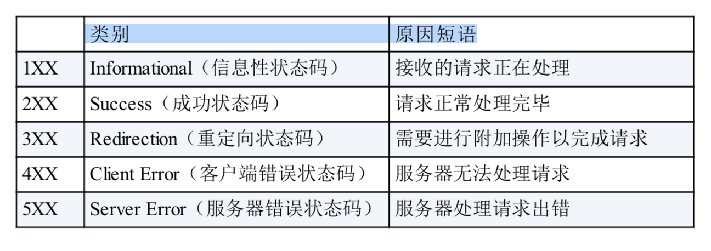
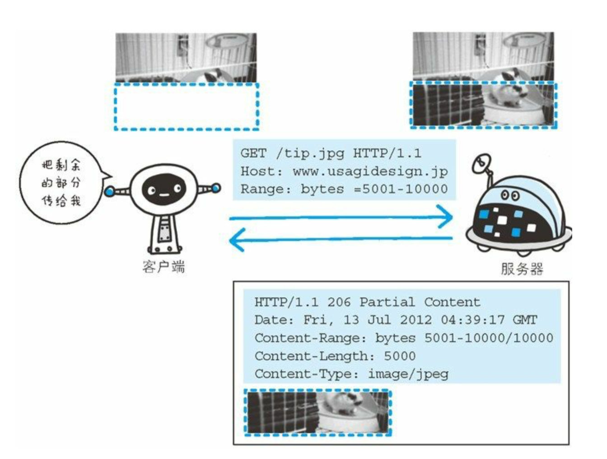

# 1.http协议

## 1.1 url和uri的区别

URI（同一资源标识符）Uniform Resource Identifier，URL（统一资源定位符）Uniform Resource Locator。

**区别：**

- URL是访问页面时所需要输入的网页地址。

- URI是用字符串表示某一互联网资源，而URL表示资源的地址。

- 所以URL是URI的子集。

## 1.2 http协议的特点

http1.1采用的**半双工**的通信模式，http2.0采用的是**全双工**的通信模式。

通信模式分为三种：单工、半双工、全双工。

**单工**指的是：消息只能单向发送，从发送者到接收者。

**半双工**指的是：通信双方都可以发送和接受消息，但是同一时间不能同时进行接受和发送消息。

**全双工**指的是：通信双方可同时收发消息。


## 1.3 http 状态码



#### 204 No Content

请求处理成功，但是没有资源，即响应报文中没有实体。一般只需要从客户端向服务端发送消息，而对客户端不新消息内容的情况下使用。

#### 206 Partial Content

客户端进行范围的请求，响应报文包含由Content-Range指定范围内的实体内容。

#### 301 Moved Permanently

永久重定向

#### 302 Found

临时重定向。

#### 303 See Other


## 1.4多部分对象集合

多部分对象集合可以容纳不同类型的数据。多部分对象集合包含的对象有：

- **multipart/form-data**：web 表单文件上传的时候使用
- **multipart/byteranges**：响应报文包含了多个范围的内容使用

### 1.4.1 范围请求

所谓恢复就是指：能从之前中断的位置恢复下载。要实现这种功能**需要指定下载的实体范围**。指定范围发送的请求成为**范围请求**。



Header中的字段Range来指定资源的byte范围。byte指定范围的形式如下：

- 5001～10000字节

```properties
Range: bytes=5001-10000
```

- 5001字节之后


##  1.5 Header字段

### 1.5.1Content-Type


# Http协议缺点

http有其不足之处，体现在以下方面：

- 通信使用明文传输，内容可能会被窃听
- 不验证通信方的身份，有可能遭遇身份伪造
- 无法保证报文的完整性，有可能遭到篡改


通过的过程是不可靠的，任何的地方都可能存在窃听，所以为防止被窃听，通常进行加密处理，有以下几种方式：

- **通信通道的加密**。用ssl建立安全通信线路。
- **内容加密**。http协议没有加密机制，就对其传输内容进行加密，要求双方都具有加密和解密机制。


Http协议通信时，服务端只接受服务，任何人都可以发起请求，不确认通信方，会存在各种隐患，比如：

- 无法确保响应返回到真实的请求方（伪造请求方）
- 无法确保请求发送到真实的服务器（web服务器伪造）
- 

# 确认用户身份的访问


## OAuth2


## JWT 

