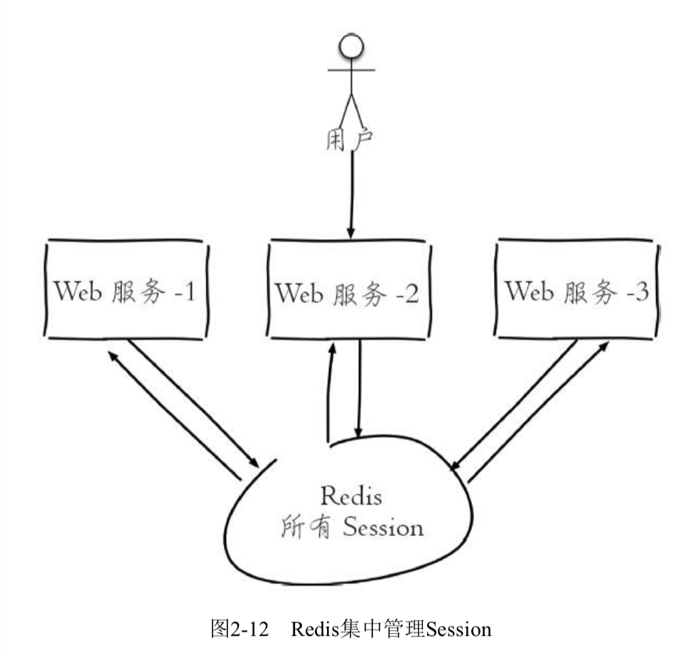
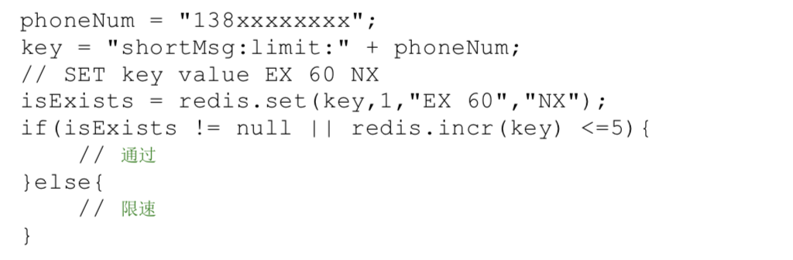
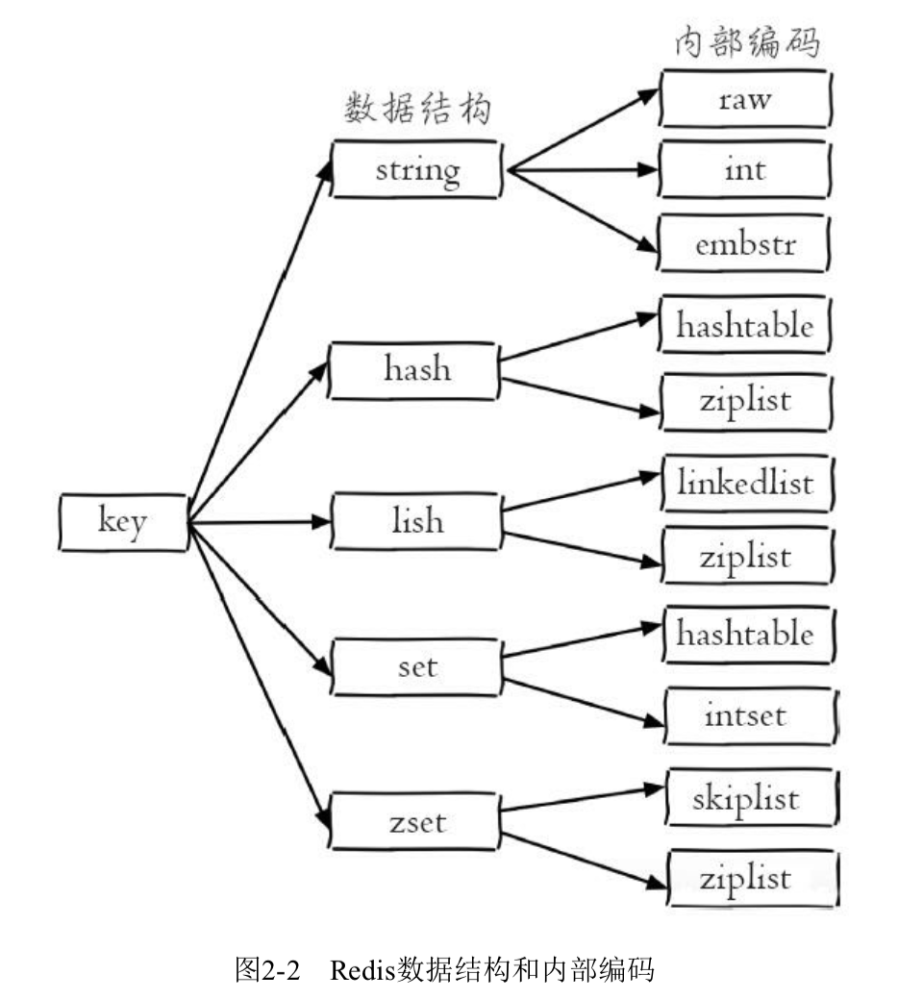
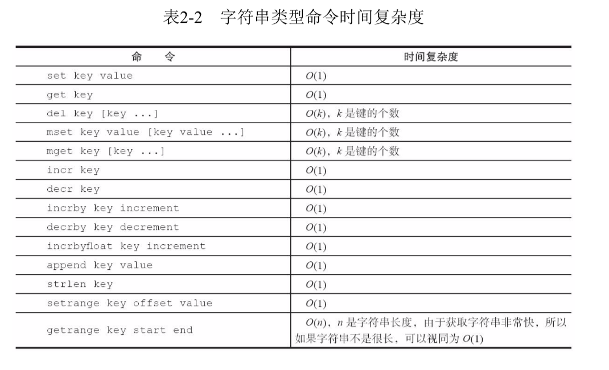
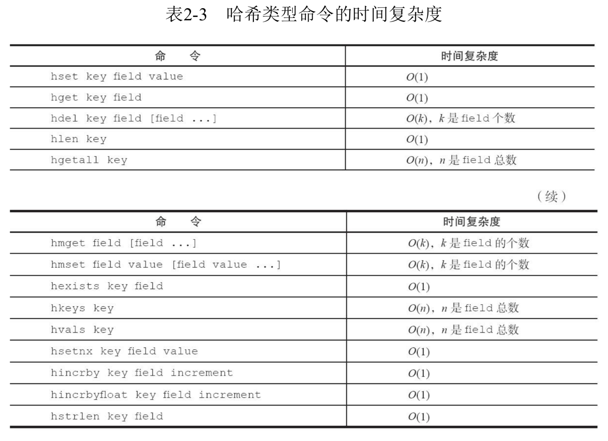
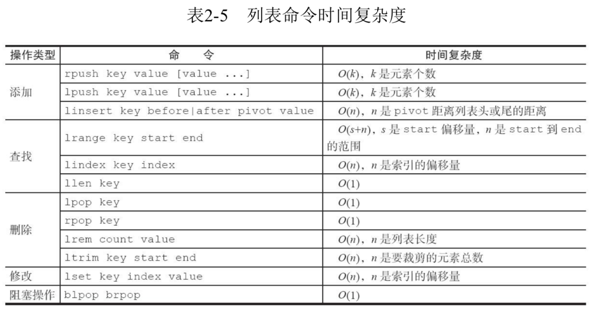
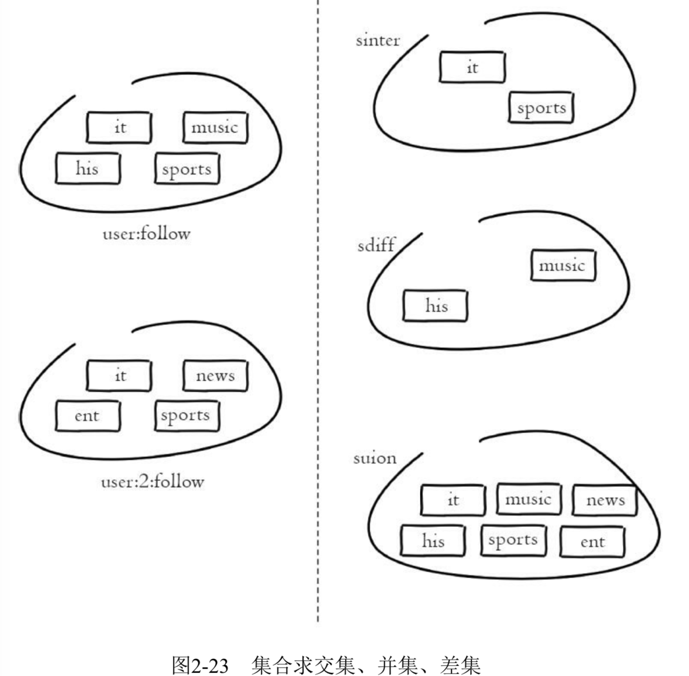
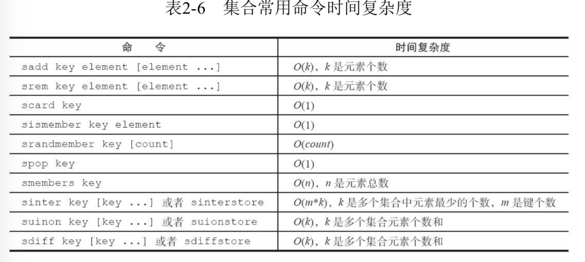
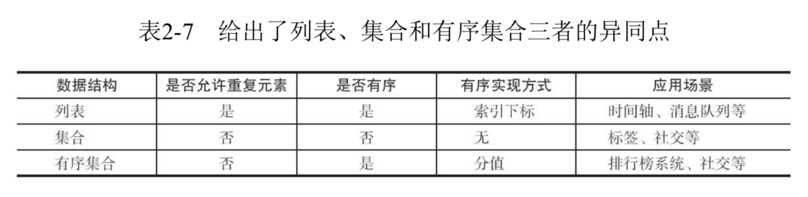

# 1. Redis简介

## 1.1 Redis能做什么

**1.缓存**

Redis提供了键值过期时间设置，并且提供了灵活控制最大内存和内存溢出后的淘汰策略。

**2.排行榜系统** 

排行榜系统几乎存在于所有的网站。例如按照热度排名的排行榜，按照发布时间的排行榜，按照各种复杂纬度计算出排行榜，Redis提供了**列表**和**有序集合**数据结构，合理使用这些数据结构可以很方便地构建各种排行榜系统。

**3.计数器应用**

比如说视频网站的播放量、电商网站的浏览数量。为了保衡数据的实时行，每一次播放和浏览都要做加1的操作，如果并发量很大很大对于传统的关系性数据库的性能是个很大的考验。Redis是天然支持计算功能并且计数的性能和很好。

**4.社交网络**

赞/踩、粉丝、共同好友/喜好、推送，下拉刷新等是社交网络的必备功能，由于社交网站访问量通常比较大，而且传统的关系性数据库不太合适保存这种类型的数据，Redis提供的数据结构可以相对比较容易的实现这些功能。

**5.消息队列**

Redis提供了发布订阅和阻塞队列的功能，虽然和专业的消息队列相比还不是很强大，但是对于一般的消息队列功能基本可以满足。

**6.共享session**

一个分布式web服务将用户的Session信息保存在各自的服务器中，由于负载均衡的原因，用户的访问可能打到不同的服务器上，用户每个刷新一次可能需要重新登录，这当然是不可取的。

为了解决这个问题，可以使用Redis来集中管理Session，只需要保证Redis是高可用和可扩展的，用户每次从Redis中更新或者查询登录信息。



**7.限速**

比如用户登录的时候，处于安全的考虑，用户的手机验证码不能多次输入，会限制每分钟获取验证码的频率，例如一分钟不能超过5次。此功能可以使用Redis来实现，比如下面这段伪代码：



例如一些网站限制一个IP地址不能在一秒钟之内访问超过n次也可以采用类似的思路。


## 1.2 Redis不能做什么

- 大规模的数据不易使用Redis（数据保存在内存，内存宝贵）
- 冷数据不宜保存在Redis，Redis中应尽可能的保存热数据。

## 1.3 Redis启动方式


## 1.4 Redis内部编码

redis的每种数据格式都有两种以上的内部编码实现，如下图所示：



这样设计有两个好处：

- **可以改进优化内部编码**，但对外数据结构没有影响，用户无感知。例如Redis3.2 提供了quicklist
- **多种内部编码实现可以在不同场景下发挥各自的优势**。例如ziplist比较省内存，但在列表元素比较多的情况下，性能会有所下降，这时内部会将其替换为linkedlist。


# 2. Redis API 

## 2.1 全局命令

```properties
key * :    					查看所有键

dbsize: 						获取键总数（直接读取Redis内置的键总数变量，O(1) ）

exists key: 				判断键是否存在

del key [key ...]: 	删除键

expire key second:	设置键的过期时间，时间一过会自动删除键

ttl key:						查询键的剩余时间

type key:						键的数据结构类型
```

## 2.2 String

字符串类型的数据，值最大不能超过512M。

**常用命令：**

```properties
## 设置值
set key value [ex seconds] [px millseconds] [nx|xx]: nx 键必须不存在（添加），xx 键必须存在（更新）

setex key: 键必须存在（更新）， 同 nx 参数一样 
setnx key: 键必须不存在（添加），同 xx 参数一样 （用于实现分布式锁）

mset key value [key value ...]: 批量设置值

## 获取值
get key:

mget key [key ...]: 批量获取值

## 计数
incr key: 对值做自增操作
decr key: 自减操作
incrby key increment:自增指定数目
decrby key increment:自减指定数据
incrbyfloat key increment: 自增指定浮点数目
```

[Redis分布式锁](https://redis.io/topics/distlock)

**不常用命令：**

```properties
## 追加
append key value: 

## 字符串长度
strlen key: 

## 设置并返回原值
getset key value: 先get然后在set

## 设置指定位置的字符
setrange key offset value: offset是位置下表

## 获取部分字符串
getrange key start end:
```

**时间复杂度：**



### 内部编码

字符串的内部编码有三种：

- **int** : 8个字节的长整型
- **embstr:** 小于等于39个字节的字符串
- **raw:** 大于39个字节的字符串

Redis会根据当前值的类型和长度决定使用那种内部编码实现。

```properties
## 查看内部编码格式
object encoding [key]: 查看内部编码格式
```


## 2.3 Hash

 Redis中的Hash类型可以看成具有String Key和String Value的map容器。所以该类型非常适合于存储值对象的信息。如果Hash中包含很少的字段，那么该类型的数据也将仅占用很少的磁盘空间。每一个Hash可以存储4294967295个键值对。

Hash  ----  {username:”张三”,age:”18”,sex:”man”}------javaBean

**Hash特点：占用的磁盘空间极少**

## 命令：

```properties
## 设置值
hset key field value:

## 获取值
hget key field:

## 删除值
hdel key field [field ...]: 

## 计算field个数
hlen key:

## 批量设置或获取 field-value
hmget key field [field ...]
hmset key field value [field value ...]

## 判断field是否存在
hexists key field:

## 获取所有field
hkeys key:
## 获取所有value
hvals key:
## 获取所有的field-value
hgetall key:

## 赋值：
hset key field value: 为指定的key设定field/value对（键值对）。
hmset key field value [field2 value2 …]:设置key中的多个filed/value

## 取值：
hkeys keyname: 获得所有的字段

hvals keyname: 获得所有的字段的直

hgetall keyname: 获取字段的key-value形式

hmget keyname key1 key2: 获取字段中的多个key的值

## 自增指定数目，类似于incrby/incybyfloat
hincrby key field :
hincrbyfloat key field:

## 计算value的字符串长度
hstrlen key field:

## 删除：
del key
hdel keyname key: 删除字段的指定key的值

## 判断key中的字段是否存在：
hexists key 字段名:  返回0或1，代表存在还是不存在

## 获取key中包含的字段的数量
hlen key

## 获取key中的所有字段（相当于hashmap中的getkeys）
hkeys key

## 获取key中的所有value(相当于hashmap中的getvalues)
hvals key
```

**时间复杂度：**



## 内部编码

哈希类型的内部编码有两种：

- **ziplist(压缩列表)**：当哈希类型元素个数小于hash-max-ziplist-entries配置（默认512个），同时所有值都小于hash-max-ziplist-value配置(默认64字节)，Redis会使用ziplist作为哈希的内部实现，ziplist在内存节省方面比hashtable更好。
- **hashtable(哈希表)**：当哈希类型无法满足ziplist的条件时，Redis会使用hashtable作为哈希的内部实现，因为此时ziplist的读写效率会下降，而hashtable的读写时间复杂度为O(1)


## 2.4 列表list

Redis采用的是**双向链表**，所以插入数据的时候，分为从左边添加还是从从右边添加，左添加为lpush，右边添加有rpush。左添加类似于头插法，右添加类似于尾插法。


列表类型有两个特点：

- **列表中的元素时有序的**。可以通过索引下表获取某个元素或者某个范围内的元素列表
- **列表中的元素时可以重复的**。


### 命令

```properties
## 添加操作
lpush key value: 从左边开始添加
rpush key value: 从右边开始添加

## 在索引前/后插入元素：（效率不高）
linsert key 	before|after pivot value: 在pivot元素前或后插入value这个元素

## 取值操作
lrang key start end: 获取从start到index的元素(闭区间),start负数表示倒着数的位置。-1表示倒数第一个
lrang key 0 -1: 所有查看list的所有数据

## 获取列表指定索引下标的元素
lindex key index: 
## 获取列表长度
llen key: 返回指定链表key的元素个数

## 删除操作
 lpop key :返回删除左端链表的值，如果key不存在，返回nil
 rpop key :返回并删除右端链表的值，如果key不存在，返回nil
 
## 删除指定元素
lrem key count value: count=0,删除所有；count>0,从左到右，删除count个元素；count<0,从右到左删除。

## 删除指定元素（效率特别低下）
lrem key count value ：删除count个值为value的元素，如果count大于0，从头到尾遍历并删除count个值为value的元素，如果count小于0，则从尾到头遍历并删除。如果count等于0，则删除链表总所有等于value的元素

## 修改
lset key index value : 设置链表中的index的元素值，0代表链表的头元素，-1代表链表的尾元素。

## 将链表中的尾部元素弹出并添加到头部。[循环队列操作]
rpoplpush resource destination：将链表中的尾部元素弹出并添加到头部。[循环操作]

## 阻塞操作
blpop key [key ...] timeout:
brpop key [key ...] timeout: 
```

**时间复杂度**：



### 内部编码

列表类型有两种内部编码：

- **ziplist(压缩列表)**: 当哈希类型元素个数小于list-max-ziplist-entries配置（默认512个），同时所有值都小于list-max-ziplist-value配置(默认64字节)，Redis会使用ziplist作为哈希的内部实现。
- **linkedlist(列表)**： 
- **quicklist**：

### 使用场景：

#### 1.消息队列

lpush + brpop 命令组合即可实现阻塞队列，生产者客户端使用lrpush从列表左侧插入元素，多个消费者客户端使用brpop命令阻塞式的"抢"列表尾部的元素，多个客户端保证了消费的负载均衡和高可用用性。 

#### 2.文章列表

每个用户都有属于自己的文章列表，


## 2.5 集合set

set集合中不允许有重复的元素，并且集合中的元素都是无序的，不能通过索引获取元素。一个集合最大可以保存**2^32-1**个元素。Redis还同时支持多个集合取交集、并集、差集。

**命令:**

```properties
## 添加操作
sadd key values[value1、value2…]:向set中添加数据，如果该key的值已有则不会重复添加

## 取值
smembers key：获取set中所有的成员

## 判断元素是否在集合中
sismember key member: 判断参数中指定的成员是否在该set中，1表示存在，0表示不存在或者该key本身就不存在。

## 删除：
srem key members[member1、member2…]: 删除set中指定的成员

## 计算元素个数
scard key: 获取set中成员的数量。 O(1)，直接读取Redis内部的变量

## 随机返回set中一个成员
srandmember key [count]: 随机返回set中的一个成员，默认返回1个,如果count大于等于集合基数，那么返回整个集合。

## 从集合随机弹出元素
spop key: 

## 获取所有元素
smembers key:

```

**集合间的操作：**

```properties
## 多个集合的交集
sinter key [key ...]:返回交集

## 多个集合的并集
suinon key [key ...]:返回并集

## 多个集合的差集
sdiff key [key ...]:返回差集

## 将交集、并集、差集的结果保存
sinterstore destination key [key ...]
sunionstore destination key [key ...]
sdiffstore destination key  [key ...]
	例如： sinterstore resultmap map1 map2: 将map1和map2的交集保存在result中

```




**时间复杂度：**



### 内部编码

集合类型的内部编码有两种：

- **intset（整数集合）**：当集合元素都是整数且元素个数小于set-max-intset-entries配置（默认512个），Redis会使用intset作为集合的内部实现，从而减少内存的使用。
- **hashtable(哈希表)**：当集合类型无法满足inset条件时，Redis会使用hashtable作为集合的内部实现。

### 使用场景

集合类型比较典型的使用场景时标签（tag）。例如一个用户可能对娱乐、体育比较感兴趣，另一个用户可能对历史、新闻比较感兴趣，这些兴趣点就是标签。有了这些数据就可以得到喜欢同一标签的人，以及用户的共同喜好的标签。像一般的电子商务网站会对不同标签的用户做不同类型的推荐。

。。。。。。


## 2.6 有序集合zset

- **集合不能有重复的元素**。
- **有序集合中的元素可以排序**，他给每个元素一个分数(score)作为排序的依据。




**命令：**

```properties
## 添加成员：
zadd key score member [score2 member2 …] : 将所有成员以及该成员的分数存放到sorted-set中。如果该元素已经存在则会用新的分数替换原有的分数。

## 计算成员个数
zcar key:

## 计算某个成员分数
zscore key member：返回指定成员的分数
zrange key start end [withscores]：获取集合中脚标为start-end的成员，[withscores]参数表明返回的成员包含其分数。（分数由小到大排列）
 
zrevrange key start end [withscores]：获取集合中脚标为start-end的成员，[withscores]参数表明返回的成员包含其分数。（分数由大到小排列）

删值：
zrem key member[member…]：移除集合中指定的成员，可以指定多个成员。
```

