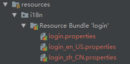
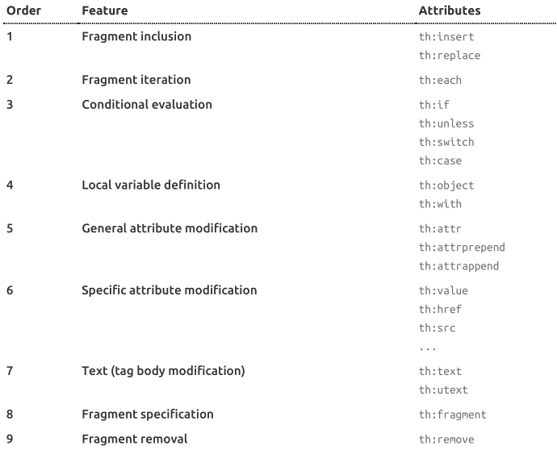

# 1、简单介绍

##  1. thymleaf中默认页面应该放在什么文件夹下？

html是默认的thymleaf默认的模板，默认情况下，模板解析的是```WEB-INF/templates```，```html```的页面。

```java
templateResolver.setTemplateMode(TemplateMode.HTML);
templateResolver.setPrefix("/WEB-INF/templates/");
templateResolver.setSuffix(".html");
```

## 2.thymleaf是有缓存的

```java
templateResolver.setCacheTTLMs(3600000L);
```

在开发中为了让修改立即的生效，一般会禁止模板的缓存，在springboot中这样做：

```properties
#禁用模板引擎的缓存
spring.thymeleaf.cache=false

# 如果还没有生效在Idea中可以使用ctrl+f9重新编译一下 
```


# 2、文本处理

```html
<!DOCTYPE html>
<html xmlns:th="http://www.thymeleaf.org">
    <head>
        <title>Good Thymes Virtual Grocery</title>
        <meta http-equiv="Content-Type" content="text/html; charset=UTF-8" />
        <link rel="stylesheet" type="text/css" media="all"
       	 	href="../../css/gtvg.css" th:href="@{/css/gtvg.css}" />
    </head>
    <body>
    	<p th:text="#{home.welcome}">Welcome to our grocery store!</p>
    </body>
</html>
```

可以使用 ```th:* ``` 表示任何的属性，但是前提是必须引入 ```th``` 的名称空间```xmlns:th="http://www.thymeleaf.org"```

​	这个属性的**基本作用：就是显示文本** ，它的值可以既可以**从thymeleaf上下文获取**，也可以**从外部文件获取**，甚至还可以使用自定义的方式获取，例如从数据库获取。 

​	需要注意的是：**如果要显示纯文本，这些文本就需要使用单引号括起来**

```html
<body>
    <p1 th:text="'hello machen'">hello world!</p1>
</body>
```

## 2.1.变量表达式

### ①${variable}

作用：**从thymeleaf上下文获取值**

```html
<h3 th:text="${welcome}">这是欢迎问候</h3>
```

如果当前上下文存在一个welcome变量的话，就显示这个值，否则显示默认的内容：`这是欢迎问候`。


 #### 1）${}的预定义变量

 thymeleaf提供了一些预定义变量param、session和application，使用${}可以方便地获取这些变量的值：

- 获取thymleaf上下文名为x的参数值：**${x}**

- 获取名为x的请求参数**：${param.x}**
- 获取当前session中名称为x的属性：**${session.x}**
- 获取当前ServletContext中名称为x的属性：**${application.x}**

```java
@RequestMapping("/hello")
    public String hello(Model model,HttpSession session){
        model.addAttribute("user","马晨");
        session.setAttribute("userId","78757");
        return "helllo";
    }
```

```html
<body>
    <p1 th:text="#{login.welcome (${user},${session.userId})}">hello world!</p1>
</body>
```


### ②#{message}

作用：**从外部文件获取值**

#### 1) 外部文件都哪些？

使用```#{}``` 可以从外部文件中获取值，当然通常用于**国际化**功能中，不同的语言定义有不同的```properties```文件，可以从此文件中获取指定的值。

```properties
# 国际化默认的配置文件
login.button=登录
login.password=密码
login.remember=记住我~
login.tip=请登录
login.username=用户名
```

thymleaf默认的消息处理器，会在```/WEB-INF/templates/home.html``` **同级文件夹**下，而且要有**相同的名字**。比如这样：

```properties
# 国际化处理的外部文件
/WEB-INF/templates/home_en_US.properties : 英文环境下
/WEB-INF/templates/home_zh_CN.properties : 中文环境下
/WEB-INF/templates/home.properties : 默认匹配的文件
```

**当然也可以读取指定文件目录下的配置文件中的属性**，但是需要在springboot的配置文件中进行配置。

```properties
# 国际化前缀()
spring.messages.basename=i18n.login
```



#### 2) 为properteis添加变量

很多时候，我们希望properties文件中的内容可以根据需求而变化，而不是一成不变的；thymeleaf可以为properties中的字符串**添加变量占位符**，在运行时替换占位符的值 

```properties
# {}表示占位符，该占位符会在运行时被真正的变量值替换掉
login.welcome=welcome {0} {1}
```

```java
@RequestMapping("/hello")
    public String hello(Model model){
        model.addAttribute("user","马晨");
        model.addAttribute("time",new Date());
        return "helllo";
    }
```

```html
<body>
    <p1 th:text="#{login.welcome (${user},${time})}">hello world!</p1>
</body>
```

**${user}需要使用`()`括号括起来，否则会解析错误；多个变量可以使用逗号分隔：** 

### ③*{}

作用：**在选择对象上计算表达式**

```html
<div th:object="${session.user}">
	<p>Name: <span th:text="*{firstName}">Sebastian</span>.</p>
	<p>Surname: <span th:text="*{lastName}">Pepper</span>.</p>
	<p>Nationality: <span th:text="*{nationality}">Saturn</span>.</p>
</div>		
```

上面的代码就等同于下面的代码：

```html
<div>
	<p>Name: <span th:text="${session.user.firstName}">Sebastian</span>.</p>
	<p>Surname: <span th:text="${session.user.lastName}">Pepper</span>.</p>
	<p>Nationality: <span th:text="${session.user.nationality}">Saturn</span>.</p>
</div>
```

当然```$```符和```*``` 是可以**混合使用**的：

```html
<div th:object="${session.user}">
	<p>Name: <span th:text="${#object.firstName}">Sebastian</span>.</p>
	<p>Surname: <span th:text="${session.user.lastName}">Pepper</span>.</p>
	<p>Nationality: <span th:text="*{nationality}">Saturn</span>.</p>
</div>
```

**注意：如果没有选择对象（Object）那么```$```符和```*``` 都是一样的效果**

```html
<div>
	<p>Name: <span th:text="*{session.user.name}">Sebastian</span>.</p>
	<p>Surname: <span th:text="*{session.user.surname}">Pepper</span>.</p>
	<p>Nationality: <span th:text="*{session.user.nationality}">Saturn</span>.</p>
</div>
```

### ④@{}

作用：**连接网址**

这里有几种不同类型了url表示：

```properties
# 绝对路径
Absolute URLs: http://www.thymeleaf.org
# 相对路径
Page-relative: user/login.html
Context-relative: /itemdetails?id=3 (context name in server will be added automatically)
Server-relative: ~/billing/processInvoice (allows calling URLs in another context (= application) in the same server.
Protocol-relative URLs: //code.jquery.com/jquery-2.0.3.min.js
```

如果路径中要携带参数，**参数要使用```()``` 包裹起来**

```html
<!-- Will produce 'http://localhost:8080/gtvg/order/details?orderId=3'  -->
<a href="details.html"
   th:href="@{http://localhost:8080/gtvg/order/details(orderId=${o.id})}">view</a>

<!-- Will produce '/gtvg/order/details?orderId=3'  -->
<a href="details.html" th:href="@{/order/details(orderId=${o.id})}">view</a>

<!-- Will produce '/gtvg/order/3/details'-->
<a href="details.html" th:href="@{/order/{orderId}/details(orderId=${o.id})}">view</a>
```

那如何在```home```页导航中，添加其他页面的跳转

```html
<p>Please select an option</p>
<ol>
    <li><a href="product/list.html" th:href="@{/product/list}">Product List</a></li>
    <li><a href="order/list.html" th:href="@{/order/list}">Order List</a></li>
    <li><a href="subscribe.html" th:href="@{/subscribe}">Subscribe to our Newsletter</a></li>
    <li><a href="userprofile.html" th:href="@{/userprofile}">See User Profile</a></li>
</ol>
```


### ⑤~{}

作用：**片段表达式，引用分片代码**

最常见的就是使用```th:insert``` 或者``` th:replace```，插入或者替换后面的代码。例如：

```html
<div th:insert="~{commons :: main}">...</div>

<div th:with="frag=~{footer :: #main/text()}">
	<p th:insert="${frag}">
</div>
```


**稍后在详谈**


# 3、th:utext

和th:text作用一样，th:utext也是用来显示文本的，唯一不同的是，**th:utext可以显示未经过转义的文本**，而th:text显示的所有文本都已经被转义 


# 4、标准表达式语法

```properties
# Simple expressions:
	Variable Expressions: ${...}
	Selection Variable Expressions: *{...}
	Message Expressions: #{...}
	Link URL Expressions: @{...}
	Fragment Expressions: ~{...}
# 字面量
	Text literals: 'one text' , 'Another one!' ,…
	Number literals: 0 , 34 , 3.0 , 12.3 ,…
	Boolean literals: true , false
	Null literal: null
	Literal tokens: one , sometext , main ,…
# 文本处理:
	字符串拼接: +
	文字替换: |The name is ${name}|
# Arithmetic operations:
	Binary operators: + , - , * , / , %
	Minus sign (unary operator): -
# Boolean operations:
	Binary operators: and , or
	Boolean negation (unary operator): ! , not
# 比较和等值操作:
	比较大小: > , < , >= , <= ( gt , lt , ge , le )
	等值运算: == , != ( eq , ne )
# 条件运算符:
	If-then: (if) ? (then)
	If-then-else: (if) ? (then) : (else)
	Default: (value) ?: (defaultvalue)
# Special tokens:
	Page 17 of 106
	No-Operation: _
```

当然，这些表达式之间也可以**相互组合**：

```java
'User is of type ' + (${user.isAdmin()} ? 'Administrator' : (${user.type} ?: 'Unknown'))
```

**使用```+```作为拼接符号**


## 4.1.文字替换 

```html
<span th:text="|Welcome to our application, ${user.name}!|">
```

等价于：

```html
<span th:text="'Welcome to our application, ' + ${user.name} + '!'">
```

转化成使用**单引号**引用的字面量

## 4.2.比较操作

需要注意的是：如果使用```th:text```其中的```>```和```<```等特殊字符是换将其转移的，如果想让其生效就需要使用其替换产品（当然也可以使用```th:utext```）

```java
gt ( > ), lt ( < ), ge ( >= ), le( <= ),not ( ! ), eq ( == ), neq / ne ( != )
```

## 4.3.条件操作

```html
<a href="comments.html"
	th:href="@{/product/comments(prodId=${prod.id})}"
	th:if="${not #lists.isEmpty(prod.comments)}">view
</a>
```

当然还有一个相反的属性```th:less```

```html
<a href="comments.html"
	th:href="@{/comments(prodId=${prod.id})}"
	th:unless="${#lists.isEmpty(prod.comments)}">view
</a>
```

## 4.4.本地变量

如果循环遍历输出所有值，当然可以使用```th:earch```标签，但是如果想要输出集合中的特定序列值，怎么办？

可以通过定义本地变量的方式。例如下面代码：

```html
<div th:with="firstPer=${persons[0]}">
    <p>
    	The name of the first person is <span th:text="${firstPer.name}">Julius Caesar</span>.
    </p>
</div	
```

获取```${persons[0]}```集合中的第一个元素，然后输出表示，当然要使用```th:with```标签。

**注意：```th:with```允许重用在同一标签中定义的属性**

```html
<div th:with="company=${user.company + ' Co.'},account=${accounts[company]}">...</div>
```

**其中company属性就作为了account属性的值**。

# 5、循环迭代

```html
<table>
    <tr>
        <th>NAME</th>
        <th>PRICE</th>
    	<th>IN STOCK</th>
    </tr>
    <tr th:each="prod : ${prods}">
        <td th:text="${prod.name}">Onions</td>
        <td th:text="${prod.price}">2.41</td>
        <td th:text="${prod.inStock}? #{true} : #{false}">yes</td>
	</tr>
</table>
```

其中```${prods}```为迭代对象集合，```prod```为迭代变量

# 6、属性的优先级



# 7、内联表达式

尽管可以使用标签的任何属性，但是我们更倾向于直接写表达式到html的文本上，需要使用特殊的标签```[[]]```,例如这样：

```html
<p>Hello, [[${session.user.name}]]!</p>
```

等同于下面这样，但是比较简单

```html
<p>Hello, <span th:text="${session.user.name}">Sebastian</span>!</p>
```

  **注意：```[[]]```等同于```th:text```，```[()]```等同于```th:utext```**


