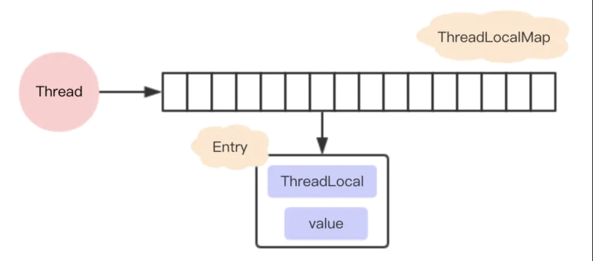
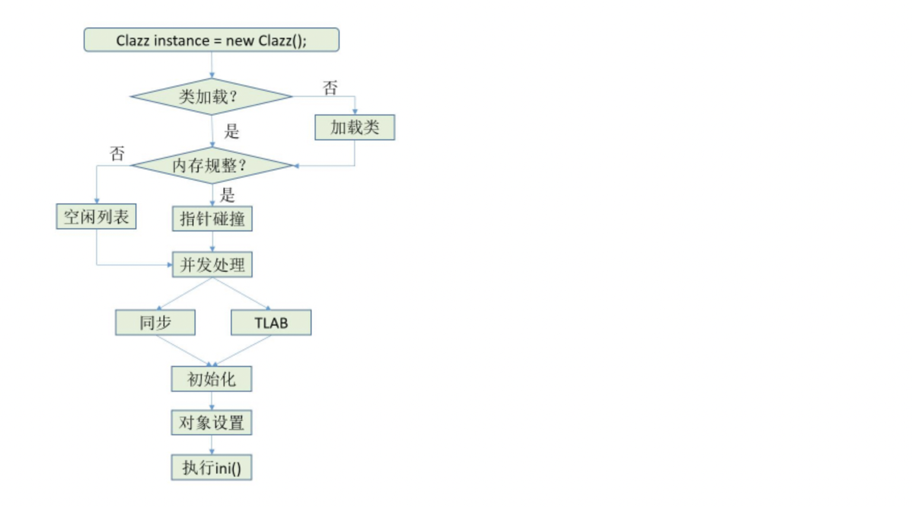

# 并发编程

## ThreadLocal有用过吗？讲讲原理？

"在多线程情况下，如何防止自己的对象被别的线程修改！"。这个时候就需要 `ThreadLocal`，那么`ThreadLcoal`到底是什么？

**`ThreadLocal`是如何保证线程之间数据的隔离的？**

```java
public void set(T value) {
    Thread t = Thread.currentThread();
    ThreadLocalMap map = getMap(t);
    if (map != null)
      map.set(this, value);
    else
      createMap(t, value);
}

public T get() {
        Thread t = Thread.currentThread();
        ThreadLocalMap map = getMap(t);
        if (map != null) {
            ThreadLocalMap.Entry e = map.getEntry(this);
            if (e != null) {
                @SuppressWarnings("unchecked")
                T result = (T)e.value;
                return result;
            }
        }
        return setInitialValue();
}

```

可以发现，**每个线程中都有一个`ThreadLocalMap`数据结构**。

**在`ThreadLoalMap`中，也是初始化一个大小16的`Entry`数组，`Entry`对象用来保存每一个`key-value`键值对，只不过这里的`key`永远都是`ThreadLocal`对象**，是不是很神奇，通过`ThreadLocal`对象的`set`方法，结果把`ThreadLocal`对象自己当做`key`，放进了`ThreadLoalMap`中。




**`ThreadLocal `是如何解决hash 冲突的？**

每个ThreadLocal对象都有一个hash值`threadLocalHashCode`，每初始化一个ThreadLocal对象，hash值就增加一个固定的大小`0x61c88647`。在插入的过程中：根据ThreadLocal对象的hash值，定位到table中的位置i

- 如果当前位置是空的，那么正好，就初始化一个Entry对象放在位置i上
- 如果已经有Entry对象了，如果这个Entry对象的key正好是即将设置的key，那么重新设置Entry中的value
- 不巧，位置i的Entry对象，和即将设置的key没关系，那么只能找下一个空位置；


```java
  private void set(ThreadLocal<?> key, Object value) {

    Entry[] tab = table;
    int len = tab.length;
    int i = key.threadLocalHashCode & (len-1);

    for (Entry e = tab[i];
         e != null;
         e = tab[i = nextIndex(i, len)]) {
      ThreadLocal<?> k = e.get();

      if (k == key) {
        e.value = value;
        return;
      }

      if (k == null) {
        replaceStaleEntry(key, value, i);
        return;
      }
    }

    tab[i] = new Entry(key, value);
    int sz = ++size;
    if (!cleanSomeSlots(i, sz) && sz >= threshold)
      rehash();
}
```


**内存泄漏问题**

```java
static class Entry extends WeakReference<ThreadLocal<?>> {
    /** The value associated with this ThreadLocal. */
    Object value;

    Entry(ThreadLocal<?> k, Object v) {
        super(k);
        value = v;
    }
}
```

**在`ThreadLocalMap`的实现中，`key`被保存到了`WeakReference`对象中。对于弱引用，只要发生GC，那么对象一定会被清除。但是value在线程(Thread)不死亡时却可能存在一条强引用链。由于value是强引用，只要Thread不死亡时，例如线程池，这条强引用链就会存在，那么value就不会回收，可能造成内存溢出**。

```java
//解决方法：所以养成良好的编程习惯十分重要，使用完ThreadLocal之后，记得调用remove方法。
ThreadLocal<String> localName = new ThreadLocal();
try {
    localName.set("占小狼");
    // 其它业务逻辑
} finally {
    localName.remove();
}
```


## 讲讲HashMap的原理，线程安全吗？有什么解决方案！

## 讲讲你对AQS的理解

## Synchronized和RetternLocal，什么是锁升级


## 线程池的原理


## 你知道都有哪几种阻塞队列


# JVM

## 四种引用类型

- **强引用**

**只要强引用存在，垃圾回收器将永远不会回收被引用的对象**，哪怕内存不足时，JVM也会直接抛出OutOfMemoryError，不会去回收。如果想中断强引用与对象之间的联系，可以显示的将强引用赋值为null，这样一来，JVM就可以适时的回收对象了。

- **软引用**

描述一些非必需但仍有用的对象。**在内存足够的时候，软引用对象不会被回收，只有在内存不足时，系统则会回收软引用对象，如果回收了软引用对象之后仍然没有足够的内存，才会抛出内存溢出异常**。

- **弱引用**

**无论内存是否足够，只要 JVM 开始进行垃圾回收，那些被弱引用关联的对象都会被回收**。

- **虚引用**

虚引用是最弱的一种引用关系，如果一个对象仅持有虚引用，那么它就和没有任何引用一样，它随时可能会被回收。**虚引用必须要和 ReferenceQueue 引用队列一起使用。**


## 类加载的过程

JVM 类加载机制分为五个部分：**加载，验证，准备，解析，初始化**，下面我们就分别来看一下这 五个过程


> **加载**

在装载阶段，JVM虚拟机需要完成下面三件事情：

1. **通过的classload获取的二进制字节流**。需要借助 [classLoader](##类装载器classLoader)完成(就是用来装载Class文件的)。
2. **将这个字节流所代表的静态存储结构转化为 `方法区` 的运行时数据结构**。
3. **在Java堆中生成一个代表这个类的Class对象，作为对方法区中这些数据的访问入口**。

在我们的装载阶段完成之后，我们的运行时数据区的方法区以及堆就已经有数据了：

- **方法区**：类信息，静态变量，常量
- **堆**：代表被加载类的java.lang.Class对象

**注意**：**加载阶段与连接阶段的部分动作（如一部分字节码文件格式验证动作）是交叉进行的，加载阶段尚未完成，连接阶段可能已经开始。**


> 验证

**目的：保证被加载类的正确性**，包括对：字节码的验证和符号引用的验证。


> 准备

**目的**：为类的 **`静态变量`** 分配内存，并将其初始化为默认值。**即在方法区中分配这些变量所使 用的内存空间**。

- <u>这里不包含用</u>final修饰的static，**因为final在编译的时候就会分配了**，准备阶段会显式初始化
- 这里不会为实例变量（也就是没加static）分配初始化，类变量会分配在方法区中，而实例变量是 会随着对象一起分配到Java堆中


> 解析

是指把**常量池中的符号引用转换为直接引用的过程**。

**符号引用**：就是一组符号来描述引用的对象。各个虚拟机实现虽然不同，但代表的符号引用必须相同

**直接引用**：直接指向目标的内存地址引用，通过该引用能够确定唯一的一块内存空间。


> 初始化

**初始化阶段是执行类构造函数方法的过程**。


## 类加载器

JVM 提 供了 3 种类加载器:

- **启动类加载器(Bootstrap ClassLoader)**

负责加载 **`JAVA_HOME\lib`** 目录中的类

- **扩展类加载器(Extension ClassLoader)**

负责加载 **`JAVA_HOME\lib\ext`** 目录中的类

- **应用程序类加载器(Application ClassLoader)**

负责加载 **`用户路径(classpath)`** 上的类库


<u>**双亲委派原则**</u>

当一个类收到了类加载请求，他首先不会尝试自己去加载这个类，而是把这个请求委派给父 类去完成，每一个层次类加载器都是如此，因此所有的加载请求都应该传送到启动类加载其中， **只有当父类加载器反馈自己无法完成这个请求的时候(在它的加载路径下没有找到所需加载的Class)，子类加载器才会尝试自己去加载**。


面试问题：什么地方违背的双亲委派原则

https://www.pianshen.com/article/28691232696/


## 对象创建的过程



- **对于new指令，首先将去检查这个指令是否能在常量池中定位到一个类的符号引用，并且检查这个符号引用代表的类是否已被加载、解析和初始化过**。
  - 如果没有，则执行类加载过程
- **类加载检查过程中，虚拟机为新生对象分配内存(对象所需内存的大小在类加载完成后便可完全确定)**。具体的分配方式有两种：
  - **指针碰撞**：java堆内存绝对规整，中间的指针作为空闲空间和已使用空间的分界线，只需要将指针向空间空间移动与对象相等的距离。
  - **空闲列表**：java堆内存不规整，虚拟机需要维护一个内存列表，用于记录哪些内存块可用，哪些不可用。在分配时从列表中找到一块足够大的空间划分给对象实例，并更新列表上的记录。
- **内存分配完成后，然后设置对象的对象头信息**。比如：对象属于哪个实例、对象的GC年龄，对象的哈希码，是否启用偏向锁等
- 执行完new指令后，接着执行<init>方法（根据字节码中是否跟随invokespecial指令所决定），这样一个真正可用的对象才算完全产生出


<u>**内存划分过程中的并发问题！！！！**</u>

​		比如在正给对象A分配内存，指针还没来的急修改，对象B又同时使用了原来的指针来分配内存。如何保证分配内存空间过程中的安全问题。有两种解决办法：

1. 采用CAS配上失败重试的方法保证更新操作的原子性
2. **将内存分配动作按照线程划分在不同的空间之中进行**。每个线程在java堆中预先分配一小块内存【TLAB】，哪个线程要分配内存，就在哪个线程的 TLAB 中分配，只有缓存用完了并分配新的缓存时，才需要同步锁定。


## JVM内存区域

对象创建完后，对象的数据都保存在哪里？


# Redis


# Mysql 


# kafka


# Spring 框架


# 微服务


# 项目


# 自我介绍

你好，我叫马晨， 2019毕业于西安邮电大学学校，2019.7 入职瓜子二手车，先后工作于金融用户中心团队和二手车开放平台团队。

金融用户中心，主要是金融服务的门户。期间我主要负责：用户进件信息材料的维护和版本的升级， 用户合规视频录制、审核流程的维护和版本迭代。

开放平台，主要聚焦一些车商服务，比如：车辆的上架，车辆活动的推广，车商经营数据的分析等。期间我主要参与车辆广告活动的研发的上线。

